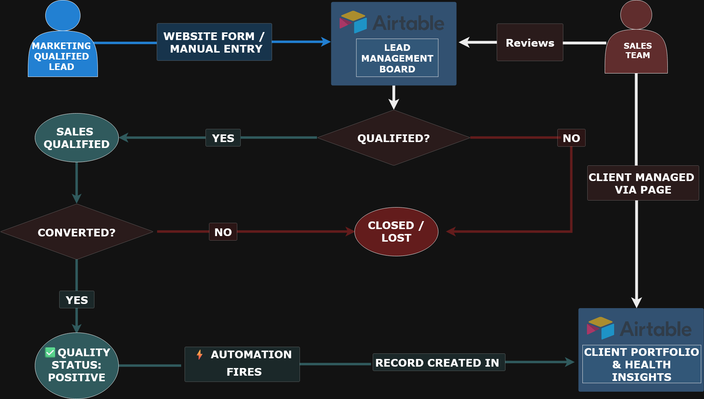
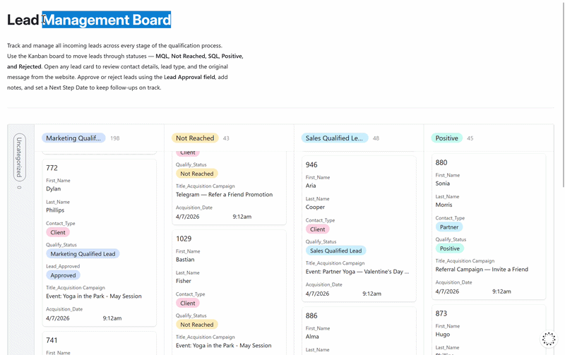

# 🏗️ Yoga Studio Go-to-Market & Operations — No-Code Platform Built Around Processes & Workflows

> Built for **[Intelligent Yoga Paris](https://intelligentyogaparis.com)** — a volunteer-run yoga association for expats transitioning to a commercial studio model. This project covers the full scope: go-to-market strategy (market analysis, benchmark research, audience segmentation, pricing tiers) through to end-to-end operations (CRM, ERP, HR, scheduling, content publishing, analytics) — all implemented as a connected no-code ecosystem within a highly constrained non-commercial budget.
>
> *Transitioning from a manual, volunteer-based operation — no website, no CRM, no financial tracking, no structured scheduling — to a fully automated, scalable commercial infrastructure, on a non-commercial budget.*
>
> **Design principle:** everything runs through purpose-built interfaces built on top of the Airtable database — and access is strictly scoped by role. Sales sees only the CRM pipeline; HR sees only contracts and staff; the admin sees scheduling and front-desk operations; marketing sees campaigns, events, and the website workspace. The database connects to the outside world through Make: inbound leads arrive from the website form, frontend content is published live on a toggle by the non-technical marketing team and translated automatically into other languages via AI, and operational data flows to analytics dashboards on schedule. No one sees or touches raw data.
>
> 🌐 **Live site:** [intelligentyogaparis.com](https://intelligentyogaparis.com)
>
> **Roles covered:** HR Manager · Studio Admin · Sales Manager · Marketing Manager · Front Desk
> **Interfaces built:** [💼 Sales Ops Hub](./interfaces/sales-ops-hub-README.md) · [🏢 Check-in & Operations Hub](./interfaces/checkin-operations-hub-README.md) · [🧑‍💼 Studio HR Hub](./interfaces/studio-hr-hub-README.md) · [📣 Marketing Ops Hub](./interfaces/marketing-ops-hub-README.md) · [🌐 Web Operations Hub](./interfaces/web-ops-hub-README.md)

---

*Example — Marketing Manager updates the website Instagram gallery:* a new post is imported automatically via Instagram API, media uploaded to Cloudinary CDN, AI generates multilingual titles. The Marketing Manager opens the Web Ops workspace in Airtable, reviews the draft, edits the title if needed, flips one toggle — the post appears in the live website gallery in three languages. No file transfers, no developer, no manual coordination.

[](./assets/interfaces/web_ops_instagram_gallery.gif)

*Marketing reviews imported posts in the Web Ops workspace — checks media, edits AI titles, toggles to publish. → [Web Operations Hub](./interfaces/web-ops-hub-README.md)*

[](./assets/interfaces/instagram_gallery2.gif)

*Posts appear in the website gallery with multilingual titles instantly. → [intelligentyogaparis.com](https://intelligentyogaparis.com)*

---

> 👤 **My Role — Ops Architect & Product Owner:** I designed and built this platform end-to-end: go-to-market strategy (market and benchmark analysis, audience segmentation, pricing design, acquisition funnel architecture); full process audit and workflow redesign (lead qualification & customer journey, client lifecycle, contract renewals, session scheduling, subscriptions, content publishing, financial tracking); system architecture from scratch (data model, automation logic, integration layer); 5 custom interfaces, 18 automated workflows, 4 Make pipelines, and a custom-built multilingual website; ETL pipeline and 6 analytics dashboards; team training; and full technical documentation and team playbooks — all living on Notion, connected to Claude Code via MCP for documentation automation. Claude Code has access to all tools and projects including the live Airtable database, enabling automated README generation, cross-file link validation, and batch media formatting across the full documentation set.

**Stack:** `Notion` · `Claude Code` · `Airtable` · `Make` · `Cloudinary` · `Cloudflare Pages` · `GitHub API` · `Instagram Business API` · `Make AI Tools` · `Google Sheets` · `Looker Studio` · `Eleventy 3` · `Tailwind CSS 4`

**Contents:** [📂 Documentation Structure](#doc-structure) · [🚀 Project Overview](#overview) · [💡 Architecture & Customer Journey](#solution) · [🧩 Back Office to Analytics](#platform-blocks) · [🌐 Frontend–Backend](#frontend) · [🖥️ Interfaces & Governance](#interfaces) · [🔬 Technical Deep Dive](#deep-dive) · [🔧 Tech Stack](#tech-stack) · [📁 Repository Structure](#structure) · [📂 Documentation Index](#docs)

> ⚠️ **Data Privacy:** All datasets are synthetically generated. Names, contact details, and financial figures are fictional and used for demonstration purposes only. Analytics dashboards are populated with generated data.

---

<a id="doc-structure"></a>
## 📂 Documentation Structure

| Section | What it covers | Folder |
|---|---|---|
| **🏗️ Architecture** | System design, HLD diagram, data flows, database schema — 11 tables, ER diagram, automation map | [→ README](./architecture/hld.md) |
| **🖥️ Interfaces** | 5 role-scoped workspaces: CRM & lead pipeline (Sales) · client registration & scheduling (Check-in Ops) · HR & contracts · campaigns & events (Marketing) · website content (Web Ops) — pages, demos, automation links, governance | [→ README](./interfaces/interfaces-README.md) |
| **⚙️ Automations** | 18 automated workflows — 14 native Airtable + 4 Make integration pipelines | [→ README](./automations/automations-README.md) |
| **📊 Analytics** | ETL pipeline · 6 Looker Studio dashboards: campaign ROI, lead funnel, client lifecycle & LTV, session fill rates, revenue trends, churn analysis | [→ README](./business-intelligence-analytics/business-intelligence-analytics-README.md) |
| **🌐 Frontend** | Custom multilingual website — Eleventy 3 + Tailwind CSS 4 + Cloudflare Pages + Make content sync | [→ README](./frontend/frontend-README.md) |

---

<a id="overview"></a>
## 🚀 Project Overview

### The Challenge

Before the transformation: the studio had no website and no intake form — interested clients sent direct messages on Instagram (DMs). Each DM had to be manually copied into an Excel spreadsheet; follow-ups were tracked in the same file and roughly half were forgotten. There was no way to know who had expressed interest but never showed up, no record of who became a paying client, and no visibility into where clients came from. Sessions were coordinated by text message. Teacher contracts weren't tracked. There were no subscription records, no revenue data, no dashboards. Decisions were made on intuition, not data.

> Transitioning from a manual, volunteer-based operation — no website, no CRM, no financial tracking, no structured scheduling — to a fully automated, scalable commercial infrastructure, on a non-commercial budget.

| Area | Before | After |
|---|---|---|
| **Lead Capture** | Email inbox, manually logged, no attribution | Make webhook → CRM record instantly, attributed to source campaign via UTM, team notified |
| **Client Lifecycle** | No records, no segments, no LTV | 7-segment client health model (VIP / Regular / Churn Risk / New / etc.) calculated daily by formula |
| **HR & Contracts** | Spreadsheet tracking, renewals missed | 4-stage automated renewal state machine — contract advances without anyone managing it |
| **Session Scheduling** | Manual re-entry every week | Recurring session generator — completed session → next week's session created automatically |
| **Event Publishing** | Developer required — code edits, JSON, deploy | One toggle → Make uploads media, AI translates (3 languages), GitHub push, Cloudflare deploys |
| **Instagram Gallery** | 3 people, file transfers, manual JSON | Make fetches posts, AI generates titles, marketing curates and publishes with one toggle |
| **Analytics** | No dashboards — decisions made on intuition | 6 role-scoped Looker Studio dashboards, updated automatically on schedule |

---

<a id="solution"></a>
## 💡 Architecture & Customer Journey

One Airtable base is the source of truth for the entire studio. **11 linked tables** cover every operational domain — CRM and lead pipeline, client lifecycle and subscriptions, session scheduling, HR contracts, financial transactions, campaigns, and partners. On top of this data layer: **5 role-scoped interfaces** through which every team member does their daily work, and **18 automations** that advance the next step the moment a business event occurs — without anyone initiating it. Make connects Airtable to the outside world: leads arrive from the website, events publish to the frontend, Instagram syncs to the gallery, and analytics data flows to dashboards — all automatically.

[](./assets/architecture/High-Level%20Design%282%29.png)

*Click to open full size. → [Architecture & High-Level Design](./architecture/hld.md)*

**How data flows through the platform:**

- **Marketing** creates campaigns in Marketing Ops Hub, publishes events and Instagram posts through Web Ops Hub → Make syncs content to the live website automatically
- **Customer journey & lead capture** — visitor follows a UTM link from a campaign, lands on the website, submits the contact or registration form → Make webhook fires, lead created in CRM linked to the source campaign with full UTM attribution, team notified instantly by email
- **Sales** qualifies the lead (MQL → SQL → Positive) in Sales Ops Hub → automation migrates the record to `Clients`, `Partners`, or `Staff & Teachers`
- **Client onboarding** — Admin registers the client and sells a plan in Check-in Hub → transaction record created automatically
- **Studio operations** — Admin manages scheduling, sessions, and check-ins; HR Manager handles contracts and teacher assignments — both through dedicated interfaces, automations handle every transition
- **Analytics** — all data flows monthly into Google Sheets via Make ETL → 6 Looker Studio dashboards refresh automatically

→ [Architecture & High-Level Design — full breakdown](./architecture/hld.md) · [Database Schema — 11 tables, ER diagram](./architecture/database.md)

---

<a id="platform-blocks"></a>
### From Back Office to Analytics

**🔵 Growth & Acquisition** — campaign lifecycle, UTM-tracked lead capture, CRM qualification pipeline. Every inbound lead lands in the CRM instantly and is attributed to the source campaign. Sales Manager qualifies through MQL → SQL → Positive; conversion fires automatically.

→ [Sales Ops Hub](./interfaces/sales-ops-hub-README.md) · [Marketing Ops Hub](./interfaces/marketing-ops-hub-README.md) · [CRM Automations](./automations/airtable/crm-lead-management-README.md) · [Inbound Lead Capture](./automations/make/inbound-leads-README.md)

[](./assets/interfaces/events_gallery_register.gif)

*Lead fills in the registration form from the event page — UTM attribution captured automatically, lead lands in the CRM.*

[](./assets/interfaces/acquisition_campaigne.png)

*Lead attributed to source campaign in the CRM — conversion tracking without any manual input.*

[](./assets/interfaces/email_crm.png)

*Instant HTML email alert — lead details, source campaign, and routed action for the team.*

---

**🔴 Internal Back Office** — client registration, subscription sales, class scheduling, attendance, HR contract renewals, teacher assignments, absence management. Every workflow through a role-scoped interface; automations propagate changes across tables automatically.

→ [Check-in & Operations Hub](./interfaces/checkin-operations-hub-README.md) · [Studio HR Hub](./interfaces/studio-hr-hub-README.md) · [Airtable Automations](./automations/airtable/airtable-README.md)

**CRM:** The Sales Manager qualifies leads through the MQL → SQL → Positive Kanban in the Sales Ops Hub. Every interaction is automatically archived to the activity log; notes clear when the follow-up date arrives. When a lead is marked Positive, automation instantly creates a fully populated record in the right destination — Clients, Partners, or Staff — with all contact fields pre-filled.

[](./assets/interfaces/5.CRM_Workflows.png)

*CRM workflow — lead qualification stages, automation triggers, and record migration destinations.*

[](./assets/interfaces/CRM_lead_management_board-ezgif.com-video-to-gif-converter.gif)

*Kanban board in action — MQL → SQL → Positive. Notes archived automatically. One status change migrates the record to Clients, Partners, or HR. → [Sales Ops Hub](./interfaces/sales-ops-hub-README.md)*

**HR:** Employee and teacher profiles, contracts, specializations, and absence records are all managed from the Studio HR Hub. Contract renewals advance through a 4-stage pipeline automatically. Teacher-to-class assignments update the moment a specialization is added or changed.

[](./assets/interfaces/hr_stuff_directory.gif)

*Staff directory in the Studio HR Hub — employee and teacher profiles, specializations, approval status, contract tracking. → [Studio HR Hub](./interfaces/studio-hr-hub-README.md)*

---

**⬛ Frontend Ops & Content Management** — events and Instagram gallery published to the live website without a developer or file transfer. One toggle in the Airtable workspace → Make handles Cloudinary CDN upload, AI translation (RU / EN / FR), GitHub API push, Cloudflare Pages auto-deploy.

→ [Web Operations Hub](./interfaces/web-ops-hub-README.md) · [Event Publishing](./automations/make/website-sync-README.md) · [Instagram Gallery Sync](./automations/make/instagram-gallery-sync-README.md)

[](./assets/interfaces/web_ops_events_board.gif)

*One toggle in the Events Board — photo uploaded, AI-translated into 3 languages, pushed to GitHub, Cloudflare deploys.*

[](./assets/interfaces/events_gallery1.gif)

*The event appears on the live website in 3 languages within seconds.*

[](./assets/interfaces/instagram_gallery2.gif)

*Instagram posts appear in the website gallery with multilingual titles — published from the Airtable workspace with one toggle.*

---

**⬛ Data & Insights** — all operational data flows into 6 Looker Studio dashboards automatically on a monthly schedule. Make ETL pipeline extracts from 4 Airtable tables, transforms, loads into Google Sheets. No manual exports, no coordination.

→ [Business Intelligence & Analytics](./business-intelligence-analytics/business-intelligence-analytics-README.md) · [ETL Pipeline](./automations/make/etl-README.md)

[](./assets/analytics/dashboards.gif)

*6 dashboards — campaign ROI, lead funnel, client LTV, session fill rates, churn, revenue trends.*

[](https://datastudio.google.com/s/jH8JAT6_iVs)

---

<a id="frontend"></a>
## 🌐 Frontend–Backend Connection

🌐 **[intelligentyogaparis.com](https://intelligentyogaparis.com)**

The studio website was designed and developed from scratch as part of this project — not a template, not a CMS. Built with **Eleventy 3** and **Tailwind CSS 4**, deployed on **Cloudflare Pages**. Three languages (FR / RU / EN) with all content managed from Airtable workspaces and all text managed via `data-i18n` attributes and `i18n.json` — no text is hardcoded in HTML.

**How the frontend connects to Airtable:**

- **Events gallery** — managed from the Web Ops Hub. Marketing fills in event details, flips the publish toggle → Make uploads to Cloudinary, AI translates, pushes `events.json` to GitHub, Cloudflare deploys. Gallery updates in seconds.
- **Contact & registration forms** — UTM parameters captured at page load, submitted via a **Cloudflare Pages serverless function** (security proxy hiding the Make webhook URL) → Make creates a lead in the CRM linked to the source campaign + sends HTML email alert to the team.
- **Instagram gallery** — Make runs on schedule, fetches posts via Instagram Business API, uploads to Cloudinary, AI generates multilingual titles, marketing publishes from the Airtable workspace with one toggle.

[](./assets/interfaces/website_page1.gif)

*About page — community gallery, events section, teacher cards.*

[](./assets/interfaces/events_gallery_register.gif)

*Event registration form — visitor submits, lead lands in the CRM attributed to the source campaign.*

→ [**Website — full documentation**](./frontend/frontend-README.md) · [Event Publishing pipeline](./automations/make/website-sync-README.md) · [Inbound Lead Capture](./automations/make/inbound-leads-README.md) · [Instagram Gallery Sync](./automations/make/instagram-gallery-sync-README.md)

---

<a id="interfaces"></a>
## 🖥️ Interfaces & Governance

> No team member has direct access to the underlying database or another role's data. Every workflow runs through a purpose-built, role-scoped interface — access is strictly limited to what each role needs.

| Interface | Stakeholder | Scope | Governance | Sub-README |
|---|---|---|---|---|
| **💼 Sales Ops Hub** | Sales Manager · Admin | Lead qualification funnel · client portfolio health · retention | Sales only — no access to HR, scheduling, or finance data | [→](./interfaces/sales-ops-hub-README.md) |
| **🏢 Check-in & Operations Hub** | Studio Admin | Client registration · plan sales · class check-ins · studio calendar | Admin owns. Marketing has read access to the studio calendar only | [→](./interfaces/checkin-operations-hub-README.md) |
| **🧑‍💼 Studio HR Hub** | HR Manager · Admin (read) | Contracts · onboarding · teacher assignments · absence tracking | HR Manager owns. Admin has read access to absences and scheduling only — no contract or hiring data | [→](./interfaces/studio-hr-hub-README.md) |
| **📣 Marketing Ops Hub** | Marketing Manager | Campaigns · UTM links · events · partner management | Marketing Manager owns — campaign and partner data not accessible to other roles | [→](./interfaces/marketing-ops-hub-README.md) |
| **🌐 Web Operations Hub** | Marketing Manager | Event publishing · Instagram gallery curation · AI content review | Toggle-based publish only — no access to operational data, leads, or clients | [→](./interfaces/web-ops-hub-README.md) |

→ [Full interface breakdown — pages, demos & governance](./interfaces/interfaces-README.md) · [Interface → Table mapping](./architecture/database.md#interface-map)

---

<a id="deep-dive"></a>
## 🔬 Technical Deep Dive

### ⚙️ 18 Automations — Two Layers

**14 native Airtable automations** — triggered by field updates, form submissions, status changes, and date conditions. Internal operations only.

| Domain | # | What fires | Deep dive |
|---|---|---|---|
| 🧑‍💼 HR & Staff | 6 | 4-stage contract renewal state machine · teacher approval → class roster sync · specialization update sync | [→](./automations/airtable/hr-staff-management-README.md) |
| 💼 CRM & Leads | 5 | Lead migration router (4 destination tables) · activity log archiving | [→](./automations/airtable/crm-lead-management-README.md) |
| 🏢 Operations | 2 | Recurring session generator · marketing event → studio calendar sync | [→](./automations/airtable/operations-scheduling-README.md) |
| 💰 Finance | 1 | Transaction record created on new client registration form submit | [→](./automations/airtable/finance-transactions-README.md) |

**4 Make integration pipelines** — connecting Airtable to the outside world.

| Pipeline | What it does | Deep dive |
|---|---|---|
| 🌐 Event Publishing | Toggle in Airtable → Cloudinary + AI translation (3 languages) + GitHub push + Cloudflare deploy | [→](./automations/make/website-sync-README.md) |
| 📸 Instagram Gallery Sync | Scheduled fetch → Cloudinary + AI titles → Airtable review → website publish | [→](./automations/make/instagram-gallery-sync-README.md) |
| 📋 Inbound Lead Capture | Website form → UTM match → CRM record + Gmail alert | [→](./automations/make/inbound-leads-README.md) |
| 📊 ETL Analytics | Monthly extract from Airtable → Google Sheets → Looker Studio refresh | [→](./automations/make/etl-README.md) |

→ [All automations — overview & demos](./automations/automations-README.md)

---

### 🗄️ Database — 11 Linked Tables

| Domain | Tables |
|---|---|
| Growth & Acquisition | `Marketing_Campaigns` · `Inbound_Leads` · `Partners` |
| Client Operations | `Clients` · `Transactions` · `SubscriptionPlans` · `Attendance` |
| Scheduling & Classes | `Sessions` · `Classes` |
| HR & Staff | `Stuff & Teachers` · `Stuff_Absences` |

→ [Full database schema — ER diagram, table descriptions, automation map](./architecture/database.md)

---

<a id="tech-stack"></a>
## 🔧 Tech Stack

| Layer | Tool | Role |
|---|---|---|
| **Documentation** | Notion | Project management, process documentation, technical specs |
| **Documentation Automation** | Claude Code | AI-assisted documentation generation, cross-file link synchronization, media formatting. Connected to Notion via MCP — can read/write Notion pages and databases to keep technical docs in sync with the codebase automatically |
| **Database & Automations** | Airtable | Single source of truth — 11 tables, 14 native automations, 5 role-scoped interfaces |
| **Integration & ETL** | Make | 4 pipelines — lead capture, event publishing, Instagram sync, analytics ETL |
| **Media CDN** | Cloudinary | Image and video hosting — permanent URLs for all website assets |
| **AI Content** | Make AI Tools (gpt-5-nano) | Event translation · Instagram caption → multilingual website titles (RU / EN / FR) |
| **Social** | Instagram Business API | Scheduled post import for gallery sync |
| **Website Hosting** | Cloudflare Pages | Static site hosting + serverless form proxy function |
| **Website Repo** | GitHub API | `events.json` and `gallery.json` pushed programmatically by Make |
| **Frontend** | Eleventy 3 · Tailwind CSS 4 | Custom multilingual static site — FR / RU / EN |
| **Email Alerts** | Gmail | Instant HTML lead notifications with campaign attribution |
| **Analytics Warehouse** | Google Sheets | Structured intermediate storage — 4 tabs fed by Make ETL |
| **Dashboards** | Looker Studio | 6 role-scoped dashboards — reads Google Sheets natively, auto-refreshed |

---

<a id="structure"></a>
## 📁 Repository Structure

```
readme/
│
├── README.md                                          ← you are here
│
├── interfaces/
│   ├── interfaces-README.md                           ✅ Role-based workspace overview
│   ├── studio-hr-hub-README.md                        ✅ HR & contracts
│   ├── checkin-operations-hub-README.md               ✅ Front desk & scheduling
│   ├── sales-ops-hub-README.md                        ✅ CRM & lead pipeline
│   ├── marketing-ops-hub-README.md                    ✅ Campaigns & events
│   └── web-ops-hub-README.md                          ✅ Website & gallery publishing
│
├── automations/
│   ├── automations-README.md                          ✅ All automation layers overview
│   ├── airtable/
│   │   ├── airtable-README.md                         ✅ 14 native automations overview
│   │   ├── hr-staff-management-README.md              ✅ 6 HR automations deep dive
│   │   ├── crm-lead-management-README.md              ✅ 5 CRM automations deep dive
│   │   ├── operations-scheduling-README.md            ✅ 2 Ops automations deep dive
│   │   └── finance-transactions-README.md             ✅ 1 Finance automation deep dive
│   └── make/
│       ├── etl-README.md                              ✅ Make pipelines overview & ETL
│       ├── website-sync-README.md                     ✅ Event publishing pipeline
│       ├── instagram-gallery-sync-README.md           ✅ Instagram gallery sync pipeline
│       └── inbound-leads-README.md                    ✅ Lead capture pipeline
│
├── business-intelligence-analytics/
│   └── business-intelligence-analytics-README.md     ✅ ETL architecture & 6 dashboards
│
├── frontend/
│   └── frontend-README.md                            ✅ Website & Cloudflare Pages
│
└── architecture/
    ├── hld.md                                        ✅ Architecture & High-Level Design
    └── database.md                                   ✅ Database schema & ER diagram
```

---

<a id="docs"></a>
## 📂 Documentation Index

| Section | Covers | README |
|---|---|---|
| 🖥️ Interfaces | 5 role-scoped workspaces — pages, stakeholders, demos, automation links | [interfaces-README.md](./interfaces/interfaces-README.md) |
| ⚙️ Automations | 18 automations across two layers — Airtable + Make | [automations-README.md](./automations/automations-README.md) |
| 🗄️ Airtable | 14 native automations — HR, CRM, Operations, Finance | [airtable-README.md](./automations/airtable/airtable-README.md) |
| 🔄 Make | 4 integration pipelines — event publishing, Instagram sync, lead capture, ETL | [etl-README.md](./automations/make/etl-README.md) |
| 📊 Analytics | ETL pipeline + 6 Looker Studio dashboards | [business-intelligence-analytics-README.md](./business-intelligence-analytics/business-intelligence-analytics-README.md) |
| 🌐 Frontend | Multilingual website — Eleventy + Tailwind + Cloudflare Pages | [frontend-README.md](./frontend/frontend-README.md) |
| 🏗️ Architecture | System architecture, data flows, stakeholder map, tech stack | [hld.md](./architecture/hld.md) |
| 🗄️ Database | 11 tables, ER diagram, automation map, interface mapping | [database.md](./architecture/database.md) |
