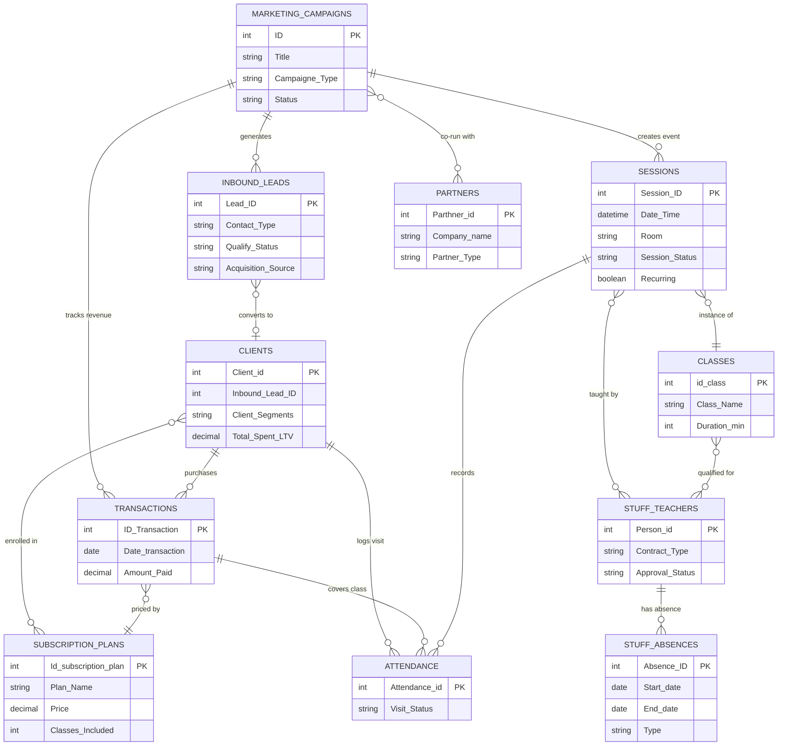

# 🗄️ Database Schema — Studio Operations Platform

> One Airtable base. **11 tables** covering every operational layer of the studio — staff and contracts, leads and clients, sessions and attendance, subscriptions and transactions, campaigns and partners. All 5 role-scoped interfaces draw from this single source of truth. Data enters once and flows automatically to wherever it's needed.

> ⚠️ **Data Privacy Note:** All records are synthetically generated for demonstration purposes only. Names, contact details, and financial figures are fictional.

**Contents:** [🗂️ Database Sectors](#sectors) · [🖥️ Interface & Stakeholder Map](#interface-map) · [🔗 ER Diagram](#erd) · [📋 Tables at a Glance](#tables) · [📁 Table Descriptions](#descriptions)

---

## 🗂️ Database Sectors

The 11 tables are organized around four functional sectors — each feeding the interfaces relevant to that domain:

**💼 Growth & Acquisition** — `Marketing_Campaigns` · `Inbound_Leads` · `Partners`
Campaign performance, lead capture, UTM attribution, and partner relationships. Feeds the Sales Ops Hub and Marketing Ops Hub.

**👤 Client Operations** — `Clients` · `Transactions` · `SubscriptionPlans` · `Attendance`
The full client lifecycle — from first visit through LTV tracking. Feeds the Sales Ops Hub and Check-in & Operations Hub.

**🗓️ Scheduling & Classes** — `Sessions` · `Classes`
Studio timetable — individual class instances, capacity, recurring logic, and the class catalogue with qualified teacher rosters. Feeds the Check-in & Operations Hub.

**🧑‍💼 HR & Staff** — `Stuff & Teachers` · `Stuff_Absences`
Contracts, specializations, absences, and teacher-to-class assignments. Feeds the Studio HR Hub.

---

## 🖥️ Interface & Stakeholder Map

> No team member has direct access to any raw Airtable table or underlying data. Every workflow runs exclusively through a purpose-built, role-scoped interface — each stakeholder sees only the data and actions relevant to their role.

| Interface | Stakeholder | Mission | Operational scope | Governance |
|---|---|---|---|---|
| **💼 Sales Ops Hub** | Sales Manager · Studio Admin | Qualify leads through the funnel, monitor client health and retention | `Inbound_Leads` · `Clients` · `Marketing_Campaigns` (attribution view only) | Sales Manager owns the acquisition funnel. Admin has equivalent access for walk-in leads and spam screening. |
| **🏢 Check-in & Operations Hub** | Studio Admin | Front desk — register clients, sell plans, log attendance, manage the studio calendar | `Clients` · `Transactions` · `SubscriptionPlans` · `Sessions` · `Classes` · `Attendance` | Admin owns all front-desk and scheduling workflows. Marketing has view access to the studio calendar events only. |
| **🧑‍💼 Studio HR Hub** | HR Manager · Admin (read) | Manage contracts, onboarding, teacher specializations, and absence tracking | `Stuff & Teachers` · `Stuff_Absences` · `Classes` (teacher assignment view) | HR Manager owns. Admin has read access to absence and scheduling views only — no contract or hiring data. |
| **📣 Marketing Ops Hub** | Marketing Manager | Run campaigns, manage UTM links, coordinate events and partner relationships | `Marketing_Campaigns` · `Inbound_Leads` (read, attribution only) · `Partners` · `Sessions` (event calendar) | Marketing Manager owns. Campaign and partner data are not accessible to other roles. |
| **🌐 Web Operations Hub** | Marketing Manager | Publish events and gallery content to the live website with one toggle | `Marketing_Campaigns` (content publishing fields only) | Toggle-based publish/unpublish only. No access to operational data, leads, clients, or raw content editing. |

---

## 🔗 Entity Relationship Diagram

Primary keys, relationships, and cardinality. Lookup and rollup fields omitted — they derive from the links shown here.

---

## 📋 Tables at a Glance

| Table | Role | Automations | Interface |
|---|---|---|---|
| `Marketing_Campaigns` | Campaigns, events, UTM links, website content, ROI | [Auto #13](../automations/airtable/operations-scheduling-README.md) · [Make: Event Publishing](../automations/make/website-sync-README.md) · [Make: Instagram Sync](../automations/make/instagram-gallery-sync-README.md) | 📣 Marketing Ops · 🌐 Web Ops |
| `Inbound_Leads` | All inquiries before conversion — CRM pipeline | [Auto #7–11](../automations/airtable/crm-lead-management-README.md) · [Make: Lead Capture](../automations/make/inbound-leads-README.md) | 💼 Sales Ops |
| `Clients` | Converted clients — lifecycle, segments, LTV | [Auto #7](../automations/airtable/crm-lead-management-README.md) (created on lead conversion) | 💼 Sales Ops · 🏢 Check-in |
| `Transactions` | Financial records — payments per plan | [Auto #14](../automations/airtable/finance-transactions-README.md) (created on form submit) | 🏢 Check-in |
| `SubscriptionPlans` | Plan catalogue — pricing, class limits, validity | — | 🏢 Check-in |
| `Sessions` | Studio timetable — class instances, capacity | [Auto #12](../automations/airtable/operations-scheduling-README.md) (recurring) · [Auto #13](../automations/airtable/operations-scheduling-README.md) (event sync) | 🏢 Check-in |
| `Classes` | Class catalogue — types, qualified teacher roster | [Auto #5–6](../automations/airtable/hr-staff-management-README.md) (teacher assignment) | 🏢 Check-in · 🧑‍💼 HR |
| `Stuff & Teachers` | HR — contracts, specializations, approval | [Auto #1–6](../automations/airtable/hr-staff-management-README.md) (renewal state machine + teacher sync) | 🧑‍💼 HR |
| `Attendance` | Visit records — client × session × transaction | — | 🏢 Check-in |
| `Stuff_Absences` | Staff absence tracking | — | 🧑‍💼 HR |
| `Partners` | Partner directory — referrals, co-marketing | — | 📣 Marketing Ops |

---

## 📁 Table Descriptions

### `Marketing_Campaigns`
The origin point for growth. Stores every campaign — Instagram posts, website events, partner activations, ads. Each record generates a UTM-tracked link that attributes inbound leads automatically. When a campaign is an event, it creates a `Session` record in the studio calendar and links to `SubscriptionPlans` for ticketing. Revenue, ROI, and conversion rates are calculated directly from linked leads and transactions. Content publishing fields (`Display_on_Website`, `Cloudinary_URL`, translated titles/descriptions) feed the Make website publishing pipeline.

**Automations:** [Auto #13 — Sync Event to Studio Calendar](../automations/airtable/operations-scheduling-README.md) · [Make: Event Publishing](../automations/make/website-sync-README.md) · [Make: Instagram Sync](../automations/make/instagram-gallery-sync-README.md)

---

### `Inbound_Leads`
Every incoming inquiry — from the website form, Instagram DMs, walk-ins, or partner referrals — lands here before conversion. The sales manager qualifies each record through the MQL → SQL → Positive pipeline. `Qualify_Status = Positive` triggers the lead migration automation, which creates a fully populated record in `Clients`, `Stuff & Teachers`, or `Partners` depending on `Contact_Type`. The original lead record is preserved and linked.

**Key fields:** `Lead_ID` · `Contact_Type` · `Qualify_Status` · `System_Status` (formula, drives Kanban grouping) · `Acquisition_Campaign` (FK → `Marketing_Campaigns`)

**Automations:** [Auto #7–11 — CRM Lead Management](../automations/airtable/crm-lead-management-README.md) · [Make: Inbound Lead Capture](../automations/make/inbound-leads-README.md)

---

### `Clients`
Converted clients — every record originates from a qualified lead. Stores contact info, subscription state, and full lifecycle metrics calculated by formula: segment classification (💎 VIP / ⭐ Regular / ⚠️ Churn Risk / 💀 Churn), LTV, visit count, last visit, and subscription validity. `Inbound_Lead_ID` references the originating lead record.

**Key calculated fields:** `Client_Segments` · `Client_Lifecycle` · `Total Spent(LTV)` · `Total Visits` · `Last Visit` · `Subscription_status` · `Days_to_Convert`

**Automations:** [Auto #7 — Lead Migration: Client](../automations/airtable/crm-lead-management-README.md) (record created automatically on lead conversion)

---

### `Transactions`
One record per sale. Created automatically when an admin submits the New Client Registration form. Each transaction links a client to a subscription plan and tracks classes remaining. `Attendance` records link back here to decrement the balance as classes are used.

**Key fields:** `ID_Transaction` · `Client` (FK → `Clients`) · `Subscription Plan` (FK → `SubscriptionPlans`) · `Remaining Classes` (formula)

**Automations:** [Auto #14 — Sync Transactions to New Client](../automations/airtable/finance-transactions-README.md) (created automatically on form submit)

---

### `SubscriptionPlans`
The plan catalogue — 7 plans from Trial (free) to 6-Month Unlimited. Each plan defines price, classes included, and validity period. Transactions reference this table for pricing; the client's balance and subscription end date are calculated from here.

| Plan | Price | Classes | Validity |
|---|---|---|---|
| Trial | $0 | 1 | 1 month |
| Single Drop-in | $15 | 1 | 1 month |
| 4-Class Pass | $50 | 4 | 2 months |
| 8-Class Pass | $80 | 8 | 3 months |
| 1-Month Unlimited | $100 | 35 | 4 months |
| 6-Month Unlimited | $450 | 200 | 8 months |
| Special Event Ticket | $50 | 1 | 1 month |

---

### `Sessions`
Individual class instances — the studio timetable. Each session is an instance of a `Class`, assigned to a primary teacher from `Stuff & Teachers`, timestamped and assigned a room. When `Session_Status = Completed` and `Recurring = ✅`, the next session is generated automatically. Event sessions link back to `Marketing_Campaigns`.

**Key fields:** `Session_ID` · `Class_Link` (FK → `Classes`) · `Primary teacher` (FK → `Stuff & Teachers`) · `If_Event` (FK → `Marketing_Campaigns`) · `Session_Status` · `Recurring`

**Automations:** [Auto #12 — Recurring Sessions Generator](../automations/airtable/operations-scheduling-README.md) · [Auto #13 — Sync Event to Studio Calendar](../automations/airtable/operations-scheduling-README.md)

---

### `Classes`
The class catalogue — yoga styles and formats. Each record defines type, duration, and which teachers are qualified to teach it. Sessions are instances of classes. The `Qualified Teachers` link to `Stuff & Teachers` drives automatic teacher-to-class assignment when a teacher is approved or their specialization updated.

**Automations:** [Auto #5 — Teacher Approval to Class Workflow](../automations/airtable/hr-staff-management-README.md) · [Auto #6 — Update Teacher Sync Class](../automations/airtable/hr-staff-management-README.md)

---

### `Stuff & Teachers`
The central HR record for every team member — teachers, office staff, and candidates. Tracks contract type (CDI/CDD), specialization, approval status, and renewal progress. The 4-stage contract renewal state machine advances CDD records automatically based on dates and field conditions. Session assignments, substitutions, and absences all link here.

**Key calculated fields:** `Contract_status` · `CDD_Days_until_expiration` · `NEW:Approval Status` · `Total_Sessions_Taught` · `Avg_Class_Fill_Rate`

**Automations:** [Auto #1–4 — Contract Renewal State Machine](../automations/airtable/hr-staff-management-README.md) · [Auto #5–6 — Teacher Sync](../automations/airtable/hr-staff-management-README.md)

---

### `Attendance`
The junction table connecting clients, sessions, and transactions. One record per client per session. Tracks visit status (Attended / No-Show / Cancelled) and links to the transaction that covers the visit. Rollups from here populate `Total Visits` on `Clients` and `Attendance_Count` on `Sessions`.

**Key fields:** `Attendance_id` · `Client` (FK → `Clients`) · `Session` (FK → `Sessions`) · `Transactions` (FK → `Transactions`) · `Visit_Status`

---

### `Stuff_Absences`
Absence records for all staff — sick leave, vacation, other. Each record links to the employee in `Stuff & Teachers` and stores start/end dates and type. The `Is_Today` formula flags active absences, which rolls up to the HR manager's absence tracking view.

---

### `Partners`
Partner directory — studios, brands, and collaborators. Each partner links to campaigns they co-run and leads they referred. Managed by the marketing manager through the Marketing Ops Hub.

---

*[← Back to Architecture](./hld.md)* · *[← Back to main README](../README.md)* · *[🖥️ Interfaces](../interfaces/interfaces-README.md)* · *[⚙️ Automations](../automations/automations-README.md)*
