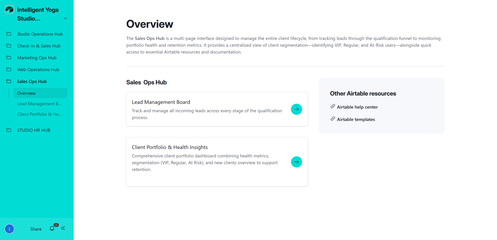
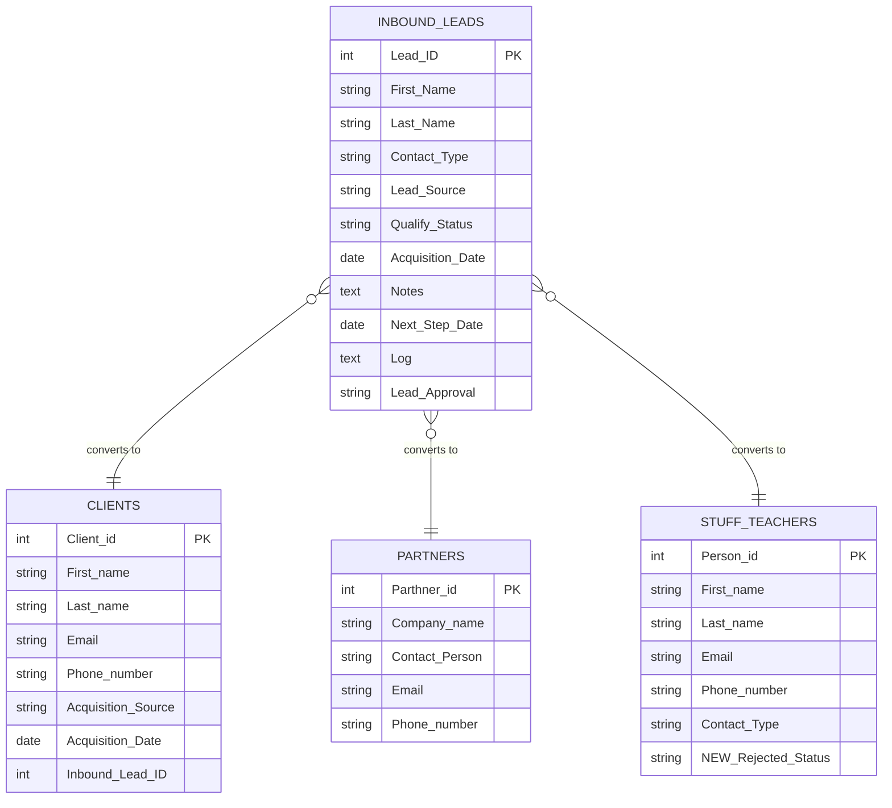

# 📁 CRM (Customer Relationship Management) & Lead Management

> **5 native Airtable automations** covering the full lead qualification lifecycle — from incoming inquiry to converted record, with automatic activity logging throughout.

**Contents:** [💡 What This Module Does](#what-it-does) · [🖥️ Interface](#interface) · [🎬 Demo](#demo) · [⚡ Automation Overview](#automation-overview) · [🔬 Technical Deep Dive](#technical-deep-dive)

---

<a id="what-it-does"></a>
## 💡 What This Module Does

**Qualified leads are instantly routed to the right table.** When a lead is marked Positive, the correct record is created automatically in `Clients`, `Partners`, or `Stuff & Teachers` — based on the lead's contact type — with all contact data pre-filled. Sales never needs to manually copy information across tables.

**Every sales interaction is logged and never lost.** Each time a rep adds notes and a follow-up date to a lead card, the system archives the interaction to a running activity log automatically. Notes are cleared when the follow-up date passes, keeping the card clean while preserving the full history.

---

<a id="interface"></a>
## 🖥️ Interface

All 5 CRM automations are managed through a single interface.

### Sales Ops Hub

The primary sales workspace. Sales managers use this interface to qualify leads, manage follow-ups, and monitor the client portfolio.

| Page | What the user does here | Automations triggered |
|---|---|---|
| **📋 Lead Management Board** | Kanban board across all qualification statuses. Opens lead cards to review contact details, add notes, set follow-up dates, and set `Qualify_Status = Positive` to convert. | LEAD MIGRATION: Clients (1), Partners (2), Stuff (3), Teachers (4), Archive Notes (5) |
| **📊 Client Portfolio & Health Insights** | Client segmentation dashboard — tracks VIP, Regular, At-Risk, and Churned clients. Subscription health, visit frequency, and LTV across the full base. | — |
| **🏠 Overview** | Sales performance summary — lead counts by status, recent conversions, key retention metrics. Quick links to resources. | — (read-only overview) |

> 📌 **Roadmap:** The Lead Management Board will be split into two dedicated pipelines — **HR Pipeline** (Teachers & Staff) and **Commerce Pipeline** (Clients & Partners) — to better reflect the distinct workflows for each contact type.

---

<a id="demo"></a>
## 🎬 Demo

### Lead Management Board

[](../../assets/interfaces/6_CRM_overview.png)

[](../../assets/interfaces/CRM_lead_management_board-ezgif.com-video-to-gif-converter.gif)

*Kanban board across all qualification stages — MQL, Not Reached, SQL, Positive. Sales opens a lead card, reviews details, adds notes, sets follow-up date, and converts with one status change.*

→ [Full workflow — Sales Ops Hub](../../interfaces/sales-ops-hub-README.md)

---

### 👤 User Workflows

[](../../assets/interfaces/5.CRM_Workflows.png)

Leads arrive in `Inbound_Leads` — from Instagram, website, referral, event, or entered manually.

- **Sales reviews** the lead on the Lead Management Board (Kanban) → moves through statuses: MQL → Not Reached → SQL
- **Sales opens the lead card** → reviews contact details, lead type, original message → uses `Lead_Approval` to approve or reject → adds Notes and sets `Next_Step_Date` for follow-up → **[5] Archive Notes fires** → interaction logged automatically
- **When lead is ready** → Sales sets `Qualify_Status = Positive` → correct migration automation fires instantly:
  - `Contact_Type = Client` → **[1]** fires → record created in `Clients`
  - `Contact_Type = Partner` → **[2]** fires → record created in `Partners`
  - `Contact_Type = Hiring_Stuff` → **[3]** fires → record created in `Stuff & Teachers`
  - `Contact_Type = Yoga_Teacher` → **[4]** fires → record created in `Stuff & Teachers` + `Contact Type = Yoga_Teacher` set
- Lead remains in `Inbound_Leads` for attribution tracking

**Activity Log Automation**

Every sales interaction is preserved automatically. When a rep fills in Notes and sets a `Next_Step_Date` on a lead card, **[5] Archive Notes** fires instantly — appending the timestamp, notes content, and follow-up date to a running `Log` field. When the follow-up date arrives or passes, the Notes field is cleared so the card is ready for the next interaction. The log entry is never overwritten — every touchpoint in the sales cycle is permanently recorded and visible in the lead card.

---

### Client Portfolio & Health Insights

[](../../assets/interfaces/CRM_Clients_Protfolio.mp4)

*Client segmentation view — VIP, Regular, At-Risk, Churned. Subscription health, visit frequency, and LTV across the full client base. Segments are calculated automatically by formula fields — no automation required.*

→ [Full workflow — Sales Ops Hub](../../interfaces/sales-ops-hub-README.md)

---

<a id="automation-overview"></a>
## ⚡ Automation Overview

5 automations covering two independent pipelines:

**Lead Migration Pipeline (automations 1–4)** — a routing mechanism. When a lead reaches `Qualify_Status = Positive`, one of four automations fires based on `Contact_Type` — instantly creating a fully populated record in the correct destination table. The lead itself stays in `Inbound_Leads` for attribution tracking.

**Activity Log Automation (automation 5)** — a logging mechanism. Every time a sales rep fills in notes and a next step date, the system archives the interaction to a running log field and clears the notes when the follow-up date arrives.

| # | Automation | Trigger | Source Table | Destination Table | Interface |
|---|---|---|---|---|---|
| 1 | LEAD MIGRATION: Clients | `Qualify_Status = Positive` + `Contact_Type = Client` | `Inbound_Leads` | `Clients` | Sales Ops Hub → Lead Management Board |
| 2 | LEAD MIGRATION: Partners | `Qualify_Status = Positive` + `Contact_Type = Partner` | `Inbound_Leads` | `Partners` | Sales Ops Hub → Lead Management Board |
| 3 | LEAD MIGRATION: Stuff | `Qualify_Status = Positive` + `Contact_Type = Hiring_Stuff` | `Inbound_Leads` | `Stuff & Teachers` | Sales Ops Hub → Lead Management Board |
| 4 | LEAD MIGRATION: Teachers | `Qualify_Status = Positive` + `Contact_Type = Yoga_Teacher` | `Inbound_Leads` | `Stuff & Teachers` | Sales Ops Hub → Lead Management Board |
| 5 | Lead Management: Archive Notes | `Notes` + `Next_Step_Date` both filled | `Inbound_Leads` | `Inbound_Leads` | Sales Ops Hub → Lead Management Board |

---

<a id="technical-deep-dive"></a>
## 🔬 Technical Deep Dive

### Tables Involved



---

### Lead Migration Pipeline — Flow

```
Inbound Lead → Qualify_Status = Positive
                        ↓
        ┌───────────────┼───────────────────┐
        │               │                   │                │
Contact_Type      Contact_Type        Contact_Type      Contact_Type
= Client          = Partner           = Hiring_Stuff    = Yoga_Teacher
        │               │                   │                │
        ↓               ↓                   ↓                ↓
  [1] CREATE       [2] CREATE          [3] CREATE        [4] CREATE
  record in        record in           record in         record in
  Clients          Partners            Stuff &           Stuff &
                                       Teachers          Teachers
                                                      (+ Contact Type
                                                       = Yoga_Teacher)
```

---

### Activity Log — Flow

```
Sales adds Notes + Next_Step_Date to lead card
                    ↓
        Action 1 — Always: Archive to Log
        Log field updated with:
        ✅ [RECORD IS UPDATED ON] {timestamp}
        📝 [LAST UPDATE DETAILS] : {Notes}
        📅 [NEXT STEP DATE] : {Next_Step_Date}
        🔄 [PREVIOUS ACTIONS DETAILS] : {Log}
                    ↓
        Next_Step_Date reaches today or passes
                    ↓
        Action 2 — Conditional: Clear Notes
        Notes field → empty
        (Log entry preserved)
```

---

### Automation 1 — LEAD MIGRATION: Clients

**Trigger:** Record matches conditions in `Inbound_Leads`
**Condition:** `Qualify_Status = Positive` AND `Contact_Type = Client`

**Action:** Creates record in `Clients`:

| Destination Field | Source Field |
|---|---|
| `First_name` | `First_Name` |
| `Last_name` | `Last_Name` |
| `Phone_number` | `Phone_number` |
| `Email` | `Email` |
| `Acquisition Source` | `Lead_Source` |
| `Acquisition_Date` | `Acquisition_Date` |
| `Inbound_Lead_ID` | `Lead_ID` |

**What this replaces:** Manually copying lead data into a new client record after qualification.

---

### Automation 2 — LEAD MIGRATION: Partners

**Trigger:** Record matches conditions in `Inbound_Leads`
**Condition:** `Qualify_Status = Positive` AND `Contact_Type = Partner`

**Action:** Creates record in `Partners`:

| Destination Field | Source Field |
|---|---|
| `Company_name` | `Company_name` |
| `Contact Person` | `First_Name` + `Last_Name` |
| `Email` | `Email` |
| `Phone number` | `Phone_number` |

**What this replaces:** Manually creating a partner record after a lead is approved.

---

### Automation 3 — LEAD MIGRATION: Stuff

**Trigger:** Record matches conditions in `Inbound_Leads`
**Condition:** `Qualify_Status = Positive` AND `Contact_Type = Hiring_Stuff`

**Action:** Creates record in `Stuff & Teachers`:

| Destination Field | Source Field |
|---|---|
| `First_name` | `First_Name` |
| `Last_name` | `Last_Name` |
| `Phone_number` | `Phone_number` |
| `Email` | `Email` |
| `NEW:Rejected_Status` | `Not Rejected` (hardcoded) |

**What this replaces:** Manually onboarding a new staff hire from a qualified lead.

---

### Automation 4 — LEAD MIGRATION: Teachers

**Trigger:** Record matches conditions in `Inbound_Leads`
**Condition:** `Qualify_Status = Positive` AND `Contact_Type = Yoga_Teacher`

**Action:** Creates record in `Stuff & Teachers`:

| Destination Field | Source Field |
|---|---|
| `First_name` | `First_Name` |
| `Last_name` | `Last_Name` |
| `Phone_number` | `Phone_number` |
| `Email` | `Email` |
| `NEW:Rejected_Status` | `Not Rejected` (hardcoded) |
| `Contact Type` | `Yoga_Teacher` (hardcoded) |

**What this replaces:** Manually creating a teacher record after qualification. Once created, the teacher record enters the **Teacher → Class Assignment** pipeline automatically. See [HR & Staff Management](./hr-staff-management-README.md).

---

### Automation 5 — Lead Management: Archive Notes to Activity Log

**Trigger:** Record matches conditions in `Inbound_Leads`
**Condition:** `Notes` is not empty AND `Next_Step_Date` is not empty

**Action 1 — Always:** Updates `Log` field in `Inbound_Leads`:

```
✅ [RECORD IS UPDATED ON] {Actual run time}

📝 [LAST UPDATE DETAILS] : {Notes}

📅 [NEXT STEP DATE] : {Next_Step_Date}

🔄 [PREVIOUS ACTIONS DETAILS] : {Log}
```

**Action 2 — Conditional:** If `Next_Step_Date` is on or before today:
- `Notes` → cleared

**What this replaces:** Manually copying notes into a log and clearing the field for the next follow-up.

---

### Key Fields

| Field | Type | Description |
|---|---|---|
| `Qualify_Status` | Single select | `MQL` → `Not Reached` → `SQL` → `Positive` / `Rejected` |
| `Contact_Type` | Single select | `Client` / `Partner` / `Hiring_Stuff` / `Yoga_Teacher` / `Event_Registrant` |
| `Lead_Source` | Single select | Instagram, Telegram, Website, Referral, Event, LinkedIn, Maps, Other |
| `Lead_Approval` | Single select | Approve or reject a lead from the board |
| `Notes` | Text | Sales rep interaction notes — triggers Activity Log automation |
| `Next_Step_Date` | Date | Follow-up date — triggers log archive + note clear |
| `Log` | Long text | Running activity log — appended automatically on each update |
| `Acquisition_Date` | Date | Date lead entered the database |

---

*[← Back to Airtable Automations](./airtable-README.md)* · *[💼 Sales Ops Hub — interface README](../../interfaces/sales-ops-hub-README.md)* · *[← Back to main project README](../../README.md)*
