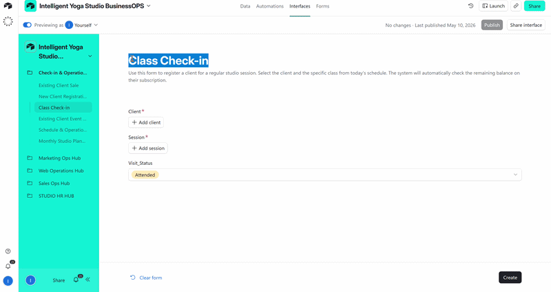
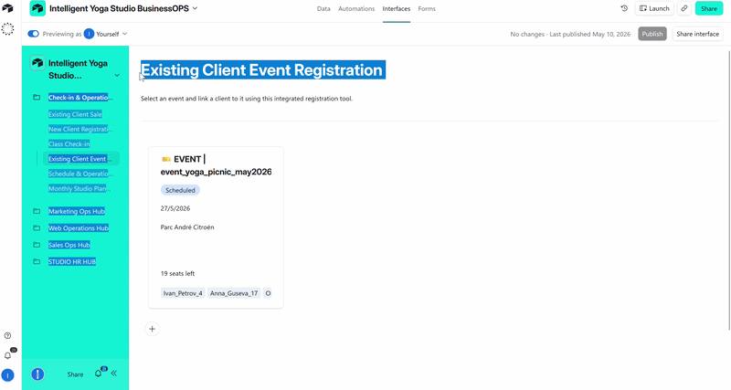
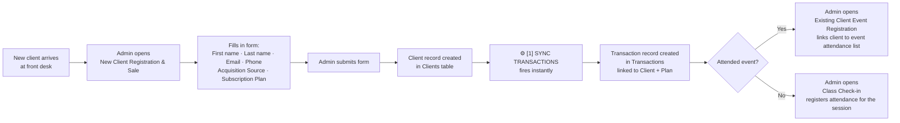
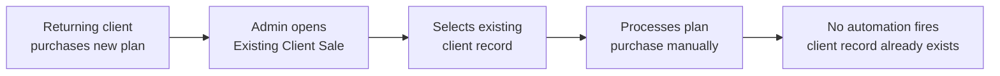
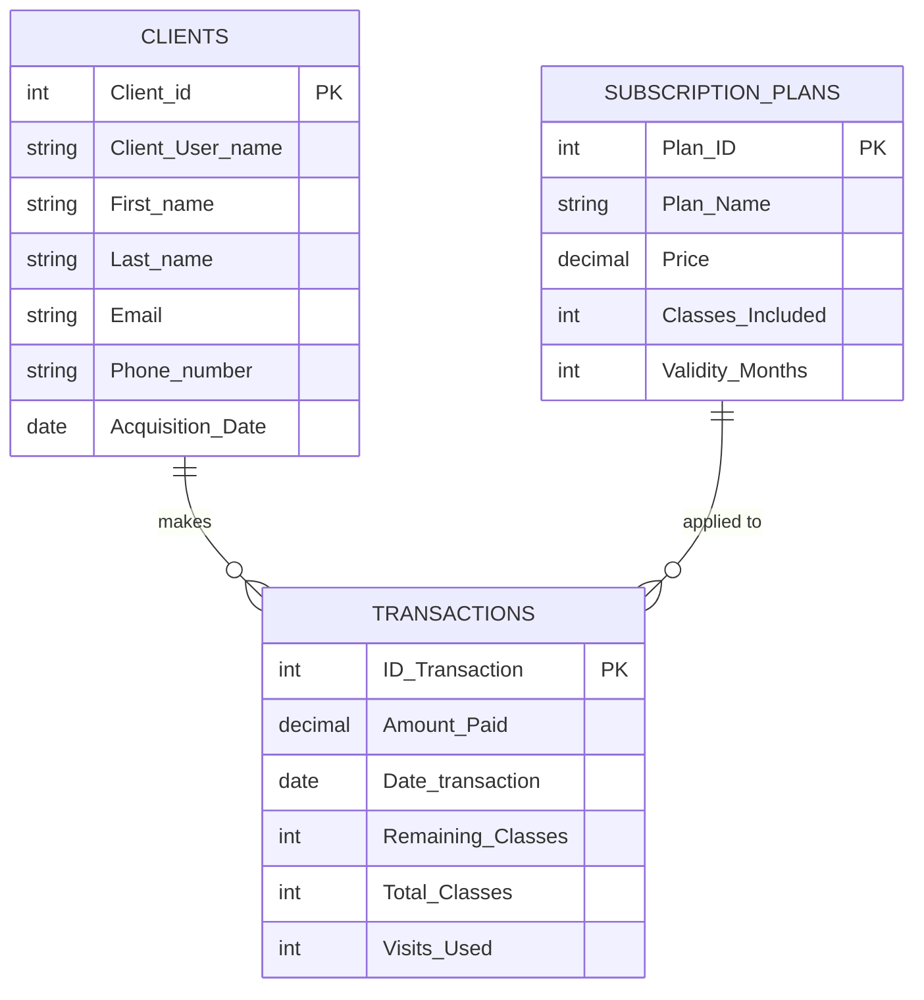

# 📁 Finance & Transactions

> **1 native Airtable automation** triggered by a form submission — instantly creating a linked transaction record when a new client is registered and a subscription plan is sold.

**Contents:** [💡 What This Module Does](#what-it-does) · [🎬 Demo](#demo) · [🖥️ Interface](#interface) · [👤 User Workflows](#user-workflows) · [⚡ Automation Overview](#automation-overview) · [🔬 Technical Deep Dive](#technical-deep-dive)

---

<a id="what-it-does"></a>
## 💡 What This Module Does

From a business perspective, this module solves one critical front-desk problem:

**A sale is never registered without a transaction.** When an admin registers a new client and sells them a subscription plan at the front desk, a transaction record is created automatically the moment the form is submitted — linked to both the client and the plan. The admin fills in one form; the system handles both the client record and the financial entry simultaneously.

Without this automation, the registration and the sale would need to be entered separately — creating a gap where a client could be onboarded but their payment never recorded.

---

<a id="demo"></a>
## 🎬 Demo

### New Client Registration & Sale

[](../../assets/interfaces/7.OPS_Hub_New_Client_Sale.png)

[](../../assets/interfaces/OPS_HUB_Class_Check_In-ezgif.com-video-to-gif-converter.gif)

*Admin submits the New Client Registration form — client record and transaction are created simultaneously. Admin proceeds to class check-in to log attendance.*

[](../../assets/interfaces/OPS_Hub_Event_Checkin-ezgif.com-video-to-gif-converter.gif)

*If the client attended an event — admin links them to the event attendance list directly from Check-in & Operations Hub.*

→ [Full workflow — Check-in & Operations Hub](../../interfaces/checkin-operations-hub-README.md)

---

### Returning Client Sale

[](../../assets/interfaces/Ops_HUB_existing_client_sale.mp4)

*Plan renewal or upgrade for an existing client — no form, no automation fires. Admin processes the sale manually from the Existing Client Sale page.*

→ [Full workflow — Check-in & Operations Hub](../../interfaces/checkin-operations-hub-README.md)

---

<a id="interface"></a>
## 🖥️ Interface

The automation is triggered and the post-registration workflow is managed entirely through one interface.

### Check-in & Operations Hub

The front-desk and session-ops workspace. Admins use this interface for all client-facing operations — registrations, plan sales, event sign-ups, and attendance check-ins.

| Page | What the user does here | Automations triggered |
|---|---|---|
| **🆕 New Client Registration & Sale** | Registers a first-time client and processes their initial plan purchase or event ticket. Fills in client details, selects subscription plan, submits the form. | SYNC TRANSACTIONS TO NEW CLIENT (1) |
| **📝 Existing Client Sale** | Processes plan renewals and upgrades for clients already in the system. Client record already exists — no new record is created. | — |
| **🎟️ Existing Client Event Registration** | Links an already-registered client to a specific event attendance list. Used after new client registration if the client attended an event. | — |
| **✅ Class Check-in** | Logs attendance for today's sessions. Used after registration to record who actually attended. | — |

---

<a id="automation-overview"></a>
## ⚡ Automation Overview

1 automation covering one transactional pipeline:

**New Client Transaction Sync (automation 1)** — a form-triggered creation. When the **New Client Registration & Sale** form is submitted, a client record appears in `Clients` and the automation immediately creates a matching record in `Transactions` — linking the client to their purchased subscription plan. Both records are created in a single admin action.

| # | Automation | Trigger | Source Table | Destination Table | Interface |
|---|---|---|---|---|---|
| 1 | SYNC TRANSACTIONS TO NEW CLIENT | Form `New Client Registration & Sale` submitted | `Clients` | `Transactions` | Check-in & Operations Hub → New Client Registration & Sale |

---

<a id="user-workflows"></a>
## 👤 User Workflows

### New Client Registration & Sale



### Returning Client Sale



---

<a id="technical-deep-dive"></a>
## 🔬 Technical Deep Dive

### Tables Involved



---

### New Client Transaction Sync — Flow

```
Administrator submits form:
"New Client Registration & Sale Classes/Events"
                ↓
Client record created in Clients table
                ↓
[1] SYNC TRANSACTIONS TO NEW CLIENT fires
                ↓
New record created in Transactions:
    ├── Client        → linked to new Client record
    └── Subscription Plan → linked to selected plan
```

---

### Automation 1 — SYNC TRANSACTIONS TO NEW CLIENT

**Trigger:** Form submitted — `New Client Registration & Sale Classes/Events`
**Table:** `Clients`

**Action:** Creates record in `Transactions`:

| Field | Value |
|---|---|
| `Client` | Linked to `Client_User_name` from submitted form |
| `Subscription Plan` | Linked to `Subscription_Plan` selected in form |

**What this replaces:** Admin manually creating a transaction record after registering a new client — a step that was often missed, leaving sales unrecorded.

---

### Form: New Client Registration & Sale Classes/Events

This is an **internal administrator form** used at the front desk when a new client walks in for the first time or registers at an event.

**Form fields:**

| Field | Description |
|---|---|
| First name, Last name | Client identity |
| Email, Phone | Contact details |
| Acquisition Source | How the client heard about the studio |
| Subscription Plan | Which plan they are purchasing — drives the linked transaction |
| Event Special Ticket | Selected instead of a plan if the client is an event attendee |

---

### Key Fields

| Field | Table | Type | Description |
|---|---|---|---|
| `Client_User_name` | `Clients` | Text | Unique client identifier — used to link the transaction |
| `Subscription Plan` | `Transactions` | Linked record | References `Subscription_Plans` table |
| `Amount_Paid` | `Transactions` | Currency | Payment amount — populated from plan price |
| `Total_Classes` | `Transactions` | Number | Classes included in the purchased plan |
| `Remaining_Classes` | `Transactions` | Formula | `Total_Classes - Visits_Used` |
| `Visits_Used` | `Transactions` | Rollup | COUNT of linked attendance records |
| `Date_transaction` | `Transactions` | Date | Date of purchase |
| `Plan_Name` | `Subscription_Plans` | Text | Name of the membership plan |
| `Price` | `Subscription_Plans` | Currency | Plan price — referenced in transaction |
| `Classes_Included` | `Subscription_Plans` | Number | Total classes per plan |
| `Validity_Months` | `Subscription_Plans` | Number | Plan duration in months |

---

*[← Back to Airtable Automations](./airtable-README.md)* · *[🏢 Check-in & Operations Hub — interface README](../../interfaces/checkin-operations-hub-README.md)* · *[← Back to main project README](../../README.md)*
