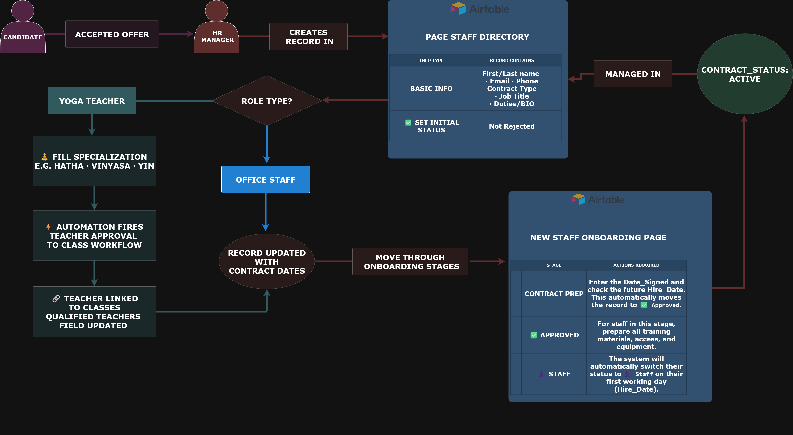
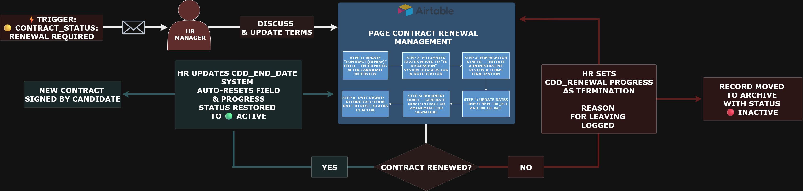
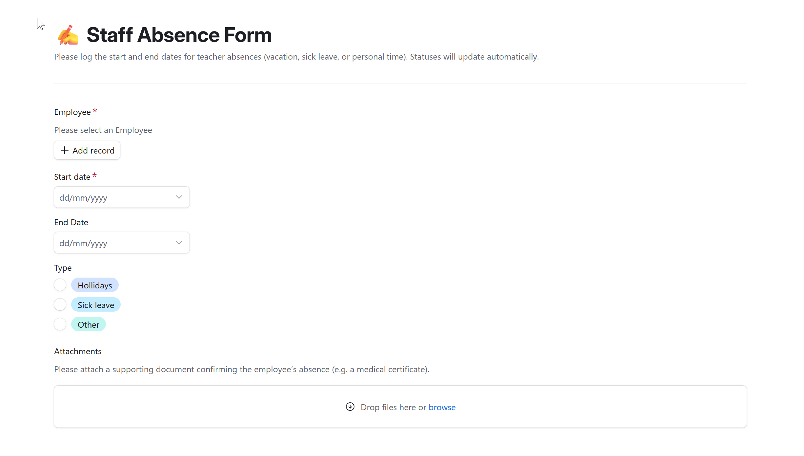
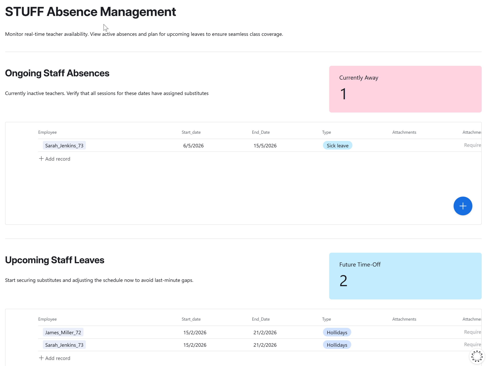
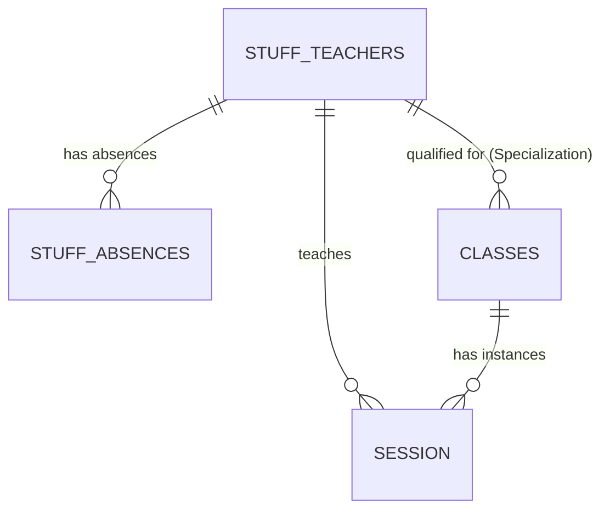

# 📁 HR & Staff Management

> **6 native Airtable automations** covering the full employee lifecycle — contract renewal tracking and teacher-class assignment synchronization. Onboarding and absence workflows are form- and pipeline-based with no automations required.

**Contents:** [💡 What This Module Does](#what-it-does) · [🎬 Demo](#demo) · [🖥️ Interfaces](#interface) · [👤 User Workflows](#user-workflows) · [⚡ Automation Overview](#automation-overview) · [🔬 Technical Deep Dive](#technical-deep-dive)

---

<a id="what-it-does"></a>
## 💡 What This Module Does

This module covers all people-operations workflows in one place:

- **👥 People Management** — employee record cards, new hire creation, all contact and contract details, teacher specialization management
- **🚀 Staff Onboarding** — structured pipeline from offer acceptance to first session (Offer Sent → Contract Signed → System Setup → First Session); form-based, no automations
- **🔄 Fixed-term contract renewal** — 4-automation state machine; HR writes a note, the system handles every stage transition
- **🔗 Teacher → Class sync** — 2 automations; teacher linked to classes automatically on approval or specialization change
- **📋 Absence logging & substitution planning** — form-based entry, report view for coverage planning; no automations

---

<a id="demo"></a>
## 🎬 Demo

### Staff Directory

[](../../assets/interfaces/HR_Staff_Directory.mp4)

*Create new hire records, manage teacher specializations, set approval status — triggers Teacher → Class assignment automatically.*

→ [Full workflow — Studio HR Hub](../../interfaces/studio-hr-hub-README.md#staff-directory)

---

### Staff Onboarding

[](../../assets/interfaces/HR_stuff_onboarding.mp4)

*New hire moves through the onboarding pipeline: Offer Sent → Contract Signed → System Setup → First Session.*

→ [Full workflow — Studio HR Hub](../../interfaces/studio-hr-hub-README.md#onboarding)

---

### Contract Renewal Management

[](../../assets/interfaces/HR_Contract_Renewal%20.mp4)

*HR writes a renewal note — the state machine handles every stage transition from In Discussion to Done or Termination.*

→ [Full workflow — Studio HR Hub](../../interfaces/studio-hr-hub-README.md#renewal)

---

<a id="interface"></a>
## 🖥️ Interfaces

### [Studio HR Hub](../../interfaces/studio-hr-hub-README.md)

The primary HR workspace. All 6 automations are triggered from here.

| Page | What the user does here | Automations triggered |
|---|---|---|
| **🚀 HR Control Center** | Daily overview — active staff count, pending renewals, onboarding pipeline status, current absences | — read-only |
| **📂 Staff Directory** | Creates new hire records, edits all staff details, manages teacher specializations, sets approval status | Teacher Approval to Class Workflow (5) · Update Teacher Sync Class (6) |
| **🔄 Contract Renewal Management** | Reviews employees with `🟡 Renewal Required` status, writes renewal notes, updates contract dates, marks termination | Auto-start Renewal (1) · Auto-mark Done (2) · Non-Renewal Auto-Close (3) · Finalize & Reset (4) |
| **⏳ New Staff Onboarding** | Moves new hires through the pipeline: Offer Sent → Contract Signed → System Setup → First Session | — manual pipeline |
| **✍️ Staff Absence Form** | Logs sick leave, holidays, and planned absences — creates a record in `Stuff_Absences` on submit | — form submit |
| **📋 Staff Absence Reporting** | Overview of all absences — past, current, upcoming — for substitution planning | — read-only |

---

<a id="automation-overview"></a>
## ⚡ Automation Overview

6 automations across two independent pipelines:

**Contract Renewal Pipeline (1–4)** — a sequential state machine. Each automation picks up where the previous left off. HR writes notes and makes the actual contract decision; the system handles all status transitions.

**Teacher → Class Sync (5–6)** — a sync mechanism. Keeps `Classes.Qualified Teachers` always current. Fires once on new teacher approval, and again on every specialization change.

| # | Automation | Trigger field | What it does |
|---|---|---|---|
| 1 | [HR] Auto-start Renewal | `Update on Contract(Renew)` updated | `CDD_Renewal Progress` → `In Discussion` · logs timestamp |
| 2 | Done: Auto-mark Renewal as Done | `CDD_End_Date` updated + conditions met | `CDD_Renewal Progress` → `Done` |
| 3 | Non-Renewal: Auto-Close | `CDD_Renewal Progress = Termination` + `Contract_status = Inactive` | Logs reason · archives record · Progress → `Done` |
| 4 | [HR] Renewal: Finalize & Reset | `CDD_Renewal Progress = Done` | Clears renewal notes · resets Progress → `Not Started` |
| 5 | Teacher Approval to Class Workflow | `Contact_Type = Yoga_Teacher` + `Specialization` filled + not rejected | Adds teacher to `Classes.Qualified Teachers` for all matching class types |
| 6 | Update Teacher Sync Class | `Specialization` field updated | Re-links teacher in `Classes.Qualified Teachers` for each updated specialization |

---

<a id="user-workflows"></a>
## 👤 User Workflows

### 👥 People Management — Staff Directory

HR creates a new hire record in the Staff Directory after a candidate accepts an offer. All contact and contract details are filled in one place. For teachers, filling `Specialization` triggers automation 5 — the teacher is linked to matching classes automatically. Ongoing: HR and admins edit records, update specializations, manage contract changes.

→ [Full workflow — Studio HR Hub](../../interfaces/studio-hr-hub-README.md#staff-directory)

---

### 🚀 Staff Onboarding

After the record is created in Staff Directory, the hire moves through the New Staff Onboarding pipeline. For yoga teachers, `Specialization` is filled first — automation 5 fires and links the teacher to all matching classes. Contract dates are then recorded. The hire moves through: **Offer Sent → Contract Signed → System Setup → First Session**. Once complete, `Contract_status` calculates to `🟢 Active`.

[](../../assets/interfaces/1.HR_Staff_Onboarding_workflow.png)

→ [Full workflow — Studio HR Hub](../../interfaces/studio-hr-hub-README.md#onboarding)

---

### 🔄 Fixed-Term Contract Renewal

Fixed-term employees appear on the Kanban board automatically when their contract is within 30 days of expiry — no manual flagging needed. HR writes a note → automation 1 fires (`In Discussion`). HR manages the negotiation and sends the contract. HR updates the end date → automation 2 fires (`Done`). If non-renewal, HR sets Termination → automations 3 and 4 close and reset the cycle.

[](../../assets/interfaces/2.HR_CONTRACT_RENEWAL_Workflow.png)

→ [Full workflow — Studio HR Hub](../../interfaces/studio-hr-hub-README.md#renewal)

---

### 📋 Absence Logging & Substitution Planning

All absences are logged through the **Staff Absence Form** — employee selected, dates set, type chosen (Sick Leave / Vacation / Personal), documentation attached if needed. On submit, a record is created in `Stuff_Absences` and linked to the employee card automatically. No automation fires — the form handles the record creation.

[](../../assets/interfaces/3.Stuff_absence_form.png)

The **Staff Absence Reporting** view shows all logged absences — past, current, and upcoming — for identifying coverage gaps and planning substitutions.

[](../../assets/interfaces/4.HR_absence_tracker.png)

→ [Full workflow — Studio HR Hub](../../interfaces/studio-hr-hub-README.md#absence)

---

<a id="technical-deep-dive"></a>
## 🔬 Technical Deep Dive

### Tables & Relationships



---

### Automation Detail

#### Automation 1 — [HR] Auto-start Renewal

**Trigger:** `Update on Contract(Renew)` updated in `Stuff & Teachers`
**Condition:** `Contract_status = 🟡 Renewal Required` AND `CDD_Renewal Progress = Not Started`
**Action:** `CDD_Renewal Progress` → `In Discussion` · `Discussion started on` → current timestamp

#### Automation 2 — Done: Auto-mark Renewal as Done

**Trigger:** `CDD_End_Date` updated in `Stuff & Teachers`
**Condition:** `Contract Type = CDD` AND `Contract_status = 🟢 Active` AND `CDD_Renewal Progress = Contract Sent`
**Action:** `CDD_Renewal Progress` → `Done` · logs renewal confirmation via `Helper_Log_Text`

#### Automation 3 — Non-Renewal: Auto-Close

**Trigger:** Record matches conditions in `Stuff & Teachers`
**Condition:** `CDD_Renewal Progress = Termination/Non-Renewal` AND `Contract_status = 🔴 Inactive (Terminated)`
**Action:** `CDD_Renewal Progress` → `Done` · logs `Reason_for_leaving` + final working day · moves to Archive

#### Automation 4 — [HR] Renewal: Finalize & Reset

**Trigger:** `CDD_Renewal Progress = Done` in `Stuff & Teachers`
**Action:** `Update on Contract(Renew)` → cleared (from `Helper_Log_Text`) · `CDD_Renewal Progress` → `Not Started`

#### Automation 5 — Teacher Approval to Class Workflow

**Trigger:** Record matches conditions in `Stuff & Teachers`
**Condition:** `Contact Type = Yoga_Teacher` AND `NEW:Approval Status` is empty AND `Specialization` is not empty
**Action:** `Classes.Qualified Teachers` → adds teacher's Airtable record ID for all matching class types

#### Automation 6 — Update Teacher Sync Class

**Trigger:** `Specialization` updated in `Stuff & Teachers` · View: 🧘‍♂️ [Teaching] Active Yoga Staff
**Action (looped):** finds records by `Person_id` · repeats for each `Specialization` item · updates `Classes.Qualified Teachers`

---

### Key Fields

| Field | Table | Type | Description |
|---|---|---|---|
| `Contract_status` | `Stuff & Teachers` | Formula | `🟢 Active` / `🟡 Renewal Required` / `🔴 Expired` / `🔴 Inactive` / `🟠 Termination Pending` |
| `CDD_Renewal Progress` | `Stuff & Teachers` | Single select | `Not Started` → `In Discussion` → `Contract Sent` → `Done` / `Termination` |
| `CDD_End_Date` | `Stuff & Teachers` | Date | Contract expiry — key trigger for status formula |
| `CDD_Days_until_expiration` | `Stuff & Teachers` | Formula | Days remaining or `🔴 Expired X days ago` |
| `Update on Contract(Renew)` | `Stuff & Teachers` | Text | HR notes — writing here triggers Auto-start |
| `Helper_Log_Text` | `Stuff & Teachers` | Formula | System-generated renewal log |
| `Specialization` | `Stuff & Teachers` | Linked | Drives which classes the teacher qualifies for |
| `Qualified Teachers` | `Classes` | Linked record | List of approved teachers per class type |
| `NEW:Approval Status` | `Stuff & Teachers` | Formula | Must be not-rejected for Automation 5 to fire |

---

### Formulas

#### `Contract_status`
```
IF(
  {NEW:Approval Status} = "❌ Rejected",
  "🔴 Inactive (Rejected)",
  IF({Contract Type} = "CDD",
    IF({CDD_Renewal Progress} = "⛔️ Termination",
      IF(IS_AFTER(TODAY(), {CDD_End_Date}), "🔴 Inactive (Terminated)", "🟠 Termination Pending"),
      IF(IS_AFTER(TODAY(), {CDD_End_Date}), "🔴 Expired",
        IF(DATETIME_DIFF({CDD_End_Date}, TODAY(), 'days') <= 30, "🟡 Renewal Required", "🟢 Active"))),
    IF({Contract Type} = "CDI",
      IF(AND({CDI_Termination_Date}, IS_BEFORE({CDI_Termination_Date}, TODAY())),
        "🔴 Inactive", "🟢 Active"),
      IF({Contract Type} = "Freelance", "🟢 Active", "⚪ No Status"))))
```

#### `CDD_Days_until_expiration`
```
IF(
  {CDD_End_Date},
  IF(DATETIME_DIFF({CDD_End_Date}, TODAY(), 'days') < 0,
    "🔴 Expired " & ABS(DATETIME_DIFF({CDD_End_Date}, TODAY(), 'days')) & " days ago",
    DATETIME_DIFF({CDD_End_Date}, TODAY(), 'days')),
  "no data")
```

---

*[← Back to Airtable Automations](./airtable-README.md)* · *[🧑‍💼 Studio HR Hub — interface README](../../interfaces/studio-hr-hub-README.md)*

*[← Back to main project README](../../README.md)*
