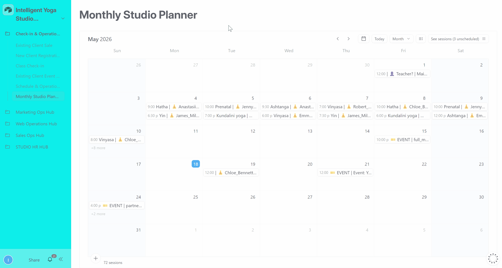
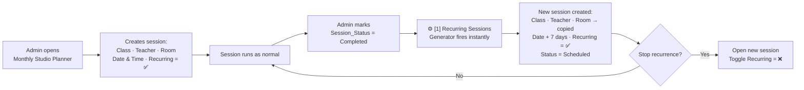
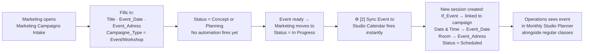
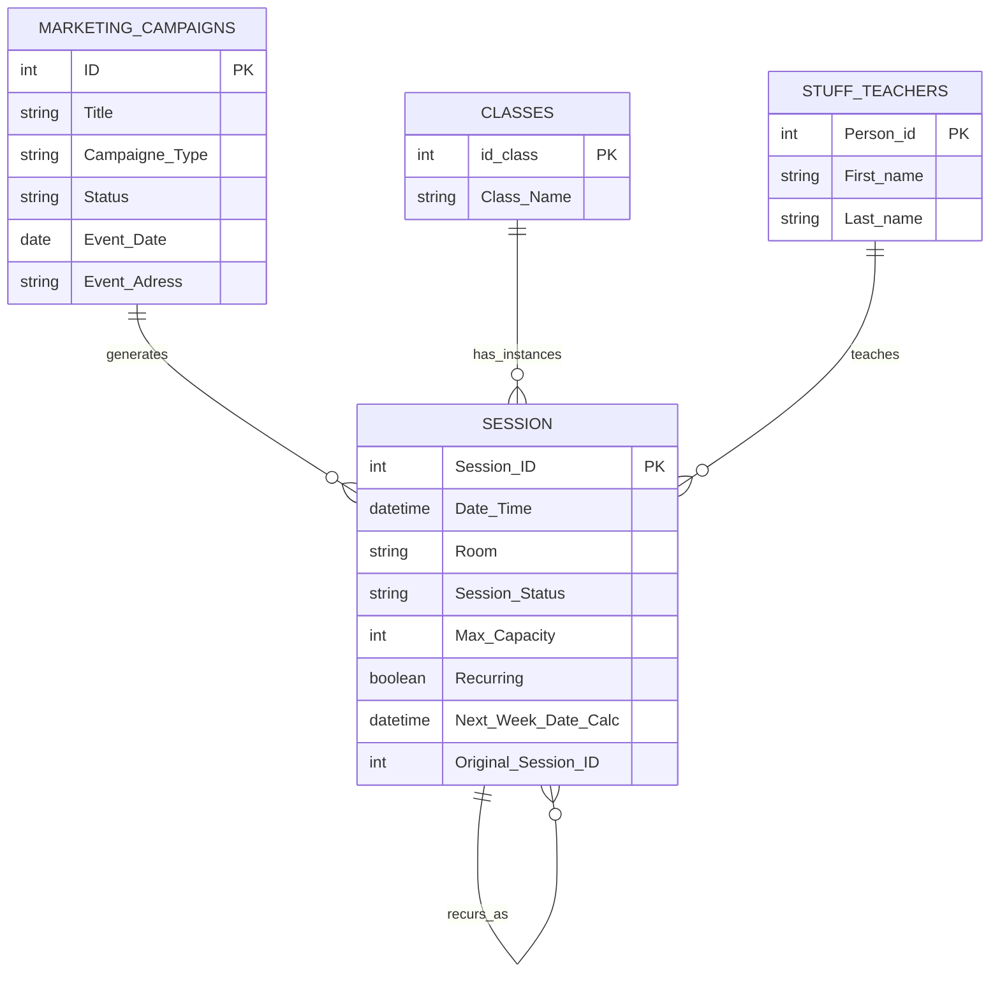

# 📁 Operations & Scheduling

> **2 native Airtable automations** handling class schedule continuity and event-to-calendar synchronization — keeping the studio timetable up to date without manual session creation.

**Contents:** [💡 What This Module Does](#what-it-does) · [🎬 Demo](#demo) · [🖥️ Interface](#interface) · [👤 User Workflows](#user-workflows) · [⚡ Automation Overview](#automation-overview) · [🔬 Technical Deep Dive](#technical-deep-dive)

---

<a id="what-it-does"></a>
## 💡 What This Module Does

From a business perspective, this module solves two recurring scheduling problems:

**Weekly classes continue without manual re-entry.** When a session is completed and marked as recurring, the next week's session is created automatically — same teacher, same room, same time slot, scheduled exactly 7 days later. Admin marks one session done; the next one appears immediately.

**Marketing events land in the studio calendar automatically.** When the marketing team moves a campaign to In Progress, a corresponding session is created in the studio timetable — so operations can see upcoming events alongside regular classes, assign teachers, and track attendance without any manual linking between the two teams.

---

<a id="demo"></a>
## 🎬 Demo

### Recurring Sessions Generator — Monthly Studio Planner

[](../../assets/interfaces/studio_planner.gif)

*Admin marks a session Completed with Recurring = ✅ — the next week's session appears immediately with all details carried over.*

→ [Full workflow — Check-in & Operations Hub](../../interfaces/checkin-operations-hub-README.md)

---

### Sync Event to Studio Calendar — Event Lifecycle Manager

*Marketing moves a campaign to In Progress — a session entry is created in the studio calendar automatically, visible to operations alongside regular classes.*

→ [Full workflow — Marketing Ops Hub](../../interfaces/marketing-ops-hub-README.md)

---

<a id="interface"></a>
## 🖥️ Interface

The 2 automations are managed across two interfaces used by different teams.

### Check-in & Operations Hub

The primary scheduling workspace. Admins manage the full session calendar and daily operations from here.

| Page | What the user does here | Automations triggered |
|---|---|---|
| **🗓️ Monthly Studio Planner** | Creates and manages sessions. Sets `Recurring` toggle for weekly classes. Marks `Session_Status = Completed` to close a session and trigger the next one. Shared with Marketing Team (events only). | Recurring Sessions Generator (1) |
| **📅 Schedule & Session Management** | Live session dashboard — KPI indicators, session grid. Admin confirms teachers, assigns substitutes, changes rooms, logs cancellations. | — |

### Marketing Ops Hub

Used by the marketing team for campaign and event management. Moving an event to In Progress here triggers the calendar sync.

| Page | What the user does here | Automations triggered |
|---|---|---|
| **📋 Event Lifecycle Manager** | Kanban pipeline across all campaign statuses. Moving a campaign to `In Progress` triggers the calendar sync automation. | Sync Event to Studio Calendar (2) |
| **📝 Marketing Campaigns Intake** | Form for registering new campaigns. Filling in `Event_Date` and selecting `Event/Workshop` type prepares the record for automation. | — (prepares trigger conditions) |
| **🤝 Partner Directory** | Full directory of studio partners and collaboration history. | — |
| **🏠 Overview** | Marketing performance summary — active campaigns, upcoming events, recent leads. | — |

---

<a id="automation-overview"></a>
## ⚡ Automation Overview

2 automations covering two independent scheduling pipelines:

**Recurring Sessions Generator (automation 1)** — a continuation mechanism. When a session is completed with the `Recurring` toggle enabled, the automation creates the next session 7 days later with all the same details carried over. The studio schedule maintains itself week to week.

**Sync Event to Studio Calendar (automation 2)** — a cross-team bridge. When the marketing team activates an event campaign, a session is automatically added to the operations calendar — keeping both teams aligned without manual coordination.

| # | Automation | Trigger | Source Table | Destination Table | Interface |
|---|---|---|---|---|---|
| 1 | Recurring Sessions Generator | `Session_Status = Completed` + `Recurring = ✅` | `Session` | `Session` | Check-in & Operations Hub → Monthly Studio Planner |
| 2 | Sync Event to Studio Calendar | Campaign `In Progress` + `Campaigne_Type = Event/Workshop` | `Marketing_Campaigns` | `Session` | Marketing Ops Hub → Event Lifecycle Manager |

---

<a id="user-workflows"></a>
## 👤 User Workflows

### Recurring Sessions Generator



### Sync Event to Studio Calendar



---

<a id="technical-deep-dive"></a>
## 🔬 Technical Deep Dive

### Tables Involved



---

### Recurring Sessions Generator — Flow

```
Session completed in Monthly Studio Planner
Recurring toggle = ✅
            ↓
[1] Recurring Sessions Generator fires
            ↓
New Session created in same table:
    ├── Class_Link        → copied from original
    ├── Primary Teacher   → copied from original
    ├── Room              → copied from original
    ├── Date & Time       → original + 7 days (Next_Week_Date_Calc)
    ├── Recurring         → ✅ (preserved for next cycle)
    ├── Session_Status    → Scheduled
    └── Original_Session_ID → linked to source session
```

---

### Sync Event to Studio Calendar — Flow

```
Marketing_Campaigns record:
    Event_Date is set
    + Status = In Progress
    + Campaigne_Type = Event/Workshop
            ↓
[2] Sync Event to Studio Calendar fires
            ↓
New Session created:
    ├── If_Event       → linked to Marketing_Campaigns record
    ├── Date & Time    → Event_Date
    ├── Room           → Event_Adress
    └── Session_Status → Scheduled
```

---

### Automation 1 — Recurring Sessions Generator

**Trigger:** Record matches conditions in `Session`
**Condition:** `Session_Status = Completed` AND `Recurring = ✅`

**Action:** Creates record in `Session`:

| Field | Value |
|---|---|
| `Class_Link` | Copied from original session |
| `Primary teacher` | Copied from original session |
| `Room` | Copied from original session |
| `Date & Time` | `Next_Week_Date_Calc` (original date + 7 days) |
| `Recurring` | `✅` (preserved for next cycle) |
| `Session_Status` | `Scheduled` |
| `Original_Session_ID` | Linked record ID of source session |

**What this replaces:** Manually creating next week's session after completing each one — a repetitive weekly task for every recurring class.

---

### Automation 2 — Sync Event to Studio Calendar

**Trigger:** Record matches conditions in `Marketing_Campaigns`
**Condition:** `Event_Date` is not empty AND `Status = In Progress` AND `Campaigne_Type = Event/Workshop`

**Action:** Creates record in `Session`:

| Field | Value |
|---|---|
| `If_Event` | Linked record ID from `Marketing_Campaigns` |
| `Date & Time` | `Event_Date` from campaign |
| `Room` | `Event_Adress` from campaign |
| `Session_Status` | `Scheduled` |

**What this replaces:** Marketing manually notifying operations of an upcoming event, and operations manually adding it to the studio calendar.

---

### Key Fields

| Field | Table | Type | Description |
|---|---|---|---|
| `Session_Status` | `Session` | Single select | `Scheduled` / `Confirmed` / `Completed` / `Cancelled` |
| `Recurring` | `Session` | Checkbox | When ✅ — triggers new session creation on completion |
| `Next_Week_Date_Calc` | `Session` | Formula | `DATEADD({Date & Time}, 7, 'days')` — pre-calculates next session date |
| `Original_Session_ID` | `Session` | Linked record | Traces recurring sessions back to their source |
| `Class_Link` | `Session` | Linked record | Links session to class type from `Classes` table |
| `Primary teacher` | `Session` | Linked record | Links session to teacher from `Stuff & Teachers` |
| `Room` | `Session` | Single select | `Main hall` / `Budda hall` / `Online` / `Outdoor` |
| `If_Event` | `Session` | Linked record | Links session to event campaign — set by Sync automation |
| `Campaigne_Type` | `Marketing_Campaigns` | Single select | Must be `Event/Workshop` to trigger calendar sync |
| `Event_Date` | `Marketing_Campaigns` | Date | Maps to `Date & Time` in new session |
| `Event_Adress` | `Marketing_Campaigns` | Text | Maps to `Room` in new session |

---

### Formula: `Next_Week_Date_Calc`

```
DATEADD({Date & Time}, 7, 'days')
```

Lives in the `Session` table. Calculates the next occurrence date automatically. The Recurring Sessions Generator reads this field at the moment of trigger to set the new session's `Date & Time`.

---

*[← Back to Airtable Automations](./airtable-README.md)* · *[← Back to main project README](../../README.md)*
