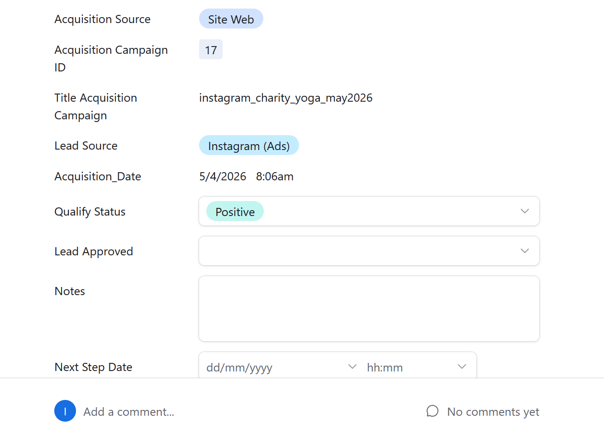
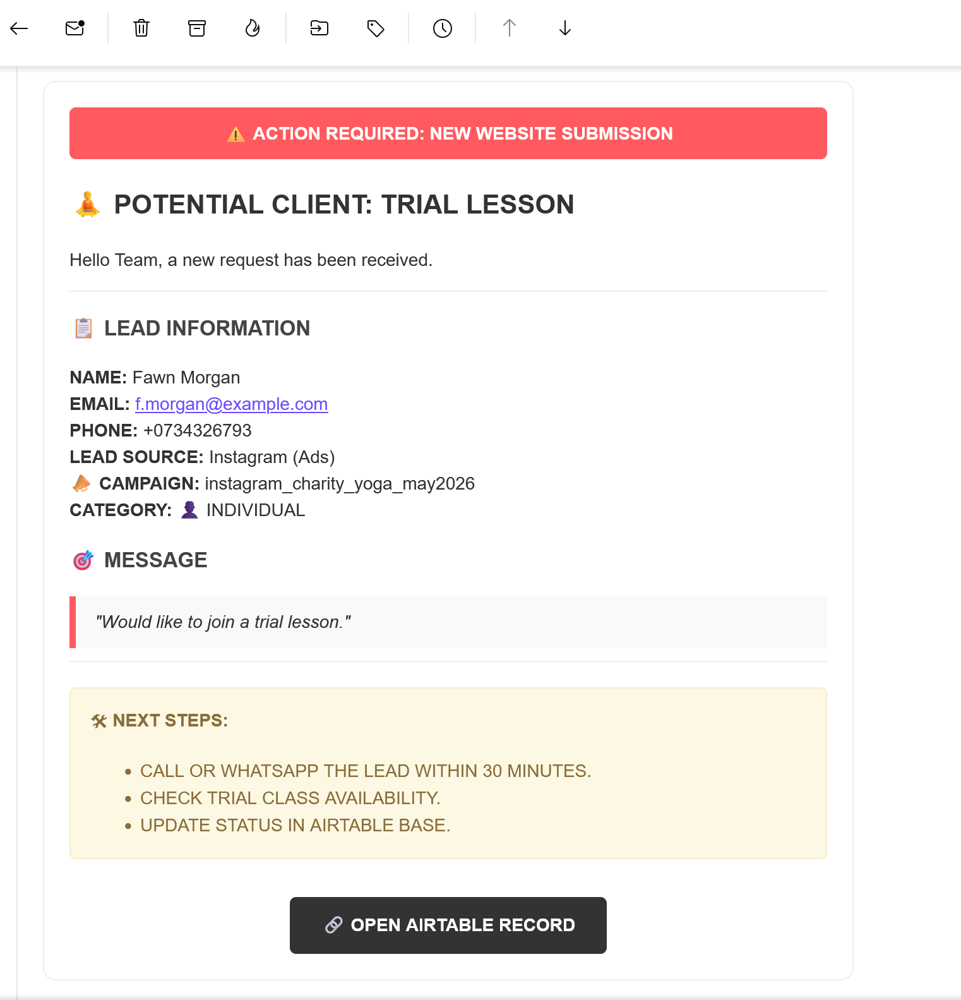
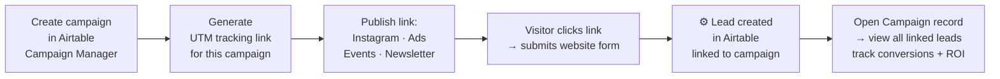
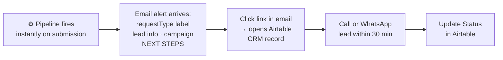
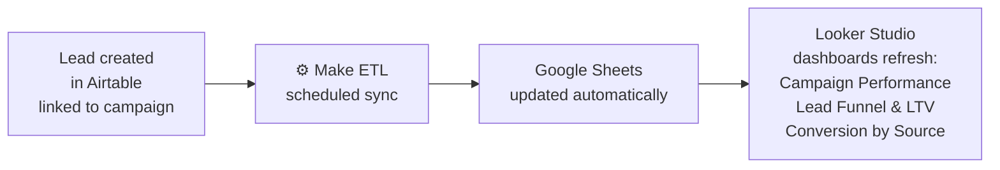
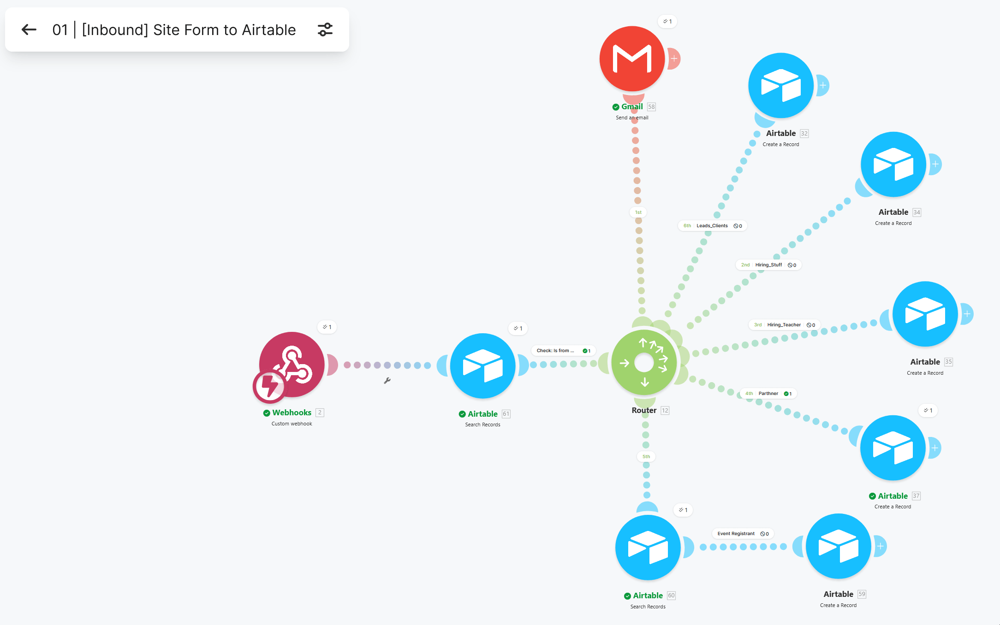

# 📋 Inbound Lead Capture & Customer Journey — Website Form to Airtable

> **For the team:** the marketing team creates a campaign in Airtable, generates a UTM tracking link, and publishes it — on Instagram, in ads, at events. When a visitor follows that link and submits the website form, the lead lands in Airtable automatically: categorized by type, attributed to the exact campaign and channel that drove it, and linked to the campaign record. The full customer journey — from first click on the campaign link to conversion into a paying client — is tracked end-to-end in Airtable and surfaced in analytics. From that moment, the lead flows into dashboards without any manual exports, calculations, or data entry — campaign conversion rates, lead funnel, and ROI update automatically. The team receives an instant email alert and can act within minutes.
>
> 📸 **[Demo — Lead Capture in Action](#demo)**

[](../../assets/interfaces/events_gallery_register.gif)

*When a visitor arrives from an event page and submits the contact form, the `utm_campaign` value is matched against the event campaign record in Airtable — the lead is created already linked to that specific event. The campaign attribution is automatic, no manual input required.*

> **What happens technically:** a Make webhook receives the form payload the moment it is submitted, looks up the source marketing campaign by UTM campaign name in Airtable, validates required fields, and simultaneously creates a categorized lead record linked to the campaign and sends an HTML notification email to the team inbox with lead info, campaign attribution, contextual NEXT STEPS, and a direct link to the record. The lead is immediately visible in CRM views and included in the next analytics sync to Looker Studio.

**Stack:** `Website Form` → `Cloudflare Pages Function` → `Make Webhook` → `Airtable Marketing_Campaigns` → `Airtable Inbound_Leads` + `Gmail` → `Looker Studio`

**Contents:** [📌 The Problem](#the-problem) · [💡 The Solution](#the-solution) · [🎬 Demo](#demo) · [🗺️ Data Flow & Customer Journey](#system-architecture) · [👤 User Workflows](#user-workflows) · [🔒 Frontend Security](#frontend-security) · [⚡ How It Works](#how-it-works)

---

<a id="the-problem"></a>
## 📌 The Problem

Before this pipeline, every lead submitted through the website required **manual work from a team member before any follow-up could begin:**

1. A form submission triggered a generic email notification — all submission types looked identical in the inbox
2. Someone had to read the email, open Airtable, and manually create a new record for each lead
3. No campaign attribution — impossible to tell whether a submission came from a paid ad, an Instagram campaign, or organic traffic
4. No automatic categorization — a yoga teacher candidate, a trial lesson request, and a partnership inquiry all arrived as undifferentiated email alerts
5. Response speed depended entirely on when someone checked email — no urgency signaling, no routing
6. If an email was missed or delayed, the lead went cold with no record in the system
7. Campaign conversion data required manual counting — no live reporting, no per-campaign breakdown
8. No customer journey visibility — no way to trace a lead from the original campaign click through form submission, follow-up, and conversion into a client

The result: every submission was a data entry task, lead categorization required reading the message and deciding manually, campaign ROI was invisible, and the full customer journey existed nowhere in the system.

---

<a id="the-solution"></a>
## 💡 The Solution

**Replace manual data entry with an instant webhook that creates the record, alerts the team, and feeds analytics — simultaneously.**

The marketing team creates a campaign in Airtable's Campaign Manager, generates a UTM tracking link, and publishes it. Every visitor who arrives via that link carries the campaign parameter in the URL — captured automatically by the website. When they submit the form, Make receives the full payload instantly. The UTM campaign name is matched against `Marketing_Campaigns` — the lead is created in Airtable already linked to the exact campaign and acquisition channel that drove it.

The team receives a formatted HTML email with lead details, campaign attribution, and a direct Airtable link within seconds. The lead record is already there when they open it.

Because the lead is linked to the campaign record in Airtable, it flows into analytics automatically on the next sync — appearing in the Campaign Performance dashboard (which campaigns convert, which don't) and the Lead Funnel dashboard (where leads drop off, which channels bring clients who spend the most) — with no manual exports, no calculations, and no additional steps.

The complete customer journey is now traceable: from the moment a customer clicks a campaign link, through form submission, CRM record creation, sales team follow-up, and conversion into a paying client — every step is recorded in Airtable and flows into analytics automatically.

**Result:** from first click to client — fully tracked. The team focuses on contacting leads, not managing data.

---

<a id="demo"></a>
## 🎬 Demo — Lead Capture in Action

**Event registration — campaign auto-sync** — when a visitor follows an event UTM link and submits the form, the lead lands in Airtable already linked to that campaign. No manual attribution.

[](../../assets/interfaces/events_gallery_register.gif)

**Campaign attribution on the lead record** — the campaign that drove the lead is linked directly on the CRM card. The marketing team opens the campaign record and sees every lead it generated; the sales team sees the acquisition source on every lead they work.

[](../../assets/interfaces/acquisition_campaigne.png)

**Email notification** — every valid submission triggers an instant HTML alert to the team inbox. The subject line and content adapt dynamically based on who submitted the form (`requestType`). The email includes lead info, campaign attribution (which campaign and channel drove the submission), a contextual NEXT STEPS block, and a direct link to the Airtable CRM record.

[](../../assets/interfaces/email_crm.png)

All notifications currently go to the **studio admin inbox**. The admin reviews the request type and routes it to the right person:

| Request type | Email header | Routed to |
|---|---|---|
| `lesson` | 🧘 POTENTIAL CLIENT: TRIAL LESSON | Sales Manager — or admin calls the lead directly |
| `stuff` | 💼 OFFICE STAFF CANDIDATE | HR Manager |
| `teacher` | 🧘‍♂️ YOGA TEACHER CANDIDATE | HR Manager |
| `partner` | 🤝 NEW PARTNER INQUIRY | Marketing Manager |
| `event` | 🎟️ NEW EVENT BOOKING | Sales Manager / Admin |

> 📹 *Walkthrough video — coming soon.*

---

<a id="system-architecture"></a>
## 🗺️ Data Flow & Customer Journey

[.png>)](<../../assets/interfaces/11-website_form_workflow.drawio(3).png>)

**How the pipeline runs:**

The diagram is organized into four color-coded layers:

**🟢 `#305A5D` — Marketing Actions** (before and after the customer journey)
The marketing team creates a campaign record in Airtable (Marketing OPS Hub interface → Marketing Campaigns Manager), generates a UTM tracking link, and publishes it on Instagram and other channels. After leads convert, the team tracks campaign performance through Looker Studio dashboards — which campaigns brought leads, which ones converted, what the ROI is.

**🔵 `#2280D2` — Customer Journey** (starts: customer clicks the campaign link → ends: lead record is created in Airtable and appears in the CRM interface)
The customer clicks the published link and lands on the website with `utm_campaign` in the URL. The form loads with UTM parameters captured invisibly into `sessionStorage`. The visitor fills in the form and submits — the full payload is sent via Cloudflare Pages Function to Make. The lead is created in Airtable and immediately appears in the CRM Lead Management Board — the customer journey is complete the moment the record lands.

**⚙️ Automation** (Make — runs in the center of the flow)
Make's webhook receives the payload. Airtable is searched for the matching campaign by `utmCampaign`. A filter validates required fields. The router fires both outputs simultaneously: Gmail sends the HTML alert to the sales team, and Airtable creates the lead record in `Inbound_Leads` linked to the campaign.

**🔴 `#602D2D` — Conversion**
The sales team receives the email notification, opens the Lead Management Board in Airtable (Sales OPS Hub interface), contacts the lead, and updates the record as the lead progresses through qualification stages (MQL → SQL → Positive/Client). The Airtable database and CRM interface update each other bidirectionally — when a new lead record is created in the database it immediately appears in the CRM; when the sales team works in the interface (updating status, adding notes, marking a lead as converted), those changes are written back to the database record in real time.

**🔷 `#284A8A` — Analytics**
The lead, already linked to the source campaign in Airtable, is picked up by Make's scheduled ETL sync — extracted, transformed, and written to Google Sheets. Looker Studio reads the updated data and refreshes the Marketing & Acquisition Overview and Lead Funnel & Customer Value dashboards automatically, feeding back performance data to the marketing team.

→ [Analytics system overview](../../business-intelligence-analytics/business-intelligence-analytics-README.md)

---

<a id="user-workflows"></a>
## 👤 USER WORKFLOWS

---

### **Step 1 — 👤 Marketing Team — Campaign Setup & Attribution**



---

### **Step 2 — 👤 Team — Processing an Inbound Lead**



→ Full lead management workflow in Airtable CRM: [CRM Lead Management — qualification, status tracking, and follow-up process](../../automations/airtable/crm-lead-management-README.md)

---

### **Step 3 — 📊 Analytics — Automated (no action required)**



Lead data flows into analytics automatically on the next scheduled sync — no manual exports required. Dashboards updated:
- **Campaign Performance** — which campaigns bring leads, which ones convert, which underperform
- **Lead Funnel & Customer Value** — drop-off at each qualification stage (MQL → SQL → Positive), LTV by acquisition source, days to convert by channel

→ [Analytics system overview](../../business-intelligence-analytics/business-intelligence-analytics-README.md)

---

<a id="frontend-security"></a>
## 🔒 Frontend Security

The Make webhook URL is never exposed in the frontend JavaScript. The form submits to `/submit-form` — a server-side Cloudflare Pages Function that acts as a proxy. The function holds the actual Make webhook URL in a server-side environment variable and forwards the request. Visitors inspecting the page source or network traffic see only `/submit-form`, not the Make endpoint.

UTM parameters are captured from the URL at page load and stored in `sessionStorage` (not cookies — session-scoped, not persisted across tabs or browser restarts). They are attached to the form payload on submit.

```js
// UTM captured from URL → sessionStorage (only if present)
['utm_source', 'utm_medium', 'utm_campaign', 'utm_content', 'utm_term'].forEach(param => {
    const value = urlParams.get(param);
    if (value) sessionStorage.setItem(param, value);
});

// Form submits to Cloudflare Pages Function — Make webhook URL hidden server-side
const response = await fetch('/submit-form', {
    method: 'POST',
    headers: { 'Content-Type': 'application/json' },
    body: JSON.stringify(data)
});
```

---

<a id="how-it-works"></a>
## ⚡ How It Works

One Make scenario handles the complete submission-to-CRM pipeline — webhook intake, UTM-based campaign attribution, field validation, and simultaneous routing to CRM record creation and team email notification.

[](../../assets/automations/WEBSITE_FORM.png)

### Module Flow

**1. Webhook — "Site Form Intake"** receives the form payload: `firstName`, `lastName`, `requestType`, `phone`, `email`, `clientType`, `organizationName`, `message`, `utmCampaign`.

**2. Airtable: Search Records** — queries `Marketing_Campaigns` with `Formula: {Title} = utmCampaign` — returns the matching campaign's `ID`, `Title`, and `Campaigne_Type`.

**3. Filter: Is from Website** — passes the submission only if `clientType`, `firstName`, `lastName`, and `requestType` all exist. Submissions missing any required field are dropped.

**4. Router — two routes fire simultaneously:**
- **Route A (Gmail)** — sends a formatted HTML email with lead details, campaign attribution, and NEXT STEPS to the team inbox
- **Route B (Airtable Create Record)** — creates a lead record in `Inbound_Leads` with `Contact_Type` set by `requestType`, linked to the matched campaign

---

### Webhook Payload

The website form sends the following fields on submission:

| Field | Type | Description |
|---|---|---|
| `firstName` | text | Lead first name |
| `lastName` | text | Lead last name |
| `requestType` | text | Submission type — `lesson`, `stuff`, `teacher`, `partner`, `event` |
| `phone` | text | Phone number |
| `email` | text | Email address |
| `clientType` | text | `individual` or `organization` |
| `organizationName` | text | Company name (for B2B submissions) |
| `leadSource` | text | Form-level source label |
| `message` | text | Free-text message from the lead |
| `utmCampaign` | text | UTM campaign parameter captured from the landing page URL |

### Filter Logic — `Is from Website`

The filter blocks any submission missing required fields — preventing partial or test submissions from creating incomplete CRM records:

| Condition | Field | Operator |
|---|---|---|
| Client type identified | `clientType` | exists |
| First name present | `firstName` | exists |
| Last name present | `lastName` | exists |
| Request type identified | `requestType` | exists |

### Route A — Email Notification

The Gmail module sends a formatted HTML email to `intelligentyogaparis@proton.me` for every valid submission. The email content is fully dynamic:

**Subject header** — resolved by `requestType`:

| `requestType` | Email header |
|---|---|
| `lesson` | 🧘 POTENTIAL CLIENT: TRIAL LESSON |
| `stuff` | 💼 OFFICE STAFF CANDIDATE |
| `teacher` | 🧘‍♂️ YOGA TEACHER CANDIDATE |
| `partner` | 🤝 NEW PARTNER INQUIRY |
| `event` | 🎟️ NEW EVENT BOOKING |
| *(no match)* | 📩 NEW WEB INQUIRY |

`clientType = organization` appends ` (ORGANIZATION)` to the header.

**Campaign attribution** — `Campaigne_Type` and `Title` from the matched `Marketing_Campaigns` record appear inline, showing which campaign drove the submission. If no UTM match is found, the campaign line is omitted.

**NEXT STEPS block** — conditional per `requestType`:
- All types: call or WhatsApp the lead within 30 minutes · update status in Airtable
- `teacher`: verify teaching certifications
- `lesson`: check trial class availability
- `event`: check event capacity and confirm spot

**Airtable link** — direct link to open the matched Marketing Campaign record in the Airtable interface, surfacing all linked leads from that campaign.

### Route B — Airtable Record Creation

Each `requestType` value triggers a sub-filter that sets the correct `Contact_Type` when creating the record:

| `requestType` | `Contact_Type` written | Lead category |
|---|---|---|
| `lesson` | `Client` | Potential client requesting trial lesson |
| `stuff` | `Hiring_Stuff` | Office staff candidate |
| `teacher` | `Hiring_Teacher` | Yoga teacher candidate |
| `partner` | `Parthner` | Partnership or B2B inquiry |
| `event` | *(event booking)* | Event registration |

Fields written to every record in `Inbound_Leads`:

| Field | Value |
|---|---|
| `First_Name` | `firstName` from webhook |
| `Last_Name` | `lastName` from webhook |
| `Company_name` | `organizationName` from webhook |
| `Email` | `email` from webhook |
| `Phone_number` | `phone` from webhook |
| `Contact_Type` | Set by `requestType` |
| `Acquisition Source` | `Site Web` (hardcoded — all website submissions) |
| `message` | `message` from webhook |
| `Marketing_Campaign` | Linked to matched campaign record from module 61 |

### Campaign Attribution

The Search Records module runs before the router and looks up `Marketing_Campaigns` using the UTM parameter:

```
Formula: {Title} = "{{2.utmCampaign}}"
Max records: 10
```

The matched record's ID (`61.id`) is used in two places:
- **Email** — `61.Campaigne_Type` and `61.Title` appear in the lead info block
- **Airtable record** — the lead is linked to the campaign via a linked record field, enabling campaign-level conversion tracking directly in the CRM

If no campaign matches (e.g., direct traffic with no UTM), module 61 returns empty — the pipeline continues, the record is created without a campaign link, and the campaign block is omitted from the email.

---

### Design Decisions

**Why a webhook instead of polling the form submission inbox?**
Webhooks fire the moment the form is submitted — the record exists in Airtable and the email is sent before the visitor leaves the thank-you page. Polling would introduce delays and complicate deduplication.

**Why look up the Marketing Campaign before routing?**
Campaign data is needed in both outputs — the email shows which campaign drove the lead, and the Airtable record is linked to the campaign for conversion reporting. A single upstream lookup keeps both outputs consistent without duplicating logic.

**Why send an email AND create an Airtable record in parallel?**
They serve different purposes. The email is an urgent notification — it gets immediate attention and enforces the 30-minute response target. The Airtable record is the permanent CRM entry — it enables follow-up notes, status tracking, and reporting. One without the other leaves either the team uninformed or the CRM incomplete.

**Why route by `requestType` to different `Contact_Type` values instead of a single lead type?**
Airtable views, filters, and automations can be scoped by `Contact_Type` — HR sees teacher and staff candidates, sales sees client leads, operations sees partnership inquiries. Assigning the type at creation means the CRM is already organized the moment the record lands, with no manual triage required.

**Why hide the webhook URL behind a Cloudflare Pages Function?**
Exposing the Make webhook URL in client-side JS would allow anyone to send arbitrary payloads — flooding the CRM with fake leads or triggering unauthorized automations. The Cloudflare function acts as a server-side proxy: the real endpoint stays private, and request validation can be added at the function level.

**What happens if the UTM campaign doesn't match any record?**
The pipeline continues. Module 61 returns empty — the email omits the campaign block, and the Airtable record is created without a campaign link. No data is lost; attribution is simply absent for that submission.

---

### Key Airtable Fields

| Field | Type | Role in pipeline |
|---|---|---|
| `First_Name`, `Last_Name` | Text | Lead identity |
| `Email`, `Phone_number` | Text | Contact details for follow-up |
| `Company_name` | Text | Organization name for B2B submissions |
| `Contact_Type` | Select | Lead category — set at creation by `requestType` |
| `Lead_Source` | Text | Set to `Site Web` for all website form submissions |
| `Marketing_Campaign` | Linked record | Links lead to matched campaign — enables attribution reporting |

---

### Tech Stack

| Layer | Tool | Role |
|---|---|---|
| Lead capture | **Website form** | Collects lead data and UTM parameters from visitors |
| Security proxy | **Cloudflare Pages Function** | Server-side proxy — hides Make webhook URL from client-side code |
| Automation | **Make** | Webhook receiver · campaign lookup · routing |
| Campaign attribution | **Airtable** `Marketing_Campaigns` | Source-of-truth for campaign data — matched by UTM name |
| CRM | **Airtable** `Inbound_Leads` | Stores all inbound leads, categorized and campaign-attributed |
| Notification | **Gmail** | Sends formatted HTML alert to team inbox |
| Analytics | **Looker Studio** | Campaign Performance · Lead Funnel & LTV · Conversion by Source — auto-updated via Make ETL sync |

---

---

*[← Back to main README](../../README.md)* · *[📣 Marketing Ops Hub](../../interfaces/marketing-ops-hub-README.md)* · *[💼 Sales Ops Hub](../../interfaces/sales-ops-hub-README.md)* · *[🌐 Frontend](../../frontend/frontend-README.md)*

> No-code inbound lead pipeline — website form submissions land in Airtable CRM automatically, attributed to the source campaign via UTM, categorized by request type, with instant team email alerts and automatic Looker Studio analytics sync. Built with Make, Airtable, Cloudflare Pages.
