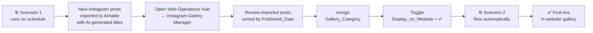
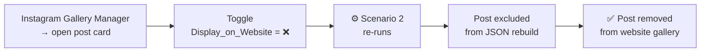

# 🖼️ Automated Instagram Gallery Sync — No-Code Pipeline from Instagram to Website

> **For the marketing team:** Instagram posts are automatically imported into Airtable. AI generates multilingual titles for each post based on the original Instagram caption using a custom prompt — not just translates, but creates website-ready content. Open the Instagram Gallery Manager, review, flip a toggle — the photo appears in the website gallery. No downloads, no file transfers, no code.
>
> 📸 **[Demo — Interface Walkthrough](#demo)**

[](../../assets/interfaces/web_ops_instagram_gallery.gif)

*Review imported posts in the Instagram Gallery Manager — check the Cloudinary URL, assign a category, flip the toggle.*

[](../../assets/interfaces/instagram_gallery2.gif)

*The post appears in the website gallery with multilingual titles and fullscreen modal.*

> **What happens technically:** a 2-scenario Make automation fetches the latest posts from the studio's Instagram account via the Instagram Business API, checks for duplicates, uploads media to Cloudinary CDN (sorted by type), generates and translates multilingual captions via AI, and pushes a structured JSON gallery file to the website repository whenever the marketing team updates post visibility. Every GitHub push triggers an automatic Cloudflare Pages deployment.

**Stack:** `Instagram API` → `Make` → `Cloudinary` + `AI Generate & Translate` → `Airtable` → `GitHub API` → `Cloudflare Pages` → `Website`

**Contents:** [📌 The Problem](#the-problem) · [💡 The Solution](#the-solution) · [🎬 Demo](#demo) · [⚡ How It Works](#how-it-works) · [👤 User Workflows](#user-workflows) · [🗺️ System Architecture](#system-architecture) · [🔬 Technical Deep Dive](#technical-deep-dive) · [↳ Scenario 1](#scenario-1) · [↳ Scenario 2](#scenario-2)

---

<a id="the-problem"></a>
## 📌 The Problem

Before this pipeline, keeping the website gallery up to date required **coordination across three people and multiple tools every time new content was needed:**

1. Contact the SMM manager — request new photos from recent shoots or posts
2. SMM manager sends a batch of files via messenger; manually pick which ones to use
3. Contact the frontend developer — write a message, wait for availability
4. Developer downloads files, uploads to CDN, adds entries to the codebase by hand
5. No live sync with the Airtable database — content lives in two places simultaneously
6. Come up with a gallery caption, translate it into English — with a separate tool
7. Translate again into French
8. Copy-paste all text into the JSON file in the correct fields
9. Commit and push to GitHub
10. Verify the gallery rendered correctly on the website

The result: the website gallery was always behind. Adding five new photos meant coordinating a small project. For a studio posting to Instagram regularly, this was not sustainable.

---

<a id="the-solution"></a>
## 💡 The Solution

**Replace the SMM-developer-translator chain with a scheduled automation and a single curation toggle.**

Make runs on a schedule and pulls the latest posts directly from the studio's Instagram account. New posts are automatically imported into Airtable — no SMM manager request, no file transfers. Media is uploaded to Cloudinary by type (photo / video). AI generates website-ready multilingual titles based on the original Instagram caption using a custom prompt, then writes all versions (RU, EN, FR) back to the record.

The marketing team opens the **Instagram Gallery Manager**, reviews the imported posts sorted by publication date, assigns a category, and toggles `Display_on_Website = ✅`. The website updates automatically.

**Result:** the website gallery stays current without involving the developer or the SMM manager. The marketing team curates — the pipeline handles everything else.

---

<a id="demo"></a>
## 🎬 Demo

**Instagram feed synced to Airtable** — posts imported automatically, AI-generated titles visible in Gallery Manager, ready for curation.

[](../../assets/interfaces/instagram_gallery1.gif)

**Published gallery on the website** — responsive grid with fullscreen modal, multilingual titles switching with the language selector.

[](../../assets/interfaces/instagram_gallery2.gif)

---

<a id="how-it-works"></a>
## ⚡ How It Works

Two Make scenarios cover one end-to-end sync pipeline:

| # | Scenario | Source | Trigger | Output |
|---|---|---|---|---|
| 1 | [**Sync & Translate Instagram Media**](#scenario-1) | Instagram Business API | Scheduled run | New posts imported to `Marketing_Campaigns` · media uploaded to Cloudinary · AI-generated titles written back |
| 2 | [**Sync Gallery JSON**](#scenario-2) | `Marketing_Campaigns` | Record modified (`Display_on_Website` toggled) | Updated `instagram-gallery.json` pushed to GitHub → Cloudflare auto-deploys |

**The two scenarios serve different purposes:** Scenario 1 runs on a schedule and keeps Airtable in sync with Instagram. Scenario 2 is triggered by the marketing team's curation decisions and keeps the website in sync with Airtable.

---

<a id="user-workflows"></a>
## 👤 User Workflows

---

### **👤 Marketing Team — Reviewing and Publishing a Post**



---

### **👤 Marketing Team — Removing a Post from the Gallery**



---

<a id="system-architecture"></a>
## 🗺️ System Architecture & Data Flow

[](../../assets/automations/MAKE%20SYNC%20INSTAGRAM.drawio.png)

**How the pipeline runs:**

- **Scheduled import.** Make runs Scenario 1 on a schedule and calls the Instagram Business API to fetch the latest 40 posts from `@intelligentyoga`. For each post, it checks whether a record with the same `Instagram_ID` already exists in Airtable — if it does, the post is skipped. New posts are uploaded to Cloudinary (sorted into folders by media type) and created as records in `Marketing_Campaigns`.
- **AI content generation.** For each new post, AI generates a website title based on the original Instagram caption and a custom prompt — producing publication-ready content, not a direct translation. All three language versions (RU, EN, FR) are written back to the Airtable record.
- **Curation & publish.** The marketing team opens Instagram Gallery Manager, reviews imported posts sorted by `Published_Date`, assigns a `Gallery_Category`, and sets `Display_on_Website = ✅`. This triggers Scenario 2.
- **Website sync.** Scenario 2 collects all posts marked for display, formats them as `instagram-gallery.json`, and pushes the file to the GitHub repository. Cloudflare Pages detects the push and automatically rebuilds and deploys the site.

---

<a id="technical-deep-dive"></a>
## 🔬 Technical Deep Dive

A breakdown of both Make scenarios — what each one does, which modules it uses, and the design decisions behind the pipeline architecture.

---

<a id="scenario-1"></a>
### 📌 Scenario 1 — Sync & Translate Instagram Media

This scenario handles **automatic content import** from Instagram. It runs on a schedule and ensures Airtable always has an up-to-date record for every recent post.

When triggered, the scenario:

1. Fetches the latest 40 posts from the Instagram Business account `@intelligentyoga`
2. For each post, searches Airtable for an existing record with the same `Instagram_ID` — deduplication prevents creating the same post twice
3. If no record exists — uploads the media to Cloudinary, sorted into dedicated folders by media type (`IMAGE` or `VIDEO`)
4. Creates a new record in `Marketing_Campaigns` with the post's data including the returned `Cloudinary_URL`
5. Generates a website title based on the Instagram caption and a custom AI prompt — produces RU, EN, and FR versions in parallel
6. Writes all AI-generated titles back to the Airtable record

After this scenario completes, new posts are available in the Instagram Gallery Manager for the team to review and curate.

[](../../assets/automations/SYNC%20INSTAGRAM%20WEBSITE%20S1.png)

**Module Breakdown**

| # | Module | Tool | Action |
|---|---|---|---|
| 1 | Get User Media | Instagram Business | Fetches latest 40 posts from account `@intelligentyoga` (ID: 17841450626842874) |
| 3 | Search Records | Airtable | `Marketing_Campaigns` · `Website: Instagram gallery` view · searches for `Instagram_ID = post ID` · max 1 record |
| — | Filter / Router | Make | If no matching record found → proceed; if exists → skip |
| — | Cloudinary Upload | Cloudinary | Uploads media to folder by type — photos and videos sorted into separate CDN folders |
| 4 | Create Record | Airtable | Creates new record: `Instagram_ID`, `Instagram_URL`, caption → `Website_describtion`, `Media_Type`, `Published_Date`, `Cloudinary_URL`, `Campaigne_Type = 📸 Instagram (Main)`, `Content_Type = Instagram_Media`, `Status = Completed` |
| 5 | Generate Title → RU | Make AI Tools | Generates website title in Russian based on caption + prompt |
| 6 | Generate Title → EN | Make AI Tools | Generates website title in English based on caption + prompt |
| 7 | Generate Title → FR | Make AI Tools | Generates website title in French based on caption + prompt |
| 8 | Update Record | Airtable | Writes `Website_Title_RU`, `Website_Title_EN`, `Website_Title_FR` back to the record |

---

<a id="scenario-2"></a>
### 📌 Scenario 2 — Sync Instagram Gallery JSON

This scenario handles **website delivery**. It fires when any record in the gallery view is modified — collecting all currently published gallery items and pushing a fresh JSON file to the website.

When triggered, the scenario:

1. Detects the record change via Last Modified Time trigger
2. Validates that the record has both a `Cloudinary_URL` and a `Published_Date` — ensures only fully processed posts trigger a sync
3. Waits 3 seconds to allow any concurrent write-back to complete
4. Queries Airtable for **all gallery posts** where `Display_on_Website = ✅` AND `Cloudinary_URL` is filled — up to 100 records
5. Aggregates all results into a single array
6. Formats the array as a structured JSON payload with key `instagram_gallery`
7. Fetches the current `instagram-gallery.json` SHA from GitHub (required by the API for file updates)
8. Pushes the new `instagram-gallery.json` to the website repository — Cloudflare Pages auto-deploys on the commit

[.png)](../../assets/automations/SYNC%20WEBSITE%20INSTAGRAM%20S2(1).png)

**Module Breakdown**

| # | Module | Tool | Action |
|---|---|---|---|
| 1 | Watch Records | Airtable | `Marketing_Campaigns` · `Website: Instagram gallery` view · Last Modified Time trigger · max 2 records |
| — | Filter | Make | `Has Cloudinary URL` — `Cloudinary_URL` exists AND `Published_Date` exists |
| 2 | Sleep | Make | Waits 3 seconds — buffer for write-back propagation |
| 4 | Search Records | Airtable | Formula: `AND({Display_on_Website}=1, {Cloudinary_URL}!="")` · max 100 · fields: `Website_Title`, `Website_Title_RU/EN/FR`, `Cloudinary_URL`, `Published_Date`, `Display_on_Website` |
| 5 | Basic Aggregator | Make | Collects all records from module 4 into a single array |
| 6 | Create JSON | Make | Structure: `instagram_gallery_structure` · key `instagram_gallery` = aggregated array |
| 8 | HTTP GET | Make | GitHub API — fetches current `instagram-gallery.json` to extract its SHA |
| 9 | HTTP PUT | Make | GitHub API — pushes new `instagram-gallery.json` with content + SHA |

**JSON payload structure per item:**
```json
{
  "Website_Title": "...",
  "Website_Title_RU": "...",
  "Website_Title_EN": "...",
  "Website_Title_FR": "...",
  "Cloudinary_URL": "...",
  "Published_Date": "...",
  "Display_on_Website": true
}
```

---

### Design Decisions

**Why check for existing `Instagram_ID` before creating a record?**
Instagram API returns the latest N posts on every scheduled run. Without deduplication, each run would create duplicate records for every post already imported. The Search Records check ensures only genuinely new posts get created.

**Why does AI generate titles rather than just translate the Instagram caption directly?**
Instagram captions are written for social media — they contain hashtags, emoji, and informal language that doesn't work as website copy. The AI step uses a custom prompt to generate clean, website-ready titles from the caption context, then produces all three language versions. The marketing team can review and edit the output in Gallery Manager before publishing.

**Why upload to Cloudinary if the media already has an Instagram URL?**
Instagram media URLs are tied to the Instagram CDN and can expire or become inaccessible. Cloudinary provides permanent, transformation-ready URLs — the website always has a stable link regardless of what happens on Instagram's side. Media is sorted into separate Cloudinary folders by type (photo / video) for organized asset management.

**Why does the marketing team assign `Gallery_Category` manually instead of auto-assigning?**
Category requires editorial judgment — a photo could be a class, an event, a studio shot, or lifestyle content depending on context. This is the one curatorial step the team intentionally retains. All other steps are automated.

**Why does Scenario 2 rebuild the full JSON every time?**
A full rebuild means removing a post from the gallery is automatic — toggling `Display_on_Website = ❌` simply excludes it from the next query. No patch logic, no state tracking.

**How can the team validate AI-generated titles before a post goes live?**
After Scenario 1 completes, all AI-generated titles are visible in the post's record card inside Instagram Gallery Manager. The team can review and edit any field directly in Airtable — Scenario 2 picks up the corrected values when the post is published.

---

### Key Airtable Fields

| Field | Type | Role in pipeline |
|---|---|---|
| `Instagram_ID` | Text | Unique post identifier — used for deduplication in Scenario 1 |
| `Instagram_URL` | Text | Permalink to the original Instagram post |
| `Published_Date` | Date | Post publication date from Instagram — used for gallery sort order |
| `Media_Type` | Text | `IMAGE`, `VIDEO`, or `CAROUSEL_ALBUM` — from Instagram API, determines Cloudinary folder |
| `Cloudinary_URL` | Text | Permanent CDN URL — written by S1, used in JSON payload and as S2 readiness signal |
| `Website_describtion` | Long text | Original Instagram caption — AI content generation source |
| `Website_Title_RU` / `_EN` / `_FR` | Text | AI-generated multilingual titles |
| `Display_on_Website` | Checkbox | Curation toggle — controls gallery visibility |
| `Gallery_Category` | Select | Assigned manually by marketing team — included in JSON payload |
| `Content_Type` | Select | Set to `Instagram_Media` by Scenario 1 — used as filter in Scenario 2 |

---

### Tech Stack

| Layer | Tool | Role |
|---|---|---|
| Content source | **Instagram Business API** | Fetches latest posts from `@intelligentyoga` |
| Automation | **Make** | Orchestrates both scenarios |
| Media CDN | **Cloudinary** | Permanent media hosting — photos and videos sorted by type |
| AI Content & Translation | **Make AI Tools** (gpt-5-nano) | Generates website titles from Instagram captions · RU, EN, FR |
| Source of truth | **Airtable** | Stores imported posts, AI content, curation state |
| Website delivery | **GitHub API** | Pushes `instagram-gallery.json` to website repository |
| Hosting & deployment | **Cloudflare Pages** | Hosts the website; auto-deploys on every GitHub push |

---

*[← Back to main README](https://github.com/anastasiiabureau/workflow-driven-gtm-ops)* · *[🌐 Web Operations Hub](../../interfaces/web-ops-hub-README.md)* · *[🌐 Frontend](../../frontend/frontend-README.md)*
