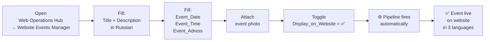
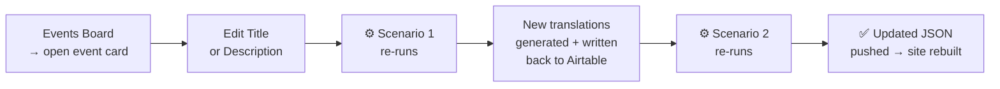
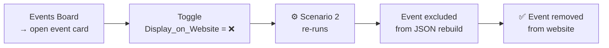
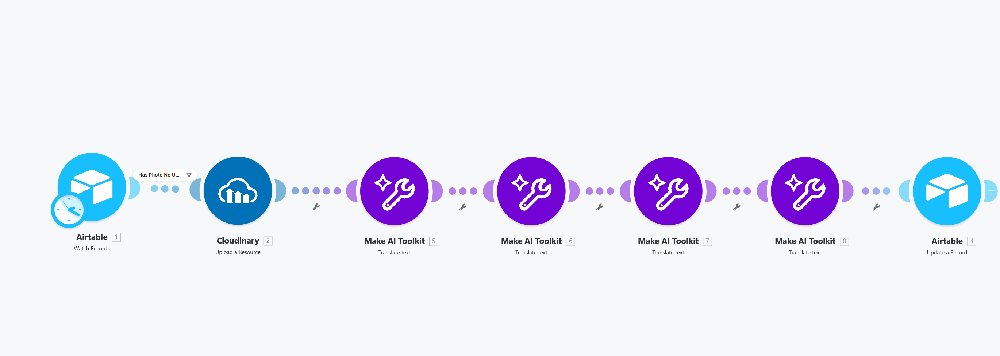

# 🌐 Automated Event Publishing — Airtable Interface → Make → Website

> **For the marketing manager:** events are created and managed through a purpose-built Airtable interface — fill in the details, attach a photo, flip one toggle. The event appears on the website in three languages within seconds. No databases, no code, no external tools. The interface handles everything.
>
> 📸 **[Demo — Interface Walkthrough](#demo)**

*One toggle in the Events Board — the pipeline fires automatically.*

*The event appears on the website in three languages within seconds.*

> **What happens technically:** a 2-scenario Make automation picks up the record, uploads the photo to Cloudinary CDN, runs 4 AI translations (title + description → EN and FR), and pushes a structured JSON payload to the website repository via GitHub API — with zero manual steps after the toggle. Every GitHub push triggers an automatic Cloudflare Pages deployment.

**Stack:** `Airtable` → `Make` → `Cloudinary` + `AI Translate` → `GitHub API` → `Cloudflare Pages` → `Website`

**Contents:** [📌 The Problem](#the-problem) · [💡 The Solution](#the-solution) · [🎬 Demo](#demo) · [⚡ How It Works](#how-it-works) · [👤 User Workflows](#user-workflows) · [🗺️ System Architecture](#system-architecture) · [🔬 Technical Deep Dive](#technical-deep-dive) · [↳ Scenario 1](#scenario-1) · [↳ Scenario 2](#scenario-2)

---

## 📌 The Problem

Before this pipeline, the Events section of the website was **managed manually by a frontend developer.** Adding or removing an event required:

1. Contacting the developer — writing a message, waiting for availability
2. Developer opens the codebase, adds or removes the event entry by hand
3. No live sync with the Airtable database — content lives in two places simultaneously
4. Any update (date change, photo swap, text edit) restarts the cycle

And for multilingual content, on top of that:
- Translate the title and description into English — manually, with a separate tool
- Translate again into French
- Copy-paste results into the JSON file in the correct fields
- Commit and push to GitHub
- Verify the website rendered correctly

The result: every event update was a coordination task involving at least two people, multiple tools, and zero automation. For a studio publishing events weekly, this was not a workflow — it was overhead.

---

## 💡 The Solution

**Replace developer dependency and manual steps with a single toggle in Airtable.**

The marketing manager works entirely inside the Airtable interface — no external tools, no codebase access, no coordination required. Flipping `Display_on_Website = ✅` fires the full automation chain automatically.

**Result:** a non-technical team member can publish, update, or unpublish any event without opening a single external tool. What previously took developer time and multiple manual steps now takes one checkbox and a few seconds.

---

## 🎬 Demo

**Events gallery on the live website** — 3-card slider fed from `events.json`, upcoming and past events, registration link opens the contact form with event pre-fill.

---

## ⚡ How It Works

Two Make scenarios cover one end-to-end publication pipeline:

| # | Scenario | Source table | Trigger | Output |
|---|---|---|---|---|
| 1 | [**Upload Photo & AI Translate**](#system-architecture) | `Marketing_Campaigns` | Record modified in `Website: Event Section` view | Cloudinary URL + EN/FR translations written back to Airtable |
| 2 | [**Sync Website Events**](#system-architecture) | `Marketing_Campaigns` | Record ready (`Display_on_Website = ✅` + `Cloudinary_URL` filled) | Updated `events.json` pushed to GitHub → Cloudflare auto-deploys |

**These two scenarios are sequentially dependent** — Scenario 2 only fires after Scenario 1 has written the CDN URL and translations back to the record. The website never receives incomplete data.

---

## 👤 User Workflows

---

### **👤 Marketing Team — Publishing a New Event**

---

### **👤 Marketing Team — Updating Event Content**

---

### **👤 Marketing Team — Unpublishing an Event**

---

## 🗺️ System Architecture & Data Flow

[.png)](../../assets/automations/MAKE%20SYNC%20EVENTS.drawio(1).png)

**How the pipeline runs:**

- **Trigger.** The marketing manager creates or edits an event through the Airtable interface — the change is written to the `Marketing_Campaigns` table. Airtable's `Last Modified Time` field updates automatically, and Make watches it to detect any record change.
- **Scenario 1 — content preparation.** The filter checks whether the record already has a `Cloudinary_URL`. If not, Scenario 1 runs: the photo is uploaded to Cloudinary and a permanent CDN URL is returned; the title and description are translated into English and French in parallel. Both the URL and all 4 translations are written back to the Airtable record.
- **Scenario 2 — website sync.** Writing back to the record updates `Last Modified Time` again — the trigger fires a second time. Now the filter finds a `Cloudinary_URL` present and passes the record to Scenario 2. All published events are collected, formatted as `events.json`, and pushed to the GitHub repository.
- **Deployment.** Cloudflare Pages detects the GitHub push and automatically rebuilds and deploys the site. The Events page is live with the updated content.

---

## 🔬 Technical Deep Dive

A breakdown of both Make scenarios — what each one does, which modules it uses, and the design decisions behind the pipeline architecture.

---

### 📌 Scenario 1 — Upload Photo & AI Translate

This scenario handles the **content preparation** half of the pipeline. When a marketing manager attaches a photo and toggles `Display_on_Website = ✅`, this scenario:

1. Detects the record change via Airtable's Last Modified Time trigger
2. Validates that the record has a photo but no Cloudinary URL yet — preventing re-runs on already-processed records
3. Uploads the photo to Cloudinary and gets back a permanent CDN URL
4. Runs 4 AI translation jobs in parallel — title and description into English and French
5. Writes the Cloudinary URL and all 4 translations back to the Airtable record

After this scenario completes, the record is **content-complete** and ready for Scenario 2 to pick up.

**Module Breakdown**

| # | Module | Tool | Action |
|---|---|---|---|
| 1 | Watch Records | Airtable | `Marketing_Campaigns` table · `Website: Event Section` view · Last Modified Time trigger |
| — | Filter | Make | `Has Photo No URL` — `Attachments` exists + `Display_on_Website = true` + `Cloudinary_URL` does not exist |
| 2 | Upload Image | Cloudinary | Uploads photo to folder `[3] EVENTS_GALLERY` with preset `EVENTS_GALLERY__preset` |
| 5 | Translate Title → EN | Make AI Tools | Translates `Website_Title` (RU) to English |
| 6 | Translate Description → EN | Make AI Tools | Translates `Website_describtion` (RU) to English |
| 7 | Translate Title → FR | Make AI Tools | Translates `Website_Title` (RU) to French |
| 8 | Translate Description → FR | Make AI Tools | Translates `Website_describtion` (RU) to French |
| 4 | Update Record | Airtable | Writes `Cloudinary_URL` + all 4 translations back to the record |

---

### 📌 Scenario 2 — Sync Website Events

This scenario handles the **website delivery** half of the pipeline. It runs after Scenario 1 has written the `Cloudinary_URL` and translations back to Airtable — meaning the record is content-complete and ready to publish.

When triggered, the scenario:

1. Detects the record change and confirms a `Cloudinary_URL` is present
2. Waits 3 seconds to ensure Scenario 1's write-back has fully committed
3. Queries Airtable for **all published events** — not just the one that triggered — using a formula filter
4. Aggregates all results into a single array and formats it as a JSON payload
5. Fetches the current `events.json` SHA from GitHub (required by the API for file updates)
6. Pushes the new `events.json` to the website repository — Cloudflare Pages auto-deploys on the commit

[.png)](../../assets/automations/MAKE-events-S2(1).png)

**Module Breakdown**

| # | Module | Tool | Action |
|---|---|---|---|
| 1 | Watch Records | Airtable | `Marketing_Campaigns` table · `Website: Event Section` view · Last Modified Time trigger |
| — | Filter | Make | `Has Cloudinary URL` — `Cloudinary_URL` exists |
| 2 | Sleep | Make | Waits 3 seconds — buffer for Scenario 1 write-back propagation |
| 4 | Search Records | Airtable | Fetches all records where `Display_on_Website = ✅` AND `Cloudinary_URL` is filled |
| 5 | Basic Aggregator | Make | Collects all records into a single array |
| 6 | Create JSON | Make | Structures the array as `{ "events": [ ... ] }` |
| 8 | HTTP GET | Make | GitHub API — fetches current `events.json` to extract its SHA |
| 9 | HTTP PUT | Make | GitHub API — pushes new `events.json` with content + SHA |

---

### Design Decisions

**Why Cloudinary instead of serving photos directly from Airtable?**
Airtable attachment URLs are temporary — they expire and cannot be embedded in a website. There is no supported way to generate a stable, publicly accessible image URL from an Airtable record. Cloudinary solves this: it receives the photo via URL at upload time, stores it permanently, and returns a CDN-served `secure_url` that never expires and supports on-the-fly transformations.

**Why AI translation in the pipeline instead of manual input?**
Requiring manual translation would add two steps per event and introduce inconsistency — different team members translating in different styles, or translations being skipped entirely. Embedding translation as an automatic step ensures every event is always content-complete in all three languages before it reaches the website.

**Why two scenarios instead of one?**
Separating photo upload + translation (Scenario 1) from website sync (Scenario 2) makes each stage independently re-runnable. If the GitHub push fails, only Scenario 2 needs to be re-triggered — the Cloudinary URL and translations are already safely written to Airtable.

**Why does Scenario 2 rebuild the full JSON every time instead of patching one record?**
A full rebuild means unpublishing is automatic — toggling `Display_on_Website = ❌` simply removes that event from the next query, and the new JSON reflects the current state with no additional logic required.

**How can the marketing team validate translations before the event goes live?**
After Scenario 1 completes, all AI-generated translations are written back to the Airtable record. The team can review them in the **Events Board** page inside Web Operations Hub — where each event card surfaces the EN and FR fields alongside the original Russian. If corrections are needed, the team edits the translation fields directly in Airtable; Scenario 2 picks up the updated values on its next run.

---

### Key Airtable Fields

| Field | Type | Role in pipeline |
|---|---|---|
| `Display_on_Website` | Checkbox | Master publication toggle |
| `Attachments` | Attachment | Source photo for Cloudinary upload |
| `Cloudinary_URL` | Text | CDN URL — written by S1, used by website and as S2 readiness signal |
| `Website_Title` | Text | Original title (RU) — AI translation source |
| `Website_Title_EN` / `_FR` | Text | AI-generated translations |
| `Website_describtion` | Long text | Original description (RU) |
| `Website_describtion_EN` / `_FR` | Long text | AI-generated translations |
| `Event_Date`, `Event_Time`, `Event_Adress` | Various | Included in JSON payload |

---

### Tech Stack

| Layer | Tool | Role |
|---|---|---|
| Source of truth | **Airtable** | Event records, content, publication state |
| Automation | **Make** | Orchestrates both scenarios |
| Media CDN | **Cloudinary** | Permanent, optimized photo hosting |
| AI Translation | **Make AI Tools** (gpt-5-nano) | EN and FR translations |
| Website delivery | **GitHub API** | Pushes `events.json` to website repository |
| Hosting & deployment | **Cloudflare Pages** | Hosts the website; auto-deploys on every GitHub push — Make's update triggers a full site rebuild automatically |

---

*[← Back to main README](https://github.com/anastasiiabureau/workflow-driven-gtm-ops)* · *[🌐 Web Operations Hub](../../interfaces/web-ops-hub-README.md)* · *[🌐 Frontend](../../frontend/frontend-README.md)* · *[📋 Inbound Leads pipeline](./inbound-leads-README.md)*
