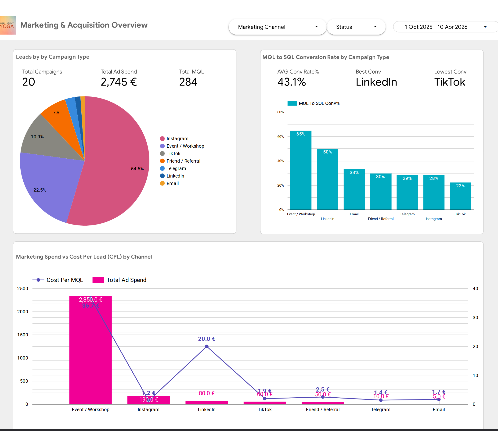
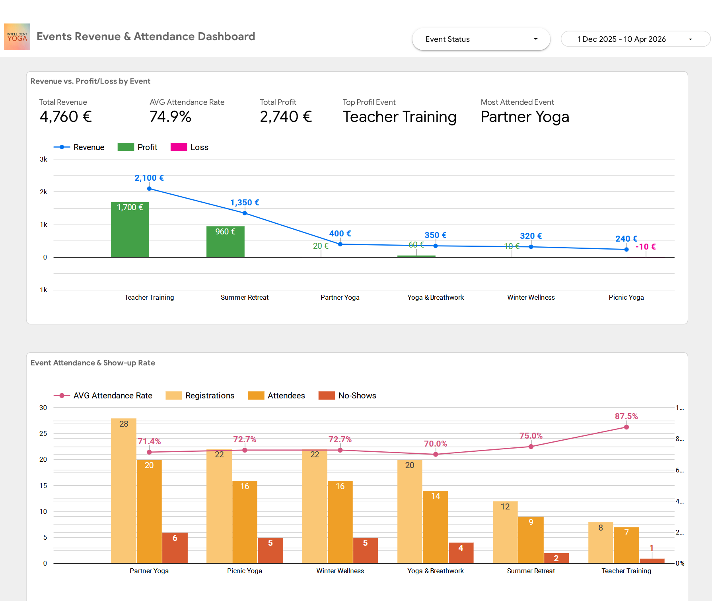
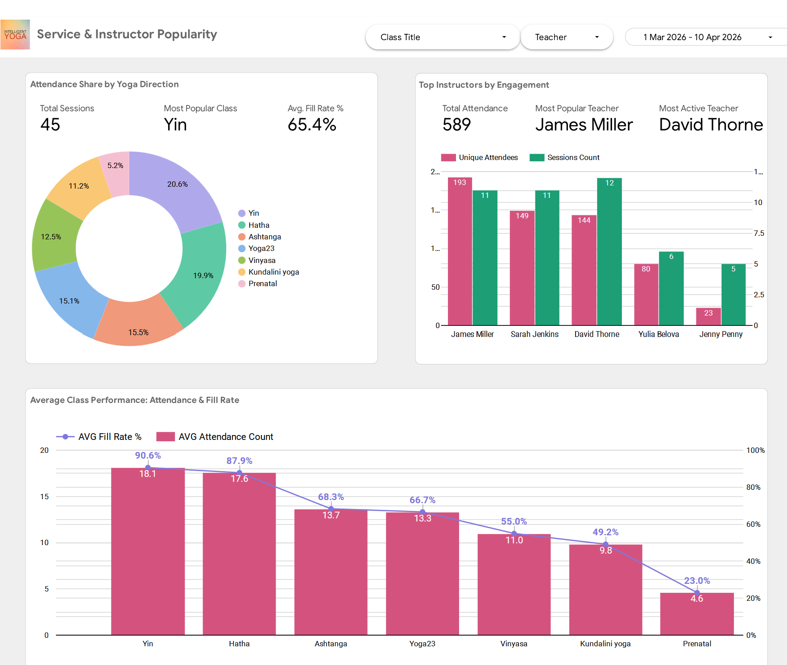
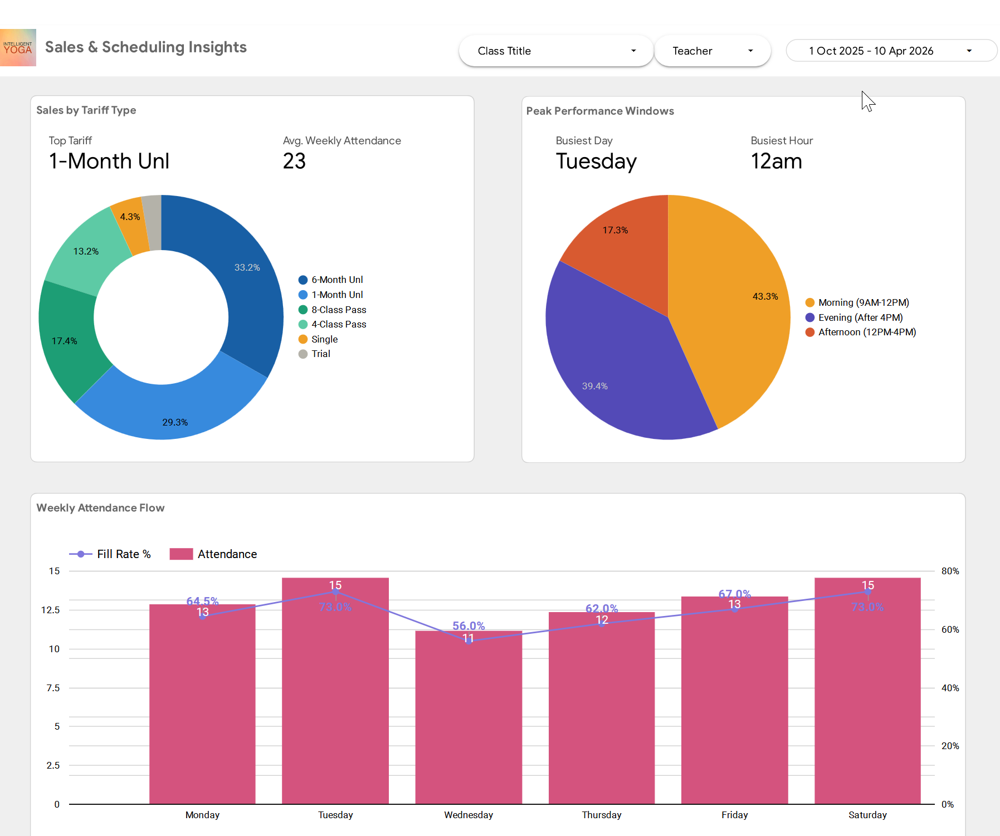
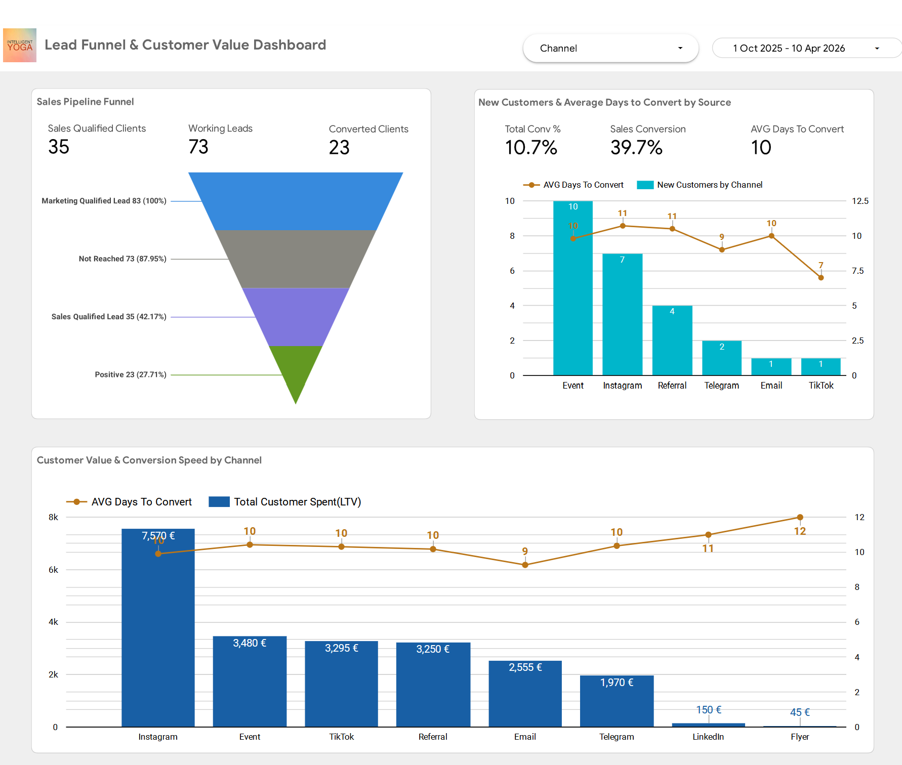
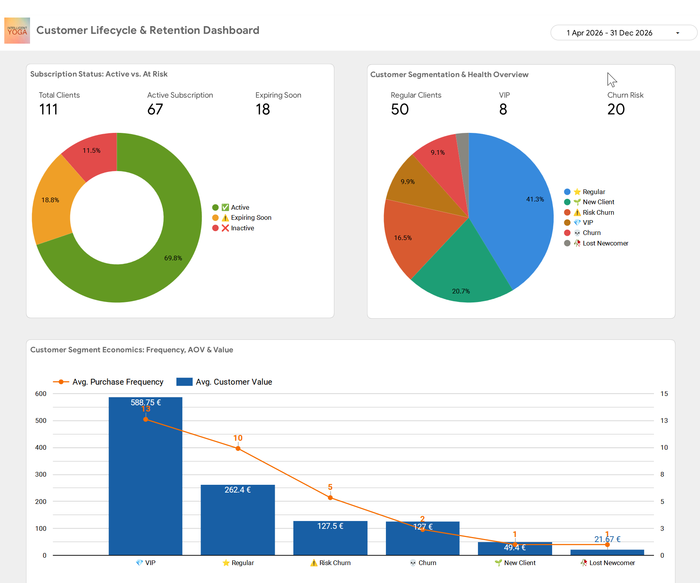
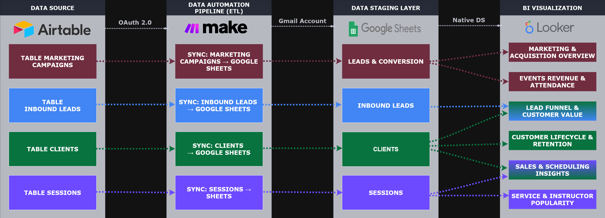

# 📊 Business Intelligence & Analytics

> A full-stack data engineering project: automated ETL (Extract, Transform, Load) pipeline + 6 real-time interactive dashboards built in Google Looker Studio.

**Stack:** `Airtable` → `Make (ETL)` → `Google Sheets` → `Looker Studio`

**Contents:** [📌 What This Project Is](#what-this-project-is) · [👥 Stakeholders](#stakeholders) · [📊 Dashboards](#dashboards) · [🎬 Demo](#demo) · [👤 User Workflows](#user-workflows) · [🔬 Technical Deep Dive](#technical-deep-dive)

> ⚠️ **Data Privacy Note:** All datasets are synthetically generated. Names, contact details, and financial figures are fictional and used for demonstration purposes only.

[](../assets/analytics/dashboards.gif)

→ [📊 Key Analytical Modules & Dashboards](#dashboards) · [](https://datastudio.google.com/s/jH8JAT6_iVs)

---

<a id="what-this-project-is"></a>
## 📌 What This Project Is

This end-to-end analytics solution provides a **360° operational view** of a yoga studio — bridging the gap between raw operational data in Airtable and actionable executive-level insights in Looker Studio.

**The problem it solves:** Studio data lives across disconnected tables — campaigns, leads, sessions, clients, transactions. Without a pipeline, managers either copy data manually or make decisions without data at all. This system eliminates both failure modes.

**What it gives:**

- **Marketing** knows which channels bring leads and which campaigns convert them — enabling precise reallocation of ad spend away from underperforming sources.
- **Operations** sees session fill rates, teacher load, and room utilization in real time — enabling smarter scheduling decisions before capacity issues appear.
- **Sales** tracks the full lead funnel from first touch to paid client, with LTV (Lifetime Value), days-to-convert, and churn risk visible at a glance.
- **Finance** monitors revenue trends, subscription plan performance, and month-over-month growth without touching a spreadsheet.
- **Leadership** gets a single source of truth — one place where marketing ROI (Return on Investment), client retention, event profitability, and operational health are visible simultaneously.

The system runs on a scheduled ETL pipeline: 4 Make scenarios extract data from Airtable, transform it, and load it into Google Sheets once a month. Looker Studio reads the Sheets and refreshes dashboards automatically. When fresh data is needed outside the schedule, any scenario can be triggered manually with a single "Run once" click in Make.

---

<a id="stakeholders"></a>
## 👥 Stakeholders

| Role | What they get from this system |
|---|---|
| 👑 **Studio Owner / CEO** | High-level ROI, total revenue, net profit, long-term growth trends |
| 📣 **Marketing Manager** | Acquisition costs, channel effectiveness, MQL → SQL conversion rates, campaign ROI |
| 🤝 **Sales Lead** | Funnel bottlenecks, lead-to-client conversion, LTV by segment, churn risk |
| 📅 **Operations Manager** | Capacity utilization, peak hour patterns, teacher load, fill rate by class and room |
| 🧘 **HR & Senior Instructor** | Instructor performance scorecards, class booking rates, attendance trends |

---

<a id="dashboards"></a>
## 📊 Key Analytical Modules & Dashboards

6 real-time dashboards across all operational layers. Each supports **date range filters** for flexible period-over-period analysis.

| Dashboard | Data Source | Date Filter |
|---|---|---|
| 📣 Campaign Performance | `leads & conversions` tab | Campaign / Event Date |
| 🎉 Events & Attendance | `leads & conversions` tab | Event Date |
| 🧘 Yoga Directions | `sessions` + `clients` tabs | Session Date & Time |
| 💰 Sales & Scheduling Insights | `sessions` + `clients` tabs | Session Date |
| 🎯 Lead Funnel & Customer Value | `inbound_leads` + `clients` tabs | Acquisition Date |
| 🔄 Customer Lifecycle & Retention | `clients` tab | Last Visit |

---

### 📣 Dashboard 1 — Campaign Performance

[](../assets/analytics/marketing_perfomance.png)

**Purpose:** Understand which marketing campaigns bring leads and which ones convert them into clients.

**Data source:** Google Sheets → `campaigns` tab

**Top Campaigns table**
Every campaign with leads, sorted best to worst by total leads. Shows breakdown by lead type: Clients, Event Registrants, Partners, Teachers, Staff.

**Flop Campaigns table**
Same structure sorted by conversion rate ascending. Only shows campaigns that had leads but failed to convert them. Identifies where leads are being lost.

**Leads by Source chart**
Which channel brings the most leads — Instagram, Website, Maps, Friend referral, Events.

**Avg Conversion by Campaign Type**
Which type of campaign converts best on average — Events, Posts, Instagram content, Gallery.

**Lowest Conversion Campaigns chart**
Visual ranking of worst converting campaigns that had leads. Helps decide what to stop or fix.

**Lead Type Distribution pie**
What kind of people are coming in — potential clients, event attendees, job applicants, partners.

---

### 🎉 Dashboard 2 — Events & Attendance

[](../assets/analytics/events_dashboard.png)

**Purpose:** Measure event profitability and real attendance vs registrations.

**Data source:** Google Sheets → `events` tab + `attendance` tab

**Event Performance table**
Every event with: date, budget, revenue, profit, ROI, registrants, attended, no-shows, fill rate.

**Budget vs Revenue chart**
Side by side bars per event — instantly see which events made money and which lost money.

**Attended vs No-show chart**
Stacked bars per event — shows the scale of the no-show problem per event.

---

### 🧘 Dashboard 3 — Yoga Directions

[](../assets/analytics/service_popularity_dashboard.png)

**Purpose:** Understand which yoga styles and class formats are most popular and drive the most attendance.

**Data source:** Google Sheets → `sessions` tab + `attendance` tab

**Class Performance table**
Each yoga direction with: number of sessions, average fill rate, average attendance, room.

**Avg Fill Rate by Class chart**
Which yoga direction fills up fastest — shows demand for each style.

**Attendance by Teacher chart**
Which teacher's classes attract the most students.

---

### 💰 Dashboard 4 — Sales & Scheduling Insights

[](../assets/analytics/sales_dashboard.png)

**Purpose:** Understand when the studio is busiest — top traffic periods, class popularity by day and time of day.

**Data source:** Google Sheets → `sessions` tab

**Sessions by Day of Week chart**
Which days drive the most visits — helps optimise the weekly schedule.

**Sessions by Time Slot chart**
Which time slots are most popular — morning, afternoon, or evening.

**Top Subscription Plans pie chart**
Which membership plans clients buy most — helps identify the most popular pricing tiers.

---

### 🎯 Dashboard 5 — Lead Funnel & Customer Value

[](../assets/analytics/lead_funnel_dashboard.png)

**Purpose:** Track the full lead journey from first inquiry to paid client, and measure lifetime value by acquisition source and segment.

**Data source:** Google Sheets → `clients` tab + leads segment

**Lead Funnel chart**
Step-by-step drop-off: MQL → Not Reached → SQL → Positive / Rejected. Shows where leads are lost in the qualification pipeline.

**Conversion Rate by Source chart**
Which acquisition channel converts best — Instagram, Website, Events, Referral.

**LTV by Acquisition Source chart**
Which channel brings clients who spend the most over their lifetime.

**Days to Convert by Source chart**
How long it takes a lead from each channel to become a paying client.

---

### 🔄 Dashboard 6 — Customer Lifecycle & Retention

[](../assets/analytics/retention_dashboard.png)

**Purpose:** Monitor client base health — segmentation, churn risk, and retention patterns over time.

**Data source:** Google Sheets → `clients` tab + `attendance` tab

**Segment Distribution pie**
💎 VIP / ⭐ Regular / 🌱 New Client / ⚠️ Churn Risk / 💀 Churn / 🥀 Lost Newcomer — share of each segment across the full client base.

**Lifecycle Distribution chart**
Active Regular / Active New / New / Churn Risk — health of the client base at a glance.

**Client Value by Segment chart**
Purchase frequency, average spend, and LTV (Lifetime Value) broken down by segment — shows behavioural and revenue differences between VIP, Regular, and at-risk groups.

---

<a id="demo"></a>
## 🎬 Demo

[](https://datastudio.google.com/s/jH8JAT6_iVs)

---

<a id="user-workflows"></a>
## 👤 User Workflows

### Standard Workflow — Fully Automated

```
The system runs on its own — no action required from any user.

Once a month (scheduled):
   → Make runs all 4 ETL scenarios automatically
   → Airtable data is extracted, transformed, and written to Google Sheets
   → Looker Studio reads updated Sheets and refreshes all 6 dashboards

User opens Looker Studio any time
   → Dashboards show data current as of the last scheduled sync
   → Use date range filters to select any period
   → All charts, tables, and scorecards update instantly
```

### Manual Workflow — When Filtering by a Specific Date

```
If you need data for a specific date range that requires fresh data
(e.g. a report for yesterday's event that happened after the 06:00 sync):

1. Open Make (make.com)
2. Find the relevant scenario:
   → SYNC Campaigns & Events — for campaign or event data
   → SYNC Sessions — for class and attendance data
   → SYNC Inbound Leads — for lead data
   → SYNC Clients — for client and retention data

3. Click "Run once" on the scenario
   → Make extracts fresh data from Airtable
   → Google Sheets is updated immediately

4. Open Looker Studio
   → Click the refresh button on the relevant dashboard
   → Apply your date filter
   → Data now reflects the just-completed sync
```

---

<a id="technical-deep-dive"></a>
## 🔬 Technical Deep Dive

### ETL Pipeline Architecture

The pipeline transforms fragmented CRM data into analytics-ready datasets across four automated stages:

**1. Extraction — Airtable**
Data is gathered from four core tables: Marketing_Campaigns, Sessions, Inbound_Leads, Clients. Data is filtered at source (e.g. Completed sessions only) to ensure only clean, relevant records enter the pipeline.

**2. Transformation & Sync — Make**
Four specialized scenarios handle: synchronization of IDs and attributes, calculation of key metrics (MQL/SQL, ROI, retention rates), and preparation for intermediate storage. Runs on schedule — no manual intervention required.

**3. Storage — Google Sheets**
Acts as a structured data warehouse across thematic tabs. Enables historical tracking and seamless native connector access for Looker Studio.

**4. Visualization — Looker Studio**
Raw figures become 6 specialized dashboards. A single sheet can feed multiple dashboards — e.g. Leads data powers both Campaign Performance and Lead Funnel.

[](../assets/analytics/BI_dataflow.png)

---

### Data Schema

#### Where the Data Comes From

All source data lives in **Airtable**. Four Make scenarios extract it nightly, transform it, and load it into **Google Sheets** as an intermediate data warehouse. Looker Studio connects directly to Sheets and visualizes the data across 6 dashboards.

```
Airtable (source of truth)
        ↓ Make syncs once a month (scheduled)
Google Sheets (structured warehouse)
        ↓ Looker reads Sheets natively
Looker Studio (6 dashboards, auto-refreshed)
```

#### Pipeline Map

| Airtable Table | Make Scenario | Google Sheets Tab | Looker Dashboard(s) |
|---|---|---|---|
| `Marketing_Campaigns` | SYNC Campaigns & Events | leads & conversions | Campaign Performance, Events & Attendance |
| `Sessions` (Completed only) | SYNC Sessions | sessions | Yoga Directions, Sales & Scheduling Insights |
| `Inbound_Leads` | SYNC Inbound Leads | inbound_leads | Lead Funnel & Customer Value |
| `Clients` | SYNC Clients | clients | Customer Lifecycle & Retention |

#### Google Sheets Structure

| Tab | Source | What it contains |
|---|---|---|
| `leads & conversions` | `Marketing_Campaigns` | All campaigns with lead counts, conversion rates, ROI, event data |
| `inbound_leads` | `Inbound_Leads` | All leads with qualification status, source attribution, contact type |
| `sessions` | `Sessions` | Class schedule — teachers, rooms, capacity, fill rate, attendance |
| `clients` | `Clients` | All clients with segments, lifecycle stage, LTV, subscription status |

#### Core Airtable Tables & Their Role

| Table | Role | Key Metrics Produced |
|---|---|---|
| `Marketing_Campaigns` | Top of funnel — ad spend & campaign performance | ROI, Revenue, MQL/SQL counts, Conversion Rate |
| `Inbound_Leads` | Interest layer — qualifies inquiries, attributes sources | Lead Source, Qualify Status, Days to Convert |
| `Clients` | Customer hub — lifecycle, segmentation, LTV | LTV, Lifecycle Stage, Churn Risk, Subscription Status |
| `Sessions` | Operations — scheduling, instructor load, capacity | Attendance Count, Fill Rate, Room Utilization |

---

### Make Scenario Settings (Global)

| Parameter | Value |
|---|---|
| Trigger type | Scheduled (no webhook) |
| Error handling | Max 3 errors, auto-commit enabled |
| Data loss prevention | Disabled (clean overwrite per run) |
| Zone | `eu1.make.com` |
| Execution mode | Sequential: OFF (parallel bundles) |

Each scenario follows the same three-step pattern:

```
Step 1 — CLEAR              Step 2 — EXTRACT             Step 3 — LOAD
Google Sheets               Airtable Search              Google Sheets
Clear old range    →        Records (filtered)    →      Add Rows
```

---

### Scenario 1 — SYNC Marketing Campaigns & Events

**Purpose:** Synchronizes all campaigns with lead metrics, conversion rates, ROI, and event attendance into `campaigns` and `events` tabs.

| Parameter | Value |
|---|---|
| Table | `Marketing_Campaigns` |
| View 1 | All campaigns → `campaigns` tab |
| View 2 | Events/Workshop type only → `events` tab |
| Max Records | 300 |

**Fields extracted:**

| Column | Field | Type |
|---|---|---|
| A | ID | Number |
| B | Title | Text |
| C | Campaigne_Type | Single select |
| D | Published_Date | Date |
| E | Event_Date | Date |
| F | Status | Single select |
| G | Total Cost (Budget) | Number |
| H | Revenue | Formula |
| I | Profit | Formula |
| J | Total_MQL | Rollup |
| K | Total_SQL | Rollup |
| L | Event_Registrants_Count | Rollup |
| M–U | Lead counts by type (Clients, Teachers, Staff, Partners, Event Registrants) | Rollup |
| V | Conversion_Rate | Formula |
| W–Z | CR by contact type | Formula |
| AA | CR_EventRegistrants | Formula |
| AB | ROI_Percent | Formula |

**Additional fields for Events tab:**

| Field | Type | Description |
|---|---|---|
| Attended_Count | Rollup | Actually attended |
| No_Show_Count | Rollup | Did not attend |
| Cancelled_Count | Rollup | Cancelled registrations |
| Fill_Rate | Formula | `Attended / Registrants × 100` |

---

### Scenario 2 — SYNC Sessions

**Purpose:** Pulls completed class sessions with instructor and attendance data into `sessions` tab.

| Parameter | Value |
|---|---|
| Table | `Sessions` |
| Filter | `Session_Status = "Completed"` |

| Field | Type | Description |
|---|---|---|
| Class Title | Lookup | Type of class (Hatha, Vinyasa etc.) |
| Primary_Teacher_Name | Lookup | Lead instructor name |
| Date & Time | Date | Session date and time |
| Session_Status | Text | Completed |
| Attendance_Count | Rollup | Number of registered attendees |
| Fill_Rate_Session | Formula | `Attended / Max_Capacity × 100` |

---

### Scenario 3 — SYNC Inbound Leads

**Purpose:** Synchronizes all leads with qualification status and source attribution.

| Field | Type | Description |
|---|---|---|
| Lead_ID | Autonumber | Unique lead identifier |
| Contact_Type | Single select | Client / Event_Registrant / Hiring_Teacher / Partner |
| Lead_Source | Single select | Instagram, Telegram, Website, Referral, Event, LinkedIn, Maps, Other |
| Acquisition_Date | Date | Date of entry into the database |
| Qualify_Status | Single select | MQL → Not Reached → SQL → Positive / Rejected |
| Title_Acquisition_Campaign | Lookup | Campaign that generated the lead |

---

### Scenario 4 — SYNC Clients

**Purpose:** Exports the full client base with lifecycle stages, segmentation, subscription status, and LTV.

| Field | Type | Description |
|---|---|---|
| Client_id | Autonumber | Unique client identifier |
| Client_Lifecycle | Formula | Active Regular / Active New / New / Churn Risk / SQL |
| Client_Segments | Formula | 💎 VIP / ⭐ Regular / 🌱 New / ⚠️ Risk / 💀 Churn / 🥀 Lost Newcomer |
| Subscription_Type | Lookup | Current membership plan |
| Subscription End Date | Formula | Expiry date of current plan |
| Subscription_status | Formula | ✅ Active / ⚠️ Expiring Soon / ❌ Inactive / ⚪ No Data |
| Last Visit | Lookup | Date of most recent attendance |
| Total Visits | Count | Total sessions attended |
| Total Spent (LTV) | Rollup | SUM of all payments |
| First_transaction | Rollup | Date of first purchase |
| Last_transaction | Rollup | Date of most recent purchase |
| Total_transactions | Rollup | Number of transactions |
| Acquisition_Date | Date | Record creation date |
| Acquisition_Source | Single select | Channel through which client was acquired |
| Days_to_Convert | Formula | Days between Acquisition_Date and First_transaction |

---

### Calculated Field Definitions

#### `Client_Segments`

Assigns a marketing segment based on spending, visit frequency, and recency.

```
IF(
  {Total Spent(LTV)} >= 500, "💎 VIP",
  IF(
    AND({Total Visits} > 5, DATETIME_DIFF(TODAY(), {Last Visit}, 'days') <= 30), "⭐ Regular",
    IF(
      DATETIME_DIFF(TODAY(), {Last Visit}, 'days') > 90, "💀 Churn",
      IF(
        AND({Total Visits} > 5, DATETIME_DIFF(TODAY(), {Last Visit}, 'days') > 30), "⚠️ Churn Risk",
        IF(
          AND(OR({Total Visits} = 1, {Total transactions} = 1),
            OR(DATETIME_DIFF(TODAY(), {Last Visit}, 'days') <= 30,
               DATETIME_DIFF(TODAY(), {First_transaction}, 'days') <= 30)), "🌱 New Client",
          IF(
            AND(OR({Total Visits} = 1, {Total transactions} = 1),
              OR(DATETIME_DIFF(TODAY(), {Last Visit}, 'days') > 30,
                 DATETIME_DIFF(TODAY(), {First_transaction}, 'days') > 30)), "🥀 Lost Newcomer",
            "🎯 Sales Qualified Lead"
          )
        )
      )
    )
  )
)
```

| Output | Condition |
|---|---|
| 💎 VIP | Total Spent ≥ €500 |
| ⭐ Regular | >5 visits AND last visit ≤ 30 days ago |
| 💀 Churn | Last visit > 90 days ago |
| ⚠️ Churn Risk | >5 visits AND last visit > 30 days ago |
| 🌱 New Client | 1 visit AND first transaction ≤ 30 days ago |
| 🥀 Lost Newcomer | 1 visit AND first transaction > 30 days ago |
| 🎯 Sales Qualified Lead | All other cases |

---

#### `Client_Lifecycle`

Tracks the operational stage of a client based on visit history and transaction recency.

```
IF(
  AND({Total Visits} > 5, DATETIME_DIFF(TODAY(), {Last Visit}, 'days') <= 30), "Active Regular",
  IF(
    AND(DATETIME_DIFF(TODAY(), {First_transaction}, 'days') <= 30,
        {Total Visits} > 1, {Total Visits} <= 5), "Active New",
    IF(
      AND(DATETIME_DIFF(TODAY(), {First_transaction}, 'days') <= 30,
          OR({Total Visits} = 0, {Total Visits} = 1)), "New",
      IF(DATETIME_DIFF(TODAY(), {Last Visit}, 'days') > 60, "Churn Risk",
        "Sales Qualified Lead"
      )
    )
  )
)
```

| Output | Condition |
|---|---|
| Active Regular | >5 visits AND last visit ≤ 30 days ago |
| Active New | First transaction ≤ 30 days AND 2–5 visits |
| New | First transaction ≤ 30 days AND 0–1 visits |
| Churn Risk | Last visit > 60 days ago |
| Sales Qualified Lead | All other cases |

---

#### `Subscription_status`

Evaluates the current state of a client's subscription based on expiry date.

```
IF(
  {Subscription End Date},
  IF(
    DATETIME_DIFF({Subscription End Date}, TODAY(), 'months') >= 1, "✅ Active",
    IF(IS_AFTER({Subscription End Date}, TODAY()), "⚠️ Expiring Soon", "❌ Inactive")
  ),
  "⚪ No Data"
)
```

| Output | Condition |
|---|---|
| ✅ Active | Expiry date ≥ 1 month from today |
| ⚠️ Expiring Soon | Expiry date < 1 month but still in the future |
| ❌ Inactive | Expiry date has passed |
| ⚪ No Data | No subscription date on record |

---

### Key Metrics Glossary

| Term | Definition |
|---|---|
| Conversion Rate | Positive Leads ÷ Total Leads × 100 |
| Fill Rate | Attended ÷ Max Capacity × 100 |
| No-show Rate | No-shows ÷ Registrants × 100 |
| ROI | (Revenue − Budget) ÷ Budget × 100 |
| LTV (Lifetime Value) | Total amount spent by one client across all transactions |
| Churn | Client who has not visited in 90+ days |
| Active | Client who visited in the last 30 days |
| VIP | Client with LTV ≥ €500 |
| CPL (Cost Per Lead) | Campaign Budget ÷ Total Leads |
| MQL (Marketing Qualified Lead) | Lead that entered the pipeline from a marketing source |
| SQL (Sales Qualified Lead) | Lead that has been reviewed and approved by sales |
| Days to Convert | Days between Acquisition_Date and First_transaction |
| Engagement Rate | (Likes + Comments + Saves) ÷ Reach × 100 |

---

### Key Technical Decisions

| Decision | Rationale |
|---|---|
| **Clear before load** | Prevents row duplication on re-runs; sheet always reflects current Airtable state |
| **USER_ENTERED value mode** | Allows Google Sheets to parse dates and formula outputs correctly |
| **View-based filtering in Airtable** | Offloads filter logic to Airtable (Events view, Completed sessions) — keeps Make scenarios clean |
| **Campaigns & Events in one scenario** | Both source from the same table — merging reduces redundancy |
| **Scheduled trigger (no webhook)** | Operational data changes gradually — scheduled sync is sufficient and more reliable |
| **Sequential mode OFF** | Allows parallel bundle processing for faster sync on large record sets |

---

---

*[← Back to main README](../README.md)* · *[🏗️ Architecture](../architecture/hld.md)* · *[🗄️ Database Schema](../architecture/database.md)* · *[⚙️ ETL Pipeline — Make deep dive](../automations/make/etl-README.md)* · *[⚙️ Make Pipelines overview](../automations/make/make-README.md)*
