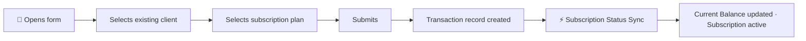
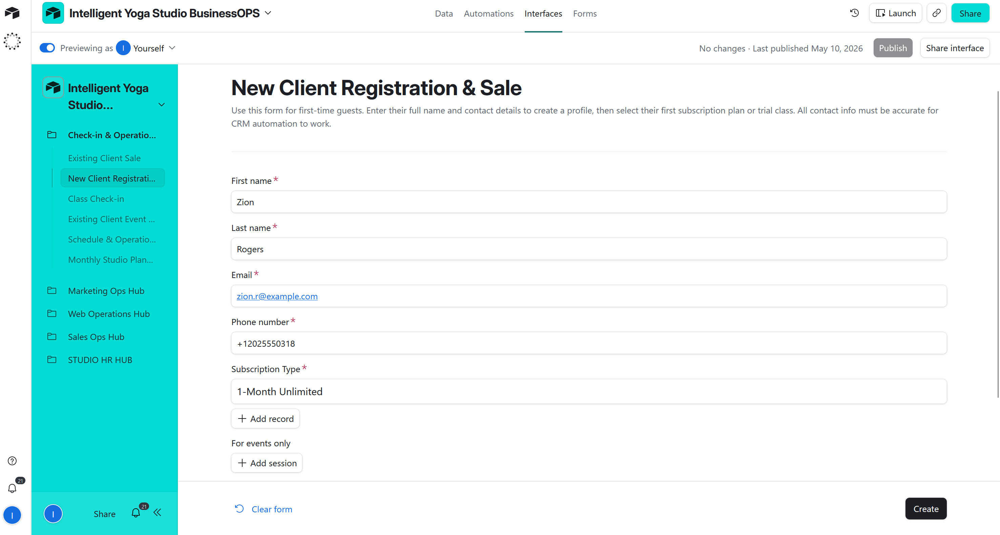
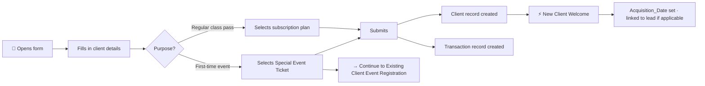
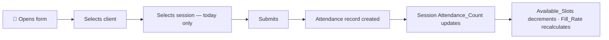
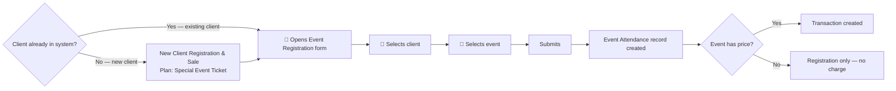
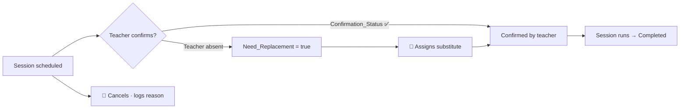
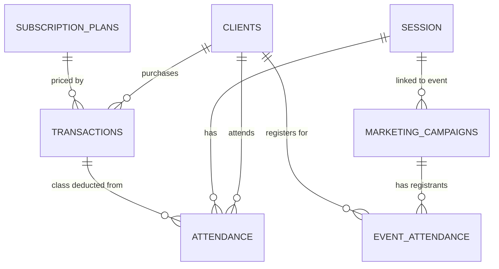

# 🏃 Check-in & Operations Hub

> Front-desk and session-ops workspace. Reception staff process sales, check clients into classes, and register clients for events — all from one interface. Admins monitor the live schedule: confirming teachers, managing substitutions, updating session statuses, and reviewing the month's calendar alongside the marketing team.

> ⚠️ **Data Privacy Note:** All client and session records are synthetically generated for demonstration purposes only. Names, contact details, and transaction history are fictional.

**Contents:** [💡 What This Interface Does](#what-it-does) · [🖥️ Interface Pages](#pages) · [📝 Existing Client Sale](#existing-sale) · [🆕 New Client Registration & Sale](#new-client) · [✅ Class Check-in](#checkin) · [🎟️ Event Registration](#event-reg) · [📅 Schedule & Session Management](#schedule) · [🗓️ Monthly Studio Planner](#planner) · [👤 Stakeholders & Governance](#stakeholders) · [⚡ Automation Coverage](#automations) · [🔬 Technical Deep Dive](#technical-deep-dive)

---

## 💡 What This Interface Does

**Workflows covered:**
- **📝 Point-of-Sale** — sell subscription plans to existing clients, register and sell to new clients, check clients into classes, register clients for special events
- **📅 Schedule & Session Management** — daily session operations: teacher confirmations, cancellations, substitutions, room changes, live capacity monitoring
- **🗓️ Monthly Studio Planner** — combined calendar of all sessions and events; shared with the marketing team for coordinated event planning

**Before:** Class sales were logged in a spreadsheet and check-ins were paper-based or not tracked at all. There was no way to see live session capacity or know which teachers had confirmed. Event registrations came through email threads. Schedule changes required updating multiple places manually.

**Now:** All front-desk transactions happen inside one interface — client lookup, plan selection, check-in, event registration. Session management is real-time: the dashboard flags pending confirmations and needed substitutions automatically. The monthly planner gives both operations and marketing a single shared view of what's happening in the studio.

---

## 🖥️ Interface Pages

| Page | Type | Workflow |
|---|---|---|
| **📝 Existing Client Sale** | Form | [Existing Client Sale →](#existing-sale) |
| **🆕 New Client Registration & Sale** | Form | [New Client Registration & Sale →](#new-client) |
| **✅ Class Check-in** | Form | [Class Check-in →](#checkin) |
| **🎟️ Existing Client Event Registration** | Form | [Event Registration →](#event-reg) |
| **📅 Schedule & Session Management** | Dashboard | [Schedule & Session Management →](#schedule) |
| **🗓️ Monthly Studio Planner** | Calendar | [Monthly Studio Planner →](#planner) |

---

## 📝 Existing Client Sale

**Who:** Studio Admin
**Entry point:** Existing Client Sale form

Used at the front desk when an existing client renews a pass or buys a new subscription plan.

Admin selects the client from the existing client list, selects the subscription plan, and submits. A `Transaction` record is created, linked to the client and the plan. The Subscription Status Sync automation fires — `Current Balance` recalculates and the client's plan is immediately active.

→ [Automation deep dive — Finance & Transactions](../automations/airtable/finance-transactions-README.md)

---

## 🆕 New Client Registration & Sale

**Who:** Studio Admin
**Entry point:** New Client Registration & Sale form

Used when a walk-in or a converted CRM lead arrives for their first purchase — including new clients signing up for a special event for the first time.

Admin fills in client details (first name, last name, email, phone, acquisition source), selects the subscription plan, and submits. Two records are created simultaneously: a `Client` record and a linked `Transaction`. The New Client Welcome automation fires — `Acquisition_Date` is set and, if the client was a converted lead, the records are linked.

> **New client at a special event:** Select **Special Event Ticket** as the plan. After submitting this form, proceed to the **Existing Client Event Registration** form to link the (now registered) client to the specific event.

→ [Finance & Transactions deep dive](../automations/airtable/finance-transactions-README.md) · [CRM Lead Management deep dive](../automations/airtable/crm-lead-management-README.md)

---

## ✅ Class Check-in

**Who:** Studio Admin
**Entry point:** Class Check-in form

Used at the start of each class. Admin selects the client and the session, then submits. An `Attendance` record is created — linked to the client, the session, and the relevant transaction (one class deducted from the client's balance). The session's `Attendance_Count` rollup updates immediately: `Available_Slots` decrements, `Fill_Rate_Session` recalculates.

> **Session filter:** The form shows only today's sessions — admin cannot accidentally check a client into a past or future date.

→ [Automation deep dive — Operations & Scheduling](../automations/airtable/operations-scheduling-README.md)

> **Analytics downstream:** Session attendance feeds into the **🧘 Yoga Directions** and **💰 Sales & Scheduling Insights** dashboards — class fill rates, peak hours, teacher load. Client visit history powers the **🔄 Customer Lifecycle & Retention** dashboard for churn and LTV analysis. → [Business Intelligence & Analytics](../business-intelligence-analytics/business-intelligence-analytics-README.md)

---

## 🎟️ Existing Client Event Registration

**Who:** Studio Admin
**Entry point:** Existing Client Event Registration form

Used when an existing client signs up for a workshop or special event. For clients who are not yet in the system, complete the **New Client Registration & Sale** form first (selecting **Special Event Ticket** as the plan), then return here to register them for the event.

Admin selects the client and the event, then submits. An event attendance record is created, linked to the client and the `Marketing_Campaigns` event record. If the event has a price, a `Transaction` is created automatically.

→ [Automation deep dive — Finance & Transactions](../automations/airtable/finance-transactions-README.md)

> **Analytics downstream:** Event attendance flows into the **🎉 Events & Attendance** dashboard — participation rates, event revenue, no-show rates. Client registrations also contribute to the **🔄 Customer Lifecycle & Retention** dashboard. → [Business Intelligence & Analytics](../business-intelligence-analytics/business-intelligence-analytics-README.md)

---

## 📅 Schedule & Session Management

**Who:** Studio Admin
**Entry point:** Schedule & Session Management dashboard

The daily session operations dashboard. Admin opens this page each morning to review the week's sessions and act on flagged items.

**6 KPI indicators:**

| KPI | What it monitors |
|---|---|
| **Total Sessions This Week** | Volume of sessions scheduled in the current week |
| **Pending Teacher Confirmations** | Sessions where `Confirmation_Status` is unchecked — teacher hasn't confirmed |
| **Teacher Replacement Required** | Sessions where `Need_Replacement = true` — primary teacher has an active absence |
| **Cancelled Sessions** | Sessions with `Session_Status = Cancelled` this week |
| **Today's Full Sessions** | Sessions today where `Available_Slots = 0` |
| **Today's Open Slots** | Total available spots across all of today's sessions |

Below the KPIs: a live session grid — clickable records where admin updates status, changes room, assigns a substitute, adds notes, or logs a cancellation reason directly.

→ [Automation deep dive — Operations & Scheduling](../automations/airtable/operations-scheduling-README.md)

---

## 🗓️ Monthly Studio Planner

**Who:** Studio Admin (sessions + events) · Marketing Team (events only)
**Entry point:** Monthly Studio Planner

A combined calendar view of all sessions and events for the current month — the single source of truth for what's happening in the studio. Operations and marketing share this page: admins can edit both sessions and events; the marketing team sees both but can only edit events.

**Access split in the planner:**

| Role | Sessions | Events |
|---|---|---|
| **Studio Admin** | View + Edit | View + Edit |
| **Marketing Team** | View only | View + Edit |

---

## 👤 Stakeholders & Governance

| Role | Scope | Can edit | Cannot edit |
|---|---|---|---|
| **Studio Admin** | Full interface | All forms · All session records · Sessions and events in the planner | — |
| **Marketing Team** | Monthly Studio Planner only | Events in the planner | Sessions · All forms · Schedule & Session Management dashboard |

> Studio Admin owns all front-desk and operational workflows. The Marketing Team has a shared view of the monthly planner to coordinate event timing alongside the regular class schedule, but has no access to session management or any sales forms.

---

## ⚡ Automation Coverage

3 native Airtable automations across Finance and Operations — triggered by form submission and status changes.

| Automation | Trigger | What it does |
|---|---|---|
| SYNC TRANSACTIONS TO NEW CLIENT | Form `New Client Registration & Sale` submitted | Creates a linked record in `Transactions` — plan, amount, and class count are pre-filled from the form |
| Recurring Sessions Generator | `Session_Status = Completed` + `Recurring = ✅` | Creates the next session automatically — same class, teacher, room, and time, one week forward |
| Sync Event to Studio Calendar | Campaign `Status = In Progress` + `Campaigne_Type = Event/Workshop` | Creates a session in `Session` table from a marketing campaign — event appears immediately in the Monthly Studio Planner |

→ [Finance & Transactions deep dive](../automations/airtable/finance-transactions-README.md) · [Operations & Scheduling deep dive](../automations/airtable/operations-scheduling-README.md)

### Calculated fields — no automation required

Several values that appear to update automatically are driven by **formulas and rollups**, not automations:

| Field | Table | How it works |
|---|---|---|
| `Subscription End Date` | `Clients` | Formula: last transaction date + validity months from plan |
| `Subscription status` | `Clients` | Formula: compares Subscription End Date to today — ✅ Active / ⚠️ Expiring Soon / ❌ Inactive |
| `Current Balance` | `Clients` | Rollup: sum of `Remaining Classes` across linked Transactions |
| `Need_Replacement` | `Session` | Formula: fires 🚨 YES when teacher is marked ⛔ Inactive (Away) or session is Cancelled |
| `Fill_Rate_Session` | `Session` | Formula: Attendance_Count ÷ Max_Capacity |

---

## 🔬 Technical Deep Dive

### Tables & Relationships

### Calculated Fields

| Field | Table | What it shows |
|---|---|---|
| `Available_Slots` | Session | Remaining seats: `Max_Capacity − Attendance_Count` — updates live on each check-in |
| `Max_Capacity` | Session | Room capacity: Online = 100 · Main hall = 20 · Budda hall = 20 · Outdoor = 20 |
| `Need_Replacement` | Session | `true` if primary teacher has an active absence record for today |
| `Deadline_Alert` | Session | Urgency signal — flags sessions where a replacement must be assigned before class starts |
| `Fill_Rate_Session` | Session | `Attendance_Count / Max_Capacity` — percentage of seats filled |
| `Remaining Classes` | Transaction | `Classes Included − Visits Used` — classes left on a pass |
| `Current Balance` | Client | Total remaining classes across all active transactions (rollup) |
| `Subscription status` | Client | `Active` / `Expired` / `No Plan` — based on subscription end date formula |
| `Subscription End Date` | Client | Calculated from first transaction date + plan validity months |

---

*[← Back to Interfaces](./interfaces-README.md)* · *[⚡ Finance & Transactions deep dive](../automations/airtable/finance-transactions-README.md)* · *[⚡ Operations & Scheduling deep dive](../automations/airtable/operations-scheduling-README.md)*

*[← Back to main project README](../README.md)*
