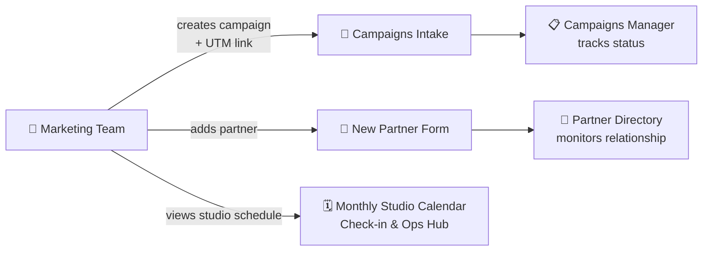
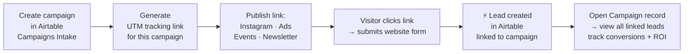

# 📣 Marketing Ops Hub

> Campaign registration and partner management workspace. The marketing team creates campaigns, generates UTM-tracked links, monitors the full campaign lifecycle, and tracks partner relationships — all from one interface. Inbound leads land in CRM automatically, attributed to the exact campaign that drove them.

> ⚠️ **Data Privacy Note:** All campaign records, lead data, and partner contacts are synthetically generated for demonstration purposes only. Names, contact details, and figures are fictional.

**Contents:** [💡 What This Interface Does](#what-it-does) · [🖥️ Interface Pages](#pages) · [📝 Marketing Campaigns Intake](#campaigns-intake) · [📋 Marketing Campaigns Manager](#campaigns-manager) · [🤝 New Partner Form](#partner-form) · [🤝 Partner Directory](#partner-directory) · [🗓️ Monthly Studio Calendar](#calendar) · [👤 Stakeholders & Governance](#stakeholders) · [⚡ Automation Coverage](#automations)

---

<a id="what-it-does"></a>
## 💡 What This Interface Does

**Workflows covered:**
- **📝 Campaign Registration** — structured intake for every campaign: required fields, UTM link generation, status tracking from creation to completion
- **📋 Campaign Lifecycle Management** — track all campaigns through their lifecycle; when an event moves to In Progress, the studio calendar updates automatically
- **🤝 Partner Management** — add new partners via form, monitor all partner relationships in a centralized directory

**Before:** Campaigns were registered in spreadsheets with no standard format. UTM links were created inconsistently or not at all — attribution was impossible. Partner contacts lived in email threads. There was no way to know which campaign drove which lead.

**Now:** Every campaign goes through a structured intake form. UTM links are generated with a consistent naming convention tied to the campaign title — every form submission from the website is automatically attributed to the exact campaign that drove it. Leads land in CRM without any manual input. Partner relationships are tracked in one place.



---

<a id="pages"></a>
## 🖥️ Interface Pages

| Page | Type | Workflow |
|---|---|---|
| **📝 Marketing Campaigns Intake** | Form | [Marketing Campaigns Intake →](#campaigns-intake) |
| **📋 Marketing Campaigns Manager** | List / Kanban | [Marketing Campaigns Manager →](#campaigns-manager) |
| **🤝 New Partner Form** | Form | [New Partner Form →](#partner-form) |
| **🤝 Partner Directory** | List | [Partner Directory →](#partner-directory) |

The **Monthly Studio Calendar** is not a page in this interface — it lives in the [Check-in & Operations Hub](./checkin-operations-hub-README.md) and is shared with the Marketing Team, who can view and edit events there.

---

<a id="campaigns-intake"></a>
## 📝 Marketing Campaigns Intake

**Who:** Marketing Manager
**Entry point:** Marketing Campaigns Intake form

Used to register every new campaign before it goes live. The form enforces a consistent structure — title format, campaign type, status, and UTM link — so every lead that arrives from the campaign is attributed correctly and automatically.

### ✅ Campaign Creation Checklist

**Required fields**

| Field | Details |
|---|---|
| **Title** | Format: `type_name_month_year` — lowercase, underscores only, no spaces or emoji. Example: `instagram_charity_yoga_may2026`. ⚠️ Do not change Title after the UTM link has been published |
| **Campaign Type** | Instagram / Telegram / Email / Event / LinkedIn / etc. |
| **Status** | Set current status on creation |
| **Event Date** | Date of the event (for events) or planned publication date (for content campaigns) |
| **Campaign_URL** | Paste the generated UTM link here after creating it (see below) |

**Optional fields**

| Field | Details |
|---|---|
| **Description** | Brief summary of the campaign goal |
| **Total Cost (Budget)** | Campaign budget in € |
| **Start Date / End Date** | If the campaign runs over a period |
| **Responsable Teacher / Office Employee** | If a team member is assigned |

### 🔗 UTM Link — create after Title is confirmed, then save in Campaign_URL

**Base URL:** `https://intelligentyogaparis.com/contact`

| Parameter | Values |
|---|---|
| `utm_source` | `instagram` / `telegram` / `email` |
| `utm_medium` | `paid` / `organic` / `post` |
| `utm_campaign` | Must match **Title** exactly |

**Final format:**
```
https://intelligentyogaparis.com/contact?utm_source=instagram&utm_medium=paid&utm_campaign=your_title#form
```

Or use the generator: [Campaign URL Builder →](https://ga-dev-tools.google/ga4/campaign-url-builder/)

### How leads arrive from this campaign

When the UTM link is published and a visitor submits the website form, Make receives the payload, matches the `utm_campaign` value to this campaign record in Airtable, and creates a lead in `Inbound_Leads` automatically — categorized by request type and linked to this campaign. The sales team receives an instant email alert.

→ [Inbound Leads automation — full pipeline documentation](../automations/make/inbound-leads-README.md)



Once leads start arriving, the Marketing Manager can open the campaign record and see all linked leads directly — who came from which campaign, what their request type was, and how many converted.

[](../assets/interfaces/acquisition_campaigne.png)

> **Analytics downstream:** Every lead linked to a campaign feeds the **📣 Campaign Performance** dashboard — which campaigns bring leads, which convert, conversion rate by channel, and ROI per campaign. → [Business Intelligence & Analytics](../business-intelligence-analytics/business-intelligence-analytics-README.md)

---

<a id="campaigns-manager"></a>
## 📋 Marketing Campaigns Manager

**Who:** Marketing Manager
**Entry point:** Marketing Campaigns Manager page

The central campaign tracking workspace. All campaigns — active, planned, completed, and archived — are visible here. The marketing manager opens a campaign card to review lead attribution, check conversion status, update the campaign lifecycle stage, and monitor budget vs. results.

**Campaigns move through lifecycle stages:** Concept → Planning → In Progress → Completed / Cancelled.

> **Key trigger:** When a campaign with `Campaigne_Type = Event/Workshop` is moved to **In Progress**, the studio calendar is updated automatically — a session is created in the `Session` table with the event date and address, and it appears immediately in the [Monthly Studio Planner](./checkin-operations-hub-README.md#planner) shared with operations.
> → [Operations & Scheduling automation deep dive](../automations/airtable/operations-scheduling-README.md)

> **Analytics downstream:** Campaign lifecycle data feeds the **📣 Campaign Performance** dashboard (top vs. flop campaigns, lead type distribution) and the **🎉 Events & Attendance** dashboard (event revenue, ROI, attendance vs. no-show rates). → [Business Intelligence & Analytics](../business-intelligence-analytics/business-intelligence-analytics-README.md)

---

<a id="partner-form"></a>
## 🤝 New Partner Form

**Who:** Marketing Manager
**Entry point:** New Partner Form

Used to add a new studio partner to the system — a company or individual with an active collaboration, sponsorship, or cross-promotion arrangement. The marketing manager fills in company name, contact person, email, and phone, and submits. The record appears immediately in the Partner Directory.

---

<a id="partner-directory"></a>
## 🤝 Partner Directory

**Who:** Marketing Manager
**Entry point:** Partner Directory page

A reference view of all studio partners and their contact details. Used to look up partner contacts, review collaboration history, and track the status of active partnerships. No automation fires here — it is a read and edit view over the `Partners` table.

---

<a id="calendar"></a>
## 🗓️ Monthly Studio Calendar

The monthly studio calendar is not a page in this interface. It is part of the [Check-in & Operations Hub](./checkin-operations-hub-README.md#planner) and is shared with the Marketing Team.

| Role | Sessions | Events |
|---|---|---|
| **Studio Admin** | View + Edit | View + Edit |
| **Marketing Team** | View only | View + Edit |

Marketing can view the full studio schedule and edit events directly in the planner. Regular class sessions remain under Admin control.

---

<a id="stakeholders"></a>
## 👤 Stakeholders & Governance

| Role | Scope | Can edit | Read-only access |
|---|---|---|---|
| **Marketing Manager** | Full interface | All campaign records · Partner records · Campaign lifecycle · Campaign_URL · Budget | Inbound Leads — to see who arrived from each campaign and which request type they submitted |

> Marketing Manager owns all campaign and partner workflows. Inbound leads linked to a campaign are visible directly inside the campaign record — read-only, so marketing can track who came from where without editing CRM records. The Monthly Studio Calendar is accessed through Check-in & Operations Hub — marketing can edit events there but not sessions.

---

<a id="automations"></a>
## ⚡ Automation Coverage

### Native Airtable — 1 automation

| Automation | Trigger | What it does |
|---|---|---|
| Sync Event to Studio Calendar | Campaign `Status = In Progress` + `Campaigne_Type = Event/Workshop` | Creates a session in `Session` table — event appears in the Monthly Studio Planner automatically |

→ [Operations & Scheduling automation deep dive](../automations/airtable/operations-scheduling-README.md)

### Make Integration — 1 pipeline

| Pipeline | Trigger | What it does |
|---|---|---|
| Inbound Leads | Website form submitted with UTM matching a campaign title | Creates lead in `Inbound_Leads` linked to this campaign · sends email alert to team |

→ [Inbound Leads pipeline documentation](../automations/make/inbound-leads-README.md)

---

*[← Back to Interfaces](./interfaces-README.md)* · *[⚡ Inbound Leads automation](../automations/make/inbound-leads-README.md)* · *[⚡ Operations & Scheduling automation](../automations/airtable/operations-scheduling-README.md)* · *[🏃 Check-in & Operations Hub](./checkin-operations-hub-README.md)*

*[← Back to main project README](../README.md)*
