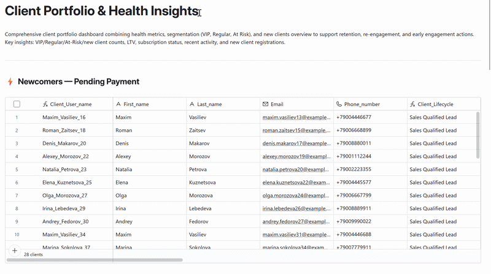
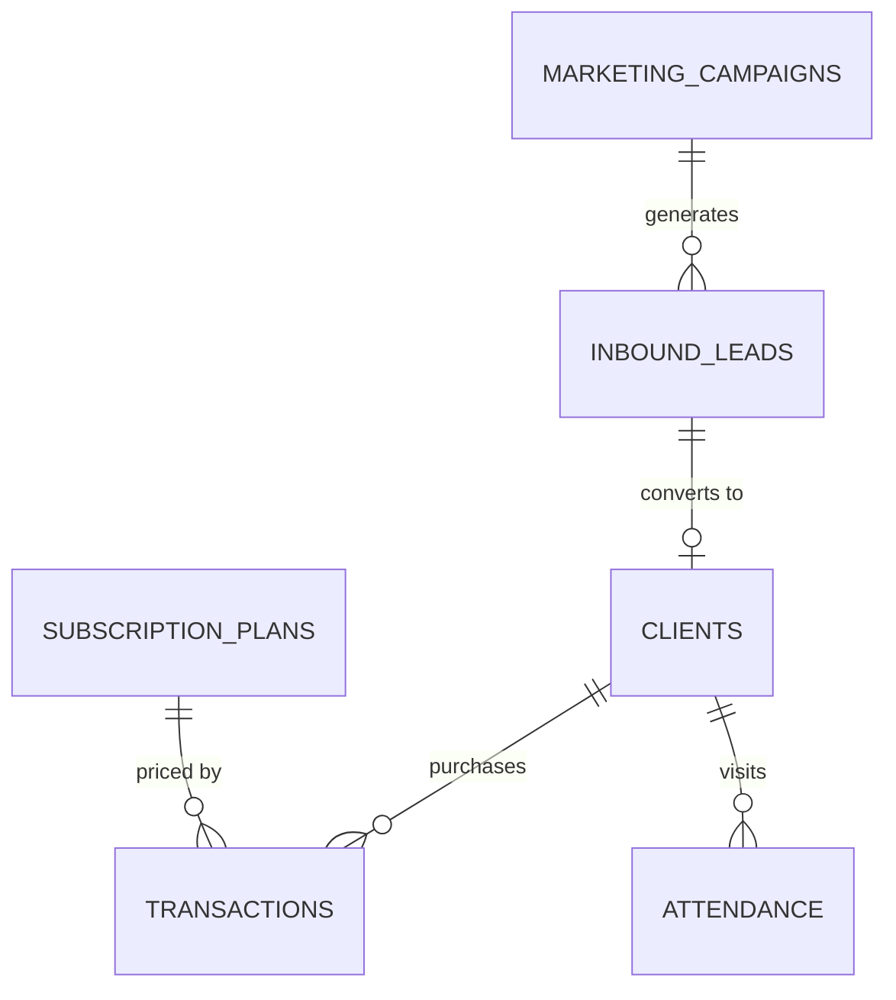

# 💼 Sales Ops Hub

> The primary client acquisition and retention workspace. Sales managers and admins track inbound leads from first contact through conversion, monitor client health across all segments, and oversee the full acquisition funnel here. No lost leads, no manual status syncing, no scattered follow-up notes.

> ⚠️ **Data Privacy Note:** All client and lead records are synthetically generated for demonstration purposes only. Names, contact details, and transaction history are fictional.

**Contents:** [💡 What This Interface Does](#what-it-does) · [🖥️ Interface Pages](#pages) · [📋 Lead Management Board](#lead-pipeline) · [💼 Client Portfolio & Health Insights](#client-portfolio) · [👤 Stakeholders & Governance](#stakeholders) · [⚡ Automation Coverage](#automations) · [🔬 Technical Deep Dive](#technical-deep-dive)

---

<a id="what-it-does"></a>
## 💡 What This Interface Does

**Workflows covered:**
- **📋 Lead Management Board** — inbound lead capture from three sources, MQL → SQL qualification, conversion to client record, automatic activity logging
- **💼 Client Portfolio & Health Insights** — segment-based client health monitoring (VIP, Regular, Churn Risk, New, Lost) and LTV tracking

**Before:** Leads captured from the website form landed in an email inbox. There was no central place to track qualification status, log follow-up notes, or know when a lead had gone cold. Client health was not tracked at all — no way to identify churn risk or high-value clients without manually reviewing session records. Conversion from lead to client was a manual copy-paste job.

**Now:** Every inbound lead lands in a structured pipeline with a clear qualification status. Sales managers work through stages with notes and follow-up dates. Every interaction is automatically logged — notes clear when the follow-up date arrives, history is preserved. When a lead converts, a client record is created automatically. Client health updates continuously — segment, LTV, visit frequency, and churn risk are always current without any manual update.

---

<a id="pages"></a>
## 🖥️ Interface Pages

| Page | Type | Workflow |
|---|---|---|
| **📋 Lead Management Board** | Kanban | [Lead Management Board →](#lead-pipeline) |
| **💼 Client Portfolio & Health Insights** | List | [Client Portfolio →](#client-portfolio) |

Individual **Lead Records** and **Client Records** are accessed by expanding cards directly from these two pages.

---

<a id="lead-pipeline"></a>
## 📋 Lead Management Board

**Who:** Sales Manager · Studio Admin
**Entry point:** Lead lands in the pipeline from one of three sources:

- 🌐 **Make · Inbound Leads scenario** — website form submissions, Instagram DMs, and other digital touchpoints arrive automatically → [Inbound Leads automation](../automations/make/inbound-leads-README.md)
- 📣 **Marketing team** — manually added leads from campaigns or direct outreach
- 👤 **Studio Admin** — manually entered via the [Check-in & Operations Hub](./checkin-operations-hub-README.md) form when a new contact attends a trial class

Every lead enters the Kanban at **MQL** status. The sales manager reviews the record, adds notes, and sets a `Next_Step_Date` for follow-up. The **Archive Notes automation fires immediately** — the interaction is logged to a running activity log, and notes clear automatically when the follow-up date arrives, keeping the card clean while preserving full history.

[](../assets/interfaces/5.CRM_Workflows.png)

Every lead record shows the campaign it came from — the acquisition source is visible directly on the card, with a direct link to the campaign record.

[](../assets/interfaces/acquisition_campaigne.png)

When a lead arrives from the website, the team receives an instant email notification — formatted by request type, with campaign attribution and a direct link to the Airtable record.

[](../assets/interfaces/email_crm.png)

The email subject and content adapt to who submitted the form. All notifications currently go to the studio admin inbox, who reviews and routes each one:

| Request type | Email header | Routed to |
|---|---|---|
| `lesson` | 🧘 POTENTIAL CLIENT: TRIAL LESSON | Sales Manager (or admin calls directly) |
| `stuff` | 💼 OFFICE STAFF CANDIDATE | HR Manager |
| `teacher` | 🧘‍♂️ YOGA TEACHER CANDIDATE | HR Manager — or admin calls the candidate directly |
| `partner` | 🤝 NEW PARTNER INQUIRY | Marketing Manager |
| `event` | 🎟️ NEW EVENT BOOKING | Sales Manager / Admin |

→ [Automation deep dive — CRM Lead Management](../automations/airtable/crm-lead-management-README.md)

[](../assets/interfaces/CRM_lead_management_board-ezgif.com-video-to-gif-converter.gif)

> **Analytics downstream:** Lead pipeline data feeds the **🎯 Lead Funnel & Customer Value** dashboard — funnel drop-off by stage (MQL → SQL → Positive), conversion rate by acquisition source, LTV by channel, and days-to-convert. → [Business Intelligence & Analytics](../business-intelligence-analytics/business-intelligence-analytics-README.md)

---

<a id="client-portfolio"></a>
## 💼 Client Portfolio & Health Insights

**Who:** Sales Manager · Studio Admin
**Entry point:** Client Portfolio & Health Insights page → Client Record

Once a lead converts, the client record appears in the portfolio automatically. The Client Portfolio view shows the full client base organized by health segment — VIP, Regular, Churn Risk, and others. Every client is assigned to a segment automatically based on visit history and lifetime value, and the formula recalculates daily without any manual input.

Sales Managers use this view to prioritize re-engagement — reaching out to ⚠️ Churn Risk clients before they become 💀 Churn, or identifying ⭐ Regular clients for upsell conversations toward 💎 VIP plans. The **Client Record** page shows the full detail card: contact info, subscription plan, current balance, visit history, LTV, and acquisition source — everything in one place.

**How segmentation works:** The `Client_Segments` formula recalculates daily:

| Segment | Condition |
|---|---|
| 💎 VIP | LTV ≥ $500 |
| ⭐ Regular | > 5 visits, last visit ≤ 30 days ago |
| ⚠️ Churn Risk | > 5 visits, last visit 31–90 days ago |
| 🌱 New Client | 1 visit or 1 transaction, within 30 days |
| 🥀 Lost Newcomer | 1 visit or 1 transaction, > 30 days ago |
| 💀 Churn | Last visit > 90 days ago |
| 🎯 Sales Qualified Lead | No visits yet — acquired lead, pending first booking |

[](../assets/interfaces/CRM_Clients_Protfolio-ezgif.com-video-to-gif-converter.gif)

> **Analytics downstream:** Client portfolio data feeds two dashboards — **🔄 Customer Lifecycle & Retention** (segment distribution, churn risk, LTV by segment, retention patterns) and **🎯 Lead Funnel & Customer Value** (lifetime value by acquisition source, client spend trends). → [Business Intelligence & Analytics](../business-intelligence-analytics/business-intelligence-analytics-README.md)

---

<a id="stakeholders"></a>
## 👤 Stakeholders & Governance

| Role | Scope | Can edit | Cannot edit |
|---|---|---|---|
| **Sales Manager** | Full interface | All lead records · Lead qualification · Conversion · Client records · Follow-up notes | — |
| **Studio Admin** | Full interface | All lead records · Lead qualification · Conversion · Client records · Follow-up notes | — |

> Sales Managers own the acquisition funnel. Studio Admins have equivalent access — they process walk-in leads and trial class contacts through this interface as part of front-desk operations.

---

<a id="automations"></a>
## ⚡ Automation Coverage

4 native Airtable automations across two pipelines — triggered by field changes in the interface.

> **Closing a lead is a manual action** — the sales manager drags the card to Rejected in the Kanban. No automation fires.

### Lead Qualification Pipeline — 2 automations

| Automation | Field trigger | What it does |
|---|---|---|
| Archive Notes | `Notes` + `Next_Step_Date` both filled | Appends interaction to `Log` · clears `Notes` when follow-up date passes |
| Lead Migration: Client | `Qualify_Status = Positive` + `Contact_Type = Client` | Creates record in `Clients` · pre-fills all contact fields · links to original lead |

### Client Health Sync — 2 automations

| Automation | Field trigger | What it does |
|---|---|---|
| New Client Welcome | New record in `Clients` (from conversion) | Sets initial `Acquisition_Date` · links to original lead |
| Subscription Status Sync | `Subscription_Plan` updated | Updates `Current Balance` · recalculates subscription validity |

→ [Full automation technical deep dive](../automations/airtable/crm-lead-management-README.md)

---

<a id="technical-deep-dive"></a>
## 🔬 Technical Deep Dive

### Tables & Relationships



### Calculated Fields

| Field | What it shows |
|---|---|
| `Client_Segments` | 💎 VIP / ⭐ Regular / ⚠️ Churn Risk / 🌱 New Client / 🥀 Lost Newcomer / 💀 Churn / 🎯 SQL — formula-driven, recalculates daily |
| `Client_Lifecycle` | `Active Regular` / `Active New` / `New` / `Churn Risk` / `Sales Qualified Lead` — lifecycle stage for operational views |
| `Days_to_Convert` | Days from `Acquisition_Date` to first transaction — funnel velocity metric |
| `Subscription_status` | Active / Expired / No Plan — based on subscription end date formula |
| `Subscription End Date` | Calculated from first transaction date + plan validity months |
| `Current Balance` | Classes remaining on active plan (rollup from Transactions) |
| `Total Spent(LTV)` | Lifetime spend — sum of all transaction amounts |
| `Total Visits` | Count of linked Attendance records |
| `Last Visit` | Date of most recent session attended |
| `System_Status` (Leads) | Formula-computed display status for pipeline Kanban grouping |
| `Is_Client_Positive` | `1` if lead converted to paying client — used in campaign conversion rate |

### Key Formulas

#### `Client_Segments`
```
IF(
  {Total Spent(LTV)} >= 500, "💎 VIP",
  IF(
    AND({Total Visits} > 5, DATETIME_DIFF(TODAY(), {Last Visit}, 'days') <= 30), "⭐ Regular",
    IF(
      OR(
        AND({Total Visits} > 10, DATETIME_DIFF(TODAY(), {Last Visit}, 'days') > 90),
        DATETIME_DIFF(TODAY(), {Last Visit}, 'days') > 90
      ), "💀 Churn",
      IF(
        AND({Total Visits} > 5, DATETIME_DIFF(TODAY(), {Last Visit}, 'days') > 30), "⚠️ Churn Risk",
        IF(
          AND(
            OR({Total Visits} = 1, {Total transactions} = 1),
            OR(DATETIME_DIFF(TODAY(), {Last Visit}, 'days') <= 30,
               DATETIME_DIFF(TODAY(), {First_transaction}, 'days') <= 30)
          ), "🌱 New Client",
          IF(
            AND(
              OR({Total Visits} = 1, {Total transactions} = 1),
              OR(DATETIME_DIFF(TODAY(), {Last Visit}, 'days') > 30,
                 DATETIME_DIFF(TODAY(), {First_transaction}, 'days') > 30)
            ), "🥀 Lost Newcomer",
            "🎯 Sales Qualified Lead"
          )
        )
      )
    )
  )
)
```

#### `Days_to_Convert`
```
IF(
  AND({Acquisition_Date}, {First_transaction}),
  DATETIME_DIFF({First_transaction}, {Acquisition_Date}, 'days'),
  BLANK()
)
```

### Subscription Plan Reference

| Plan | Price | Classes included | Validity |
|---|---|---|---|
| **Trial** | $0 | 1 | 1 month |
| **Single Drop-in** | $15 | 1 | 1 month |
| **4-Class Pass** | $50 | 4 | 2 months |
| **8-Class Pass** | $80 | 8 | 3 months |
| **1-Month Unlimited** | $100 | 35 | 4 months |
| **6-Month Unlimited** | $450 | 200 | 8 months |
| **Special Event Ticket** | $50 | 1 | 1 month |

---

*[← Back to Interfaces](./interfaces-README.md)* · *[⚡ CRM Automation deep dive](../automations/airtable/crm-lead-management-README.md)* · *[🌐 Inbound Leads automation](../automations/make/inbound-leads-README.md)* · *[🏃 Check-in & Operations Hub](./checkin-operations-hub-README.md)*

*[← Back to main project README](../README.md)*
