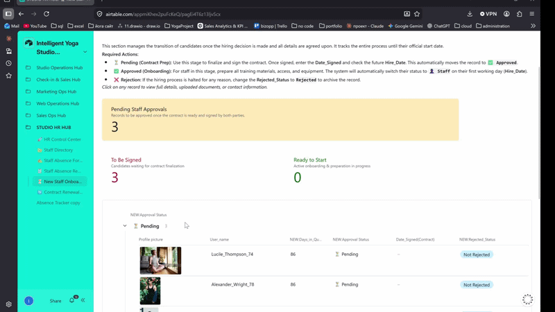
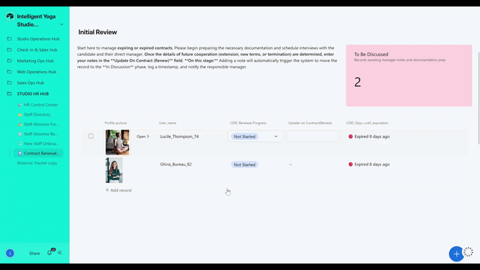
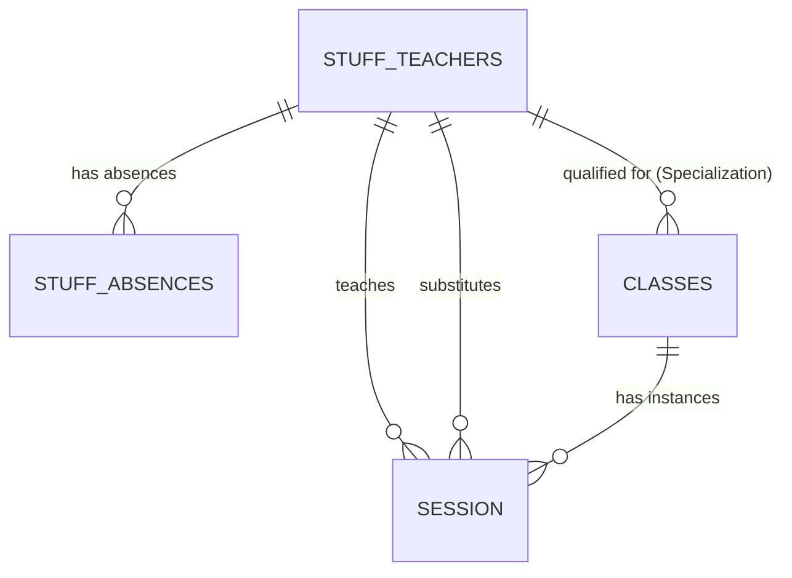

# 🧑‍💼 Studio HR Hub

> The primary people-operations workspace for the studio. HR managers and admins manage the full employee lifecycle here — from onboarding new hires and tracking fixed-term contract renewals, to maintaining employee record cards, logging absences, and syncing teacher assignments to the class catalog. No spreadsheets, no manual status updates, no coordination overhead.

> ⚠️ **Data Privacy Note:** All employee records are synthetically generated for demonstration purposes only. Names, contact details, and specializations are fictional. Profile photos are sourced from free stock libraries.

**Contents:** [💡 What This Interface Does](#what-it-does) · [🖥️ Interface Pages](#pages) · [👥 People Management](#staff-directory) · [🚀 Staff Onboarding](#onboarding) · [🔄 Contract Renewal](#renewal) · [📋 Absence Logging](#absence) · [👤 Stakeholders & Governance](#stakeholders) · [⚡ Automation Coverage](#automations) · [🔬 Technical Deep Dive](#technical-deep-dive)

---

<a id="what-it-does"></a>
## 💡 What This Interface Does

**Workflows covered:**
- **👥 People Management** — employee record cards, new hire creation, all contact and contract details, teacher specialization management
- **🚀 Staff Onboarding** — structured pipeline from offer acceptance to first session
- **🔄 Fixed-term contract renewal** — automated 4-stage state machine, triggered by HR field actions
- **📋 Absence logging & substitution planning** — form-based entry, linked to session calendar

**Before:** Fixed-term contract renewal deadlines were tracked in spreadsheets or not tracked at all. There was no central place to onboard a new hire — checklists lived in emails, contract copies in folders, setup in someone's head. Employee records didn't exist in one place — contact details, contract type, and hire date were scattered. Teacher-to-class assignments were maintained by hand: a specialization change meant manually updating every linked class roster. Absence tracking lived in a separate spreadsheet, disconnected from the session calendar.

**Now:** Contract renewals enter an automated pipeline the moment HR writes the first note. New hires move through a structured onboarding pipeline. Employee record cards centralize all HR data. Teacher assignments sync automatically when a specialization is updated. Absences are logged in the same system as sessions, giving operations real-time substitution visibility.

---

<a id="pages"></a>
## 🖥️ Interface Pages

| Page | Type | Workflow |
|---|---|---|
| **🚀 HR Control Center** | Dashboard | Overview — active staff, pending renewals, onboarding pipeline status, current absences |
| **📂 Staff Directory** | List | [Staff Directory →](#staff-directory) |
| **🔄 Contract Renewal Management** | Kanban | [Contract Renewal →](#renewal) |
| **⏳ New Staff Onboarding** | Pipeline | [Staff Onboarding →](#onboarding) |
| **✍️ Staff Absence Form** | Form | [Absence Logging →](#absence) |
| **📋 Staff Absence Reporting** | List | [Absence Logging →](#absence) |

---

<a id="staff-directory"></a>
## 📂 Staff Directory

**Who:** HR Manager (all staff) · Studio Admin (teachers only)

The Staff Directory is the central record for every person in the system. It's where new hires are created after a candidate accepts an offer, where all contact and contract details live, and where teacher specializations are managed.

**What happens here:**
- New hire record created → all basic info filled in one place (name, contact, contract type, job title, duties)
- `NEW:Rejected_Status` set to `Not Rejected` to activate the record
- For teachers: `Specialization` filled → automation fires, teacher linked to matching classes automatically
- Contract dates recorded: `Hire_date`, `Date_Signed`, `CDD_End_Date` (fixed-term only)
- Ongoing: HR or Admin updates profile info, specializations, contract changes

> **Note:** Teacher specialization changes trigger class roster sync automatically — no manual roster updates needed.

[](../assets/interfaces/hr_stuff_directory.gif)

*Staff directory — employee and teacher profiles, specializations, approval status, contract tracking.*

---

<a id="onboarding"></a>
## 🚀 Staff Onboarding

**Who:** HR Manager
**Entry point:** Staff Directory → New Staff Onboarding pipeline

[](../assets/interfaces/1.HR_Staff_Onboarding_workflow.png)

After a candidate accepts, HR creates a record in the Staff Directory and fills in basic info — name, contact, contract type, job title, duties. `NEW:Rejected_Status` is set to `Not Rejected` to activate the record.

From there the flow splits by role: **yoga teachers** get a `Specialization` field filled in — this triggers the automation that links the teacher to all matching classes automatically. **Admin and non-teaching staff** skip this step. Both paths then converge on recording contract dates (`Hire_date`, `Date_Signed`, and `CDD_End_Date` for fixed-term hires).

The hire then moves through the New Staff Onboarding pipeline: **Offer Sent → Contract Signed → System Setup → First Session**. Once complete, `Contract_status` calculates to `🟢 Active` — the record is live in the system.

→ [Automation deep dive — Teacher Approval & Sync](../automations/airtable/hr-staff-management-README.md)

[](../assets/interfaces/HR_stuff_onboarding-ezgif.com-video-to-gif-converter.gif)

---

<a id="renewal"></a>
## 🔄 Fixed-Term Contract Renewal

**Who:** HR Manager
**Entry point:** HR Control Center → Contract Renewal Management (Kanban)

Fixed-term employees appear on the renewal board automatically when their contract is within 30 days of expiry — the `Contract_status` formula handles the flagging. HR never manually marks anything as "needs renewal."

[](../assets/interfaces/2.HR_CONTRACT_RENEWAL_Workflow.png)

The cycle starts without any HR action. When a fixed-term employee's end date is within 30 days, `Contract_status` calculates to `🟡 Renewal Required` and the record surfaces on the Kanban board.

**Renewal path:** HR writes a note in `Update on Contract` → the Auto-start Renewal automation fires, moving the record to `In Discussion`. HR prepares and sends the contract (`Contract Sent` stage). Once a new end date is agreed and HR updates `CDD_End_Date`, the Auto-mark Done automation fires and the record moves to `Done`.

**Non-renewal path:** HR sets `Renewal Progress = Termination` → Non-Renewal Auto-Close fires — reason is logged, the record is archived, `Contract_status` moves to `Inactive`.

**After either path:** the Finalize & Reset automation clears renewal notes and resets the pipeline to `Not Started` — ready for the next cycle.

> **Fixed-term → permanent transition:** HR changes `Contract Type` from CDD to CDI → employee exits the renewal pipeline automatically. No action needed.

→ [Automation deep dive — Contract Renewal Pipeline](../automations/airtable/hr-staff-management-README.md)

[](../assets/interfaces/HR_Contract_Renewal-ezgif.com-video-to-gif-converter.gif)

---

<a id="absence"></a>
## 📋 Absence Logging & Substitution Planning

**Who:** HR Manager (all staff) · Studio Admin (teachers only)
**Entry point:** Staff Absence Form → Staff Absence Reporting

All absences are logged through **Staff Absence Form** — employee selected, dates set, type chosen (Sick Leave / Vacation / Personal), documentation attached if needed. On submit, a record is created in `Stuff_Absences` and linked to the employee card automatically.

[](../assets/interfaces/3.Stuff_absence_form.png)

The **Staff Absence Reporting** view shows all logged absences — past, current, and upcoming — for identifying coverage gaps and planning substitutions.

[](../assets/interfaces/4.HR_absence_tracker.png)

---

<a id="stakeholders"></a>
## 👤 Stakeholders & Governance

| Role | Scope | Can edit | Cannot edit |
|---|---|---|---|
| **HR Manager** | Full interface | All staff & teacher records · Contract data · Absence records · Onboarding pipeline · Specializations | — |
| **Studio Admin** | Teachers only | Teacher profiles · Teacher specializations · Teacher absences | Non-teacher staff · Contract renewal board · Approval status |

> HR manages the full workforce. The Studio Admin is the day-to-day teacher manager — they can view and update teacher records and log teacher absences, but have no access to non-teacher staff data or the contract renewal pipeline.

---

<a id="automations"></a>
## ⚡ Automation Coverage

6 native Airtable automations across two pipelines — all triggered by interface field actions, never from raw table edits.

### Contract Renewal Pipeline — 4 automations

| Automation | Field trigger | What it does |
|---|---|---|
| [HR] Auto-start Renewal | `Update on Contract(Renew)` updated | `CDD_Renewal Progress` → `In Discussion` · logs timestamp |
| Done: Auto-mark Renewal as Done | `CDD_End_Date` updated + conditions met | `CDD_Renewal Progress` → `Done` |
| Non-Renewal: Auto-Close | `CDD_Renewal Progress = Termination` | Logs reason · archives record · Progress → `Done` |
| [HR] Renewal: Finalize & Reset | `CDD_Renewal Progress = Done` | Clears renewal notes · resets Progress → `Not Started` |

### Teacher → Class Sync — 2 automations

| Automation | Field trigger | What it does |
|---|---|---|
| Teacher Approval to Class Workflow | `Contact_Type = Yoga_Teacher` + `Specialization` filled + not rejected | Adds teacher to `Classes.Qualified Teachers` for all matching class types |
| Update Teacher Sync Class | `Specialization` updated | Re-links teacher in `Classes.Qualified Teachers` for each updated specialization |

→ [Full automation technical deep dive](../automations/airtable/hr-staff-management-README.md)

---

<a id="technical-deep-dive"></a>
## 🔬 Technical Deep Dive

### Tables & Relationships



### Calculated Fields

| Field | What it shows |
|---|---|
| `Contract_status` | `🟢 Active` / `🟡 Renewal Required` / `🔴 Expired` / `🔴 Inactive (Terminated)` / `🟠 Termination Pending` / `🔴 Inactive (Rejected)` |
| `CDD_Days_until_expiration` | Days remaining on fixed-term contract, or `🔴 Expired X days ago` if past end date |
| `NEW:Approval Status` | Candidate approval state — controls whether Teacher Assignment automation fires |
| `NEW:Days_in_Queue` | Days since record creation — tracks onboarding pipeline velocity |
| `System_Status` | Combined display status used in HR Control Center dashboard views |
| `Current_Absence_Check` | `1` = currently absent · `0` = available (sourced from `Stuff_Absences.Is_Today`) |
| `Total_Sessions_Taught` | Lifetime session count — assesses teacher activity |
| `Avg_Class_Fill_Rate` | Average fill rate across all sessions taught |

### Key Formulas

#### `Contract_status`
```
IF(
  {NEW:Approval Status} = "❌ Rejected",
  "🔴 Inactive (Rejected)",
  IF({Contract Type} = "CDD",
    IF({CDD_Renewal Progress} = "⛔️ Termination",
      IF(IS_AFTER(TODAY(), {CDD_End_Date}),
        "🔴 Inactive (Terminated)", "🟠 Termination Pending"),
      IF(IS_AFTER(TODAY(), {CDD_End_Date}),
        "🔴 Expired",
        IF(DATETIME_DIFF({CDD_End_Date}, TODAY(), 'days') <= 30,
          "🟡 Renewal Required", "🟢 Active"))),
    IF({Contract Type} = "CDI",
      IF(AND({CDI_Termination_Date}, IS_BEFORE({CDI_Termination_Date}, TODAY())),
        "🔴 Inactive", "🟢 Active"),
      IF({Contract Type} = "Freelance", "🟢 Active", "⚪ No Status"))))
```

#### `CDD_Days_until_expiration`
```
IF(
  {CDD_End_Date},
  IF(DATETIME_DIFF({CDD_End_Date}, TODAY(), 'days') < 0,
    "🔴 Expired " & ABS(DATETIME_DIFF({CDD_End_Date}, TODAY(), 'days')) & " days ago",
    DATETIME_DIFF({CDD_End_Date}, TODAY(), 'days')),
  "no data")
```

### Contract Types Reference

| Type | Description | Renewal pipeline |
|---|---|---|
| **Fixed-term (CDD)** | Defined end date — requires active renewal tracking | ✅ Full 4-automation pipeline |
| **Permanent (CDI)** | No end date — ongoing employment | ❌ No renewal needed |
| **Freelance** | Session-based engagement | ❌ No contract tracking |

---

*[← Back to Interfaces](./interfaces-README.md)* · *[⚡ HR Automation deep dive](../automations/airtable/hr-staff-management-README.md)*

*[← Back to main project README](../README.md)*
