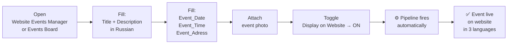
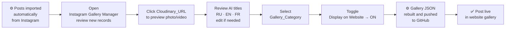

# 🌐 Web Operations Hub

> Website publishing workspace for the marketing team. Events are created and published in three languages with one toggle — no developer, no code. Instagram posts are imported automatically, reviewed here, and published to the gallery with a single tap. Everything website-related is managed from this interface.

*Flip the toggle on any event record — the pipeline fires automatically.*

*The event appears on the website in three languages within seconds.*

> ⚠️ **Data Privacy Note:** All event records and campaign data shown in demos are synthetically generated for demonstration purposes only.

**Contents:** [🖥️ Interface Pages](#pages) · [📅 Website Events Manager](#events-manager) · [📸 Instagram Gallery Manager](#gallery-manager) · [👤 Stakeholders & Governance](#stakeholders) · [⚡ Automation Coverage](#automations)

---

## 🖥️ Interface Pages

| Page | Description |
|---|---|
| **📅 Website Events Manager** | Create a new event. Fill in the required fields and upload a photo — the system will automatically upload the image to the CDN and generate translations into English and French. |
| **📋 Events Board** | View and manage all studio events — both upcoming and past. Publish events to the website, unpublish them, or edit existing content directly from this board. |
| **📸 Instagram Gallery Manager** | Review Instagram posts imported automatically from `@intelligentyoga`. AI-generated titles in RU / EN / FR are ready for review. Assign a category and toggle to publish or unpublish from the website gallery. |

---

## 📅 Website Events Manager & Events Board

**Who:** Marketing Manager
**Entry point:** Website Events Manager (new event form) · Events Board (manage existing events)

Manage events displayed on the website. Fill in the required fields and upload a photo — the system will automatically upload the image to the CDN and generate translations into English and French.

---

### Demo

*One toggle publishes the event — the pipeline handles photo upload, AI translation, and website deployment automatically.*

*The event appears in the website gallery in French, English, and Russian within seconds.*

---

### Workflow

---

### ➕ Website Events Manager — Create a New Event

**⚡ Quick Start — How to Add an Event to the Website**

1. Fill in the event title and description in Russian
2. Upload a cover photo in the **Attachments** field
3. Toggle **"Display on Website" → ON**
4. Save the record — the system will automatically:
   - Translate the title and description into EN and FR
   - Update the website events gallery

---

### 📋 Events Board — Publish, Edit, Unpublish

View and manage all studio events — both upcoming and past. Publish events to the website, unpublish them, or add new ones directly from this board.

**⚡ How to Publish an Event to the Website**

1. Open an event card and fill in the Website Title and Description (in Russian)
2. Upload a cover photo in the **Attachments** field
3. Toggle **"Display on Website" → ON**
4. Save — the system will automatically translate the content into EN and FR

**⚠️ Before Publishing — Please Review**

- Check the English and French title and description — they are AI-generated
- Edit directly in `Website_Title_EN / FR` and `Website_describtion_EN / FR` if needed
- Only toggle ON when the content looks correct in all three languages

→ [Automated Event Publishing — full pipeline documentation](../automations/make/website-sync-README.md)

---

## 📸 Instagram Gallery Manager

**Who:** Marketing Manager
**Entry point:** Instagram Gallery Manager page

Review and manage Instagram content synced automatically from `@intelligentyoga`. Photos and videos are imported from Instagram, uploaded to Cloudinary CDN, and AI-generated titles are translated into RU, EN, and FR automatically.

**Your role:** review the content, assign a category, and toggle **Display on Website** to publish or unpublish items from the website gallery.

---

### Demo

*Open a new record, check the Cloudinary URL to verify the media, review the AI titles, assign a category, and flip the toggle to publish.*

*The post appears in the website gallery with multilingual titles and fullscreen modal.*

---

### Workflow

---

### ✅ What You Need to Do

1. Open the new record
2. Review AI-generated titles in RU, EN, FR — edit if needed
3. Click the **Cloudinary_URL** link to preview the photo or video as it will appear on the website
4. Select **Gallery_Category**
5. Toggle **"Display on Website" → ON** to publish

**⚠️ To unpublish — toggle Display on Website → OFF**

→ [Instagram Gallery Sync — full pipeline documentation](../automations/make/instagram-gallery-sync-README.md)

---

## 👤 Stakeholders & Governance

| Role | Scope | Can edit |
|---|---|---|
| **Marketing Manager** | Full interface | All event records · Gallery curation · Publication toggles · Translation fields |

> Marketing Manager owns all website content workflows. No developer access is required for any publish, update, or unpublish action. AI-generated translations can be reviewed and edited directly in the record — the pipeline picks up the latest field values on every run.

---

## ⚡ Automation Coverage

### Make Integration Pipelines — 2 pipelines

| Pipeline | Trigger | What it does |
|---|---|---|
| [**Automated Event Publishing**](../automations/make/website-sync-README.md) | `Display_on_Website = ✅` + photo attached | Uploads photo to Cloudinary · AI translates title + description into EN and FR · Pushes `events.json` to GitHub · Cloudflare deploys |
| [**Instagram Gallery Sync**](../automations/make/instagram-gallery-sync-README.md) | Scheduled (import) + `Display_on_Website` toggle (publish) | Fetches latest Instagram posts · deduplicates · uploads media to Cloudinary · generates AI titles in 3 languages · writes to Airtable · on toggle: rebuilds `instagram-gallery.json` and pushes to GitHub |

---

*[← Back to Interfaces](./interfaces-README.md)* · *[← Back to main README](../README.md)* · *[⚡ Event Publishing pipeline](../automations/make/website-sync-README.md)* · *[⚡ Instagram Gallery Sync](../automations/make/instagram-gallery-sync-README.md)* · *[🌐 Frontend](../frontend/frontend-README.md)*
